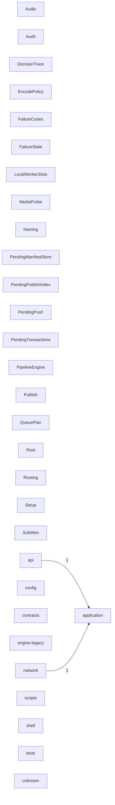

# DEPENDENCY_GRAPH

Generated by `scripts/dev/generate_project_index.py`. Do not hand-edit.
Edges aggregate cross-domain Python imports and PowerShell dot-includes.

## Edge counts

| From | To | Edges |
|---|---|---|
| api | application | 1 |
| network | application | 1 |
