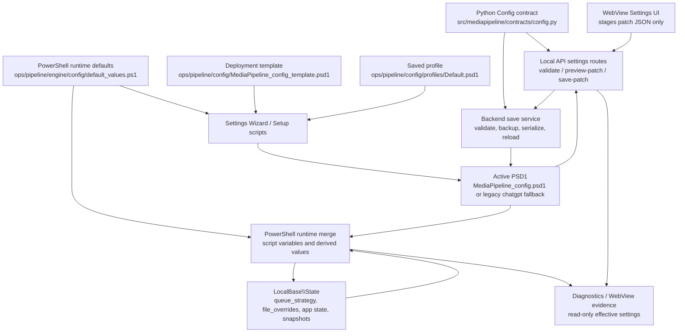

# Configuration System Audit

Date: 2026-06-17  
Change packet: `MP-CHANGE-2026-0617-009`  
Scope: report-only audit of configuration sources, precedence, lifecycle, ownership, drift risk, migration risk, media-policy settings, and validation gaps.

## Executive Summary

The configuration system is operational and has strong safety intent, but it is not yet a single generated surface. The active source of truth is split between the Python Pydantic contract, PowerShell runtime defaults/schema helpers, PSD1 templates/profiles, backend metadata, WebView staging builders, setup wizard code, release scripts, and LocalBase state files.

Highest-risk findings:

| Rank | Finding | Risk |
|---|---|---|
| High | Network settings are first-class Python/WebView/backend settings but intentionally absent from the ops JSON schema, template, and PowerShell ordered schema. | Distributed processing can be saved through backend routes while release/default/schema surfaces do not fully validate or document the same keys. |
| High | `ops/pipeline/config/profiles/Default.psd1` is not a neutral copy of template/contract defaults. It changes media policy and publish behavior. | Loading the named "Default" profile can change subtitle OCR, deferred publish, episode parsing, video quality, and encoder flag behavior. |
| High | `LibraryProfiles` is transitioning into canonical ownership while legacy `SourceMovies`, `SourceTV`, `Outsource`, and `FinalLibraryPromotionRules` remain mirrored compatibility keys. | Routing, output, and final promotion behavior can drift depending on whether a config came from PowerShell defaults, Python save, the wizard, or an older PSD1. |
| Medium | The ops JSON schema and Pydantic contract differ by exactly the 15 network keys, and both schemas allow additional properties. | Typo/stale keys can survive serialization, while different validators disagree on which keys are in-scope. |
| Medium | Runtime effective configuration includes LocalBase state layers such as `queue_strategy.json` and `file_overrides.json`. | Saved config can appear to say one thing while runtime behavior is changed by state files. |

No configuration, defaults, schemas, migrations, settings, UI, tests, or runtime files were changed by this audit.

## Methodology

I followed `AGENTS.md` startup order and read:

- `AGENTS.md`
- `docs/CURRENT_PROJECT_STATE.md`
- `docs/OPEN_WORK_CHECKLIST.md`
- `docs/generated/PROJECT_INDEX.md`

I used generated summaries before full-source reads where summaries existed. When summaries were sparse or unparsed, I opened the source or used targeted `rg` scans. Evidence included:

- PSD1 template/profile parsing and key comparisons.
- Python contract, generated contract schema, config load/save/preview/validation code.
- PowerShell config registry/default/schema/runtime merge and runtime validation.
- Local API settings routes and save/preview facades.
- WebView Settings and Network builders.
- Setup wizard and release/default scripts.
- LocalBase state/migration assumptions.
- Settings/config tests and release guards.

This was a static/report audit. It did not launch the app, process media, run release gates, or perform real-media validation.

## Configuration Source Inventory

| Source | Files | Role | Persistence | Owner surface | Notes |
|---|---|---|---|---|---|
| Python config contract | `src/mediapipeline/contracts/config.py`, `src/mediapipeline/contracts/config_defaults.py`, `src/mediapipeline/contracts/config_validators.py`, `src/mediapipeline/contracts/schemas/config.v1.schema.json` | Full Pydantic value contract and generated schema. | In-memory model, serialized PSD1 through config services. | Backend/Python | Includes all non-network and network keys; `extra="allow"` preserves unknown keys. |
| Python config load/save | `src/mediapipeline/core/config/load.py`, `save_runner.py`, `preview.py`, `validation.py`, `settings_patch_candidate_facade.py`, `settings_patch_facade.py` | PSD1 import, validation, candidate building, preview, save, backup, reload. | Active PSD1 plus `ConfigBackups`. | Backend/Python | PSD1 parse authority is PowerShell `Import-PowerShellDataFile`; save serializes ordered flat PSD1. |
| Python metadata | `src/mediapipeline/core/config/metadata.py`, `metadata_parts/*`, `metadata_network.py`, `metadata_choices.py` | WebView labels, help, choices, field grouping, managed key list. | Served through Local API workspace data. | Backend/Python | Current state doc says backend metadata is canonical for labels/help/choices/default display. |
| Python key registry | `src/mediapipeline/core/kernel/config_key_order.py`, `config_keys.py`, `config_locations.py`, `config_key_aliases.py` | Ordered keys, network keys, path candidates, aliases. | Code only. | Backend/Python | `CONFIG_KEY_ALIASES` is currently empty. |
| PowerShell key registry | `ops/pipeline/engine/config/config_keys.ps1` | Known key registry. | Runtime script state. | PowerShell runtime | Contains both non-network and network keys, but ordered key function excludes network keys. |
| PowerShell defaults/schema | `ops/pipeline/engine/config/default_values.ps1`, `config_schema.ps1`, `schema_keys.ps1`, `schema_validation.ps1`, `runtime_validation.ps1` | Runtime defaults and validation. | Runtime merged hashtable/script variables. | PowerShell runtime/scripts | PowerShell defaults create default `LibraryProfiles`; Python model default is empty. |
| PowerShell runtime merge | `ops/pipeline/engine/config/runtime_config.ps1`, `runtime_merge.ps1` | Loads PSD1, fills missing defaults, resolves derived values, publishes script variables. | Script-scope runtime variables and effective config dump. | PowerShell runtime | Unknown keys can become script variables unless reserved-name guard blocks them. |
| PSD1 template | `ops/pipeline/config/MediaPipeline_config_template.psd1` | Seed for live config. | Copied/generated as active PSD1. | Operator/setup/release | 139 keys; omits network keys and several newer contract keys. |
| PSD1 default profile | `ops/pipeline/config/profiles/Default.psd1` | Saved profile baseline. | Profile loaded into active config. | Operator/backend profile service | 136 keys; differs materially from template on media/publish settings. |
| Ops JSON schema | `ops/pipeline/config/schemas/media_pipeline_config.schema.json` | PowerShell/release-side config schema. | JSON schema artifact. | PowerShell/release | 152 keys; intentionally excludes all 15 network keys. |
| Setup wizard | `src/mediapipeline/core/config/settings_wizard.py`, `settings_wizard_facade.py`, `ops/pipeline/config/setup/ConfigFile.ps1`, `Validation.ps1`, `PathValidation.ps1` | First-run and script setup config generation. | Active PSD1; app-state wizard completion flag. | Backend/scripts/operator | Python wizard delegates to settings patch/save; PowerShell setup formats PSD1 from PowerShell defaults. |
| Local API routes | `src/mediapipeline/core/api/commands_settings.py`, command contracts | Settings validate, preview, save, reload, wizard routes. | Active PSD1 and app state through backend services. | Backend/API | Save requires `confirm_save: true`; browse stages path choices only. |
| WebView settings UI | `apps/desktop/webview/static/assets/settingsView.js`, `settingsLibraries.js`, `settingsMetadata.js`, `settingsView.builders.*.js`, `partials/page-settings.html`, `partials/page-network.html` | Display/staging controls. | No direct persistence; posts patch JSON to backend routes. | UI | Tests guard that frontend does not own settings persistence or media policy. |
| LocalBase state | `LocalBase/State/*` assumed by `src/mediapipeline/core/paths/layout.py`, `storage/state_migration.py`, PowerShell runtime | Runtime state and limited behavior overrides. | JSON/JSONL/SQLite mirror under `LocalBase\State`. | Backend/runtime | JSON state remains authoritative; SQLite is mirror-only per current state doc. |
| Release/default scripts | `ops/scripts/dev/run.bat`, `verify-env.ps1`, `ops/scripts/release/build.ps1`, `test.ps1`, `release_policy.ps1` | Launch resolution, environment checks, release inclusion/exclusion, generated artifact checks. | Release package manifest and local environment. | Scripts/release | Default releases exclude live personal config and include template/profile. |
| Docs/tests | `docs/CURRENT_PROJECT_STATE.md`, `docs/operator/NO_TOUCH_BOUNDARY_REGISTER.md`, `docs/testing/TEST_COVERAGE_MATRIX.md`, `tests/python/desktop/test_config_keys.py`, `ops/pipeline/tests/Unit/Invoke-ConfigKeyRegistryChecks.ps1`, `Invoke-RuntimeConfigResolutionChecks.ps1` | Active guidance and drift gates. | Repo docs/test suite. | Engineering | Tests intentionally encode the network split between Python all-keys and ops schema non-network keys. |

## Precedence Table

| Precedence | Layer | Evidence | Result |
|---|---|---|---|
| 1 | Contract defaults | `Config` model defaults in `src/mediapipeline/contracts/config.py` | Missing keys get Python defaults during backend load/preview/save. |
| 2 | PowerShell defaults | `Get-MediaPipelineConfigDefaultValues` in `default_values.ps1` | Missing keys get runtime defaults in pipeline execution. Not identical to Pydantic for `LibraryProfiles` and `ExtraVideoFlags`. |
| 3 | Seed/template/profile | `MediaPipeline_config_template.psd1`, `profiles/Default.psd1`, setup wizard | Creates or loads an initial live PSD1. |
| 4 | Active config path | `src/mediapipeline/core/paths/defaults.py`, `ops/scripts/dev/run.bat`, `verify-env.ps1` | Python and scripts search per-user, workspace, app config, and legacy names. |
| 5 | PSD1 import | `load.py`, PowerShell `Import-PowerShellDataFile` | Converts active PSD1 into Python dict, then Pydantic model. |
| 6 | Backend patch preview | `settings_patch_candidate_facade.py`, `preview.py`, `validation.py` | Staged UI/operator changes are normalized and validated before save. |
| 7 | Backend save | `settings_patch_facade.py`, `save_runner.py` | Requires `confirm_save: true`, optional backup, atomic write, optional reload. |
| 8 | Runtime merge | `runtime_config.ps1`, `runtime_merge.ps1` | Active PSD1 plus PowerShell defaults become script variables and derived runtime values. |
| 9 | Runtime state overlays | `queue_strategy.json`, `file_overrides.json`, worker runtime/app state | Some runtime behavior can override or refine saved config. |
| 10 | Evidence-only views | `library_effective_settings`, `runtime_effective_settings`, diagnostics/sample validation | Diagnostic output only; not persisted config and not decision input by contract. |

## Lifecycle Diagram



## Settings Ownership Map

| Owner | Owns | Must not own | Evidence |
|---|---|---|---|
| Backend/Python | Config contract, validation, settings patch preview/save, profile normalization, metadata, settings routes, identity checks, app state writes. | Direct media processing command generation. | `config.py`, `validation.py`, `commands_settings.py`, `settings_patch_facade.py`. |
| PowerShell runtime | Effective runtime defaults, FFmpeg/publish/queue behavior, source/scratch/output processing, runtime compatibility warnings. | WebView display state or independent settings persistence. | `runtime_config.ps1`, `runtime_merge.ps1`, `default_values.ps1`. |
| WebView | Display current settings, stage JSON patches, show backend warnings/readiness, call backend routes. | Filesystem mutation, settings persistence, queue mutation, media policy, pending drain, rename apply. | `settingsView.js`, `settingsView.builders.*.js`, `test_webview_frontend_mutation_boundary.py`. |
| Scripts/operator | Choose live PSD1, run setup, run release/build/test scripts, decide operator-specific paths. | Reintroducing root launchers or bypassing backend save/validation. | `run.bat`, `verify-env.ps1`, `build.ps1`, `release_policy.ps1`. |
| LocalBase runtime state | Runtime evidence, app state, snapshots, queue/file overrides, SQLite mirror. | Becoming an undocumented parallel config source. | `storage/state_migration.py`, `paths/layout.py`, runtime `file_overrides.json` references. |

## Risk Ranking

| Rank | Risk area | Impact | Likelihood | Overall |
|---|---|---|---|---|
| 1 | Network key split across Python/WebView/backend vs ops schema/template | Distributed mode misconfiguration and incomplete validation | Medium | High |
| 2 | Default profile policy drift | Silent media-policy changes when loading "Default" | Medium | High |
| 3 | LibraryProfiles plus legacy key mirroring | Wrong source/output/final promotion behavior | Medium | High |
| 4 | Derived/freeform codec and encoder flags | Saved value differs from effective runtime behavior | Medium | Medium |
| 5 | LocalBase runtime overlays | Operator sees saved settings but runtime uses state override | Medium | Medium |
| 6 | Unknown/stale key preservation | Typos survive and may become PowerShell variables | Medium | Medium |
| 7 | Legacy config filename and compatibility fallbacks | Older files keep receiving implicit support | Low to medium | Medium |

## Risky Setting Evidence

### Source And Consumer Reference Sets

| Ref | Source files |
|---|---|
| S1 | `src/mediapipeline/contracts/config.py`, `src/mediapipeline/contracts/schemas/config.v1.schema.json` |
| S2 | `src/mediapipeline/core/config/load.py`, `preview.py`, `validation.py`, `settings_patch_candidate_facade.py`, `settings_patch_facade.py`, `save_runner.py` |
| S3 | `src/mediapipeline/core/config/metadata.py`, `metadata_network.py`, `metadata_parts/network_fields.py`, `metadata_parts/*_fields.py` |
| S4 | `src/mediapipeline/core/kernel/config_key_order.py`, `config_keys.py`, `config_locations.py`, `config_key_aliases.py` |
| S5 | `ops/pipeline/engine/config/config_keys.ps1`, `default_values.ps1`, `config_schema.ps1`, `schema_keys.ps1`, `schema_validation.ps1`, `runtime_config.ps1`, `runtime_merge.ps1` |
| S6 | `ops/pipeline/config/MediaPipeline_config_template.psd1`, `ops/pipeline/config/profiles/Default.psd1`, `ops/pipeline/config/schemas/media_pipeline_config.schema.json` |
| S7 | `apps/desktop/webview/static/assets/settingsView.js`, `settingsLibraries.js`, `settingsMetadata.js`, `settingsView.builders.*.js`, `partials/page-settings.html`, `partials/page-network.html` |
| S8 | `src/mediapipeline/core/config/settings_wizard.py`, `settings_wizard_facade.py`, `ops/pipeline/config/setup/ConfigFile.ps1` |
| S9 | `ops/scripts/dev/run.bat`, `ops/scripts/dev/verify-env.ps1`, `ops/scripts/release/build.ps1`, `test.ps1`, `release_policy.ps1` |
| S10 | `src/mediapipeline/core/storage/state_migration.py`, `src/mediapipeline/core/paths/layout.py`, runtime references to `queue_strategy.json` and `file_overrides.json` |

| Ref | Consumers |
|---|---|
| C1 | Backend settings API and patch/save routes. |
| C2 | WebView Settings and Network staging builders. |
| C3 | PowerShell pipeline runtime. |
| C4 | Network coordinator/worker facade and lifecycle helpers. |
| C5 | Queue/source scan/rerun/runtime state. |
| C6 | Release/setup scripts. |
| C7 | Media processing: FFmpeg routing, subtitles, audio, publish, size guard. |
| C8 | Diagnostics, sample validation, settings readiness, raw-key action plan. |

### Detailed Risk Table

| Key/name | Sources | Consumers | Default | Override mechanism | Persistence location | Risk | Recommended consolidation path | Validation needed |
|---|---|---|---|---|---|---|---|---|
| `NetworkRole` | S1, S3, S4, S5, S7 | C1, C2, C4 | `standalone` | WebView Network patch, wizard worker payload, direct PSD1 | Active PSD1 | High: Python/backend/UI manage it, but ops schema/template omit it. | Decide whether network keys are canonical PSD1 keys; if yes, generate ops schema/template/order from the full contract or add a network schema section. | Cross-surface test that template/profile/schema/metadata contain intended network treatment. |
| `CoordinatorPort` | S1, S3, S4, S5, S7 | C1, C2, C4 | `7830` | WebView Network patch, direct PSD1 | Active PSD1 | High: port is runtime critical but not in ops JSON schema/template. | Same as `NetworkRole`; add release-package validation for distributed-mode config. | Network lifecycle tests plus schema/template parity check. |
| `CoordinatorBindAddress` | S1, S3, S4, S5, S7 | C1, C2, C4 | `0.0.0.0` | WebView Network patch, direct PSD1 | Active PSD1 | High: security/availability behavior can drift outside ops schema. | Canonicalize network schema and document trusted-LAN assumptions. | Backend validation for bind address and release schema coverage. |
| `CoordinatorAlsoEncodeLocally` | S1, S3, S4, S5, S7 | C1, C2, C4, C7 | `false` | WebView Network role setup, direct PSD1 | Active PSD1 | High: changes launch/worker processing posture while schema/template omit it. | Include in network schema/template or keep as explicit app-state-only setting, not both. | Launch/network gate tests for coordinator-local-worker mode. |
| `CoordinatorHeartbeatTimeoutMins` | S1, S3, S4, S5, S7 | C1, C2, C4 | `5` | WebView Network patch, direct PSD1 | Active PSD1 | Medium: stale worker reclaim behavior depends on a key excluded from ops schema. | Add network validation group. | Worker stale-claim tests and schema bounds. |
| `CoordinatorMaxJobRetries` | S1, S3, S4, S5 | C1, C4 | `3` | Direct PSD1/backend metadata | Active PSD1 | Medium: retry safety is cluster behavior but less visible in WebView builder excerpts. | Include in Network builder or mark intentionally advanced/raw. | Network coordinator retry policy tests. |
| `CoordinatorAuthToken` | S1, S3, S4, S5 | C1, C4 | `""` | Backend/network lifecycle auto-generation or direct PSD1 | Active PSD1/app state depending flow | Medium: intentionally hidden from UI; stale docs/schema can make auth behavior unclear. | Keep hidden but document persistence and redaction path. | Secret redaction and no-leak tests. |
| `WorkerCoordinatorUrl` | S1, S3, S4, S5, S7 | C1, C2, C4 | `""` | WebView Network patch, join import, direct PSD1 | Active PSD1 | High: worker cannot run correctly without it; UI validates but ops schema/template omit it. | Canonicalize network keys and keep URL validation backend-owned. | URL validator parity between UI advisory and backend authoritative checks. |
| `WorkerName` | S1, S3, S4, S5, S7 | C1, C2, C4 | `""` | WebView Network patch, direct PSD1 | Active PSD1 | Medium: runtime default hostname differs from saved blank display. | Document blank means hostname; surface effective value separately. | Network worker state tests. |
| `WorkerAuthToken` | S1, S3, S4, S5 | C1, C4 | `""` | Join/import or direct PSD1 | Active PSD1 | Medium: secret hidden from UI and excluded from ops schema. | Maintain hidden/redacted metadata plus schema coverage decision. | Auth redaction and join import tests. |
| `WorkerPollIntervalSecs` | S1, S3, S4, S5, S7 | C1, C2, C4 | `10` | WebView Network patch, direct PSD1 | Active PSD1 | Medium: runtime behavior but not ops schema/template. | Add bounds to canonical schema group. | Worker poll interval validation. |
| `WorkerSourcePathMap` | S1, S3, S4, S5, S7 | C1, C2, C4, C5 | `""` JSON text | WebView Network JSON text, direct PSD1 | Active PSD1 | High: source path translation affects file access and source safety. | Make structured map validation canonical and shared. | Path-map validation, source-root safety tests, no source mutation tests. |
| `WorkerEncoderMap` | S1, S3, S4, S5, S7 | C1, C2, C4, C7 | `""` JSON text | WebView Network JSON text, direct PSD1 | Active PSD1 | High: can alter encoder implementation while coordinator policy remains authoritative. | Validate structured JSON and allowed encoder values in backend/schema. | Network encode snapshot and real-media validation before enabling broadly. |
| `WorkerHonorCoordinatorPolicy` | S1, S3, S4, S5, S7 | C1, C2, C4, C7 | `false` | WebView Network patch, direct PSD1 | Active PSD1 | High: flips worker from local full-config behavior toward coordinator policy. | Keep behind explicit rollout setting with schema/docs/test gates. | Cluster policy real-media validation. |
| `WorkerConfigOverrides` | S1, S3, S4, S5, S7 | C1, C2, C4, C7 | `""` JSON text | WebView Network JSON text, direct PSD1 | Active PSD1 | High: per-worker partial config can override media policy. | Schema-validate override keys against allowed safe subset. | Override-key allowlist and worker claim tests. |
| `VideoQuality` | S1, S5, S6, S7, S8 | C1, C2, C3, C7 | Contract/template `22`; Default profile `21` | Profile load, WebView Video builder, setup wizard, direct PSD1 | Active PSD1/profile | High: named Default profile changes encode quality. | Regenerate `Default.psd1` from canonical defaults or rename it to an opinionated profile. | Template/profile/contract default parity test. |
| `DeferredPublish` | S1, S5, S6, S7, S8 | C1, C2, C3, C7 | Contract/template `false`; Default profile `true` | Profile load, Pending Publish builder, setup wizard, direct PSD1 | Active PSD1/profile | High: changes final output movement and pending-publish lifecycle. | Split neutral default from operator preference profile. | Pending publish real-media validation when defaults change. |
| `ConvertBdpgsToSrt` | S1, S5, S6, S7, S8 | C1, C2, C3, C7 | Contract/template `false`; Default profile `true` | Profile load, Subtitle builder, setup wizard, direct PSD1 | Active PSD1/profile | High: enables OCR path and review behavior; media-policy-affecting. | Make profile intent explicit and validate OCR tool paths before save. | BDPGS sample validation and OCR path evidence tests. |
| `AggressiveEpisodeParsing` | S1, S5, S6, S7, S8 | C1, C2, C3, C5 | Contract/template `false`; Default profile `true` | Profile load, setup wizard, direct PSD1 | Active PSD1/profile | Medium: changes TV parse behavior and routing decisions. | Align Default profile with template or rename as opinionated. | Queue TV parse regression coverage. |
| `SubKeepLanguages` | S1, S5, S6, S7, S8 | C1, C2, C3, C7 | Contract/template includes `eng,en,und,''`; Default profile omits blank tag | Profile load, Subtitle builder, direct PSD1 | Active PSD1/profile | Medium: blank subtitle language preservation differs by source. | Decide whether blank language should remain default; enforce profile parity. | Subtitle-bearing sample validation. |
| `ExtraVideoFlags` | S1, S2, S5, S6, S7, S8 | C1, C2, C3, C7 | Contract/template empty; PowerShell defaults/profile may include NVENC flags | Encoder preset, WebView Video builder, setup wizard, direct PSD1 | Active PSD1/profile | High: value is derived/ignored unless `EncodeTuningPreset=custom_legacy_flags`; saved value can mislead operators. | Store preset as canonical and treat raw flags as advanced custom-only with strong validation. | Preview/save tests already warn; add template/profile parity and real encode smoke for custom flags. |
| `EncodeTuningPreset` | S1, S2, S5, S7, S8 | C1, C2, C3, C7 | `balanced_nvenc` | WebView Video builder, setup wizard, direct PSD1 | Active PSD1 | Medium: controls whether raw `ExtraVideoFlags` survive preview/save. | Keep single derivation path for flags from preset. | Config preview tests plus PowerShell effective-config dump. |
| `AudioPassthroughProfile` | S1, S2, S5, S6, S7, S8 | C1, C2, C3, C7 | `plex_balanced` | Audio builder, setup wizard, direct PSD1 | Active PSD1/profile | Medium: controls/overrides `CompatibleAudioCodecs`. | Make profile the primary saved intent; treat codecs as derived except custom profile. | Audio policy validation and multi-audio real-media validation. |
| `CompatibleAudioCodecs` | S1, S2, S5, S6, S7, S8 | C1, C2, C3, C7 | Contract/template/profile currently profile-derived list | Audio builder, setup wizard, direct PSD1 | Active PSD1/profile | High: effective codecs are overwritten by profile unless `AudioPassthroughProfile=custom_codec_list`. | Same as audio profile; make derived values explicit in UI/effective evidence. | Existing preview tests plus PowerShell effective-config parity. |
| `AudioTranscodeCodec` | S1, S5, S7, S8 | C1, C2, C3, C7 | `eac3` | Audio builder, direct PSD1 | Active PSD1 | Medium: media-policy setting omitted from template; defaults only through contract/runtime. | Add to template or document as advanced defaulted key. | Audio transcode tests and sample validation. |
| `AudioTranscodeBitrate` | S1, S5, S7, S8 | C1, C2, C3, C7 | `640k` | Audio builder, direct PSD1 | Active PSD1 | Medium: template omission plus schema-specific pattern validation. | Add to template or generated defaults inventory. | Schema parity and audio validation tests. |
| `AudioDownmixMode` | S1, S5, S7, S8 | C1, C2, C3, C7 | `max_channels` | Audio builder, direct PSD1 | Active PSD1 | Medium: media-policy key omitted from template. | Add template coverage or mark as contract-only default. | Multi-channel audio real-media validation. |
| `AudioMaxChannels` | S1, S5, S7, S8 | C1, C2, C3, C7 | `6` | Audio builder, direct PSD1 | Active PSD1 | Medium: media-policy key omitted from template. | Same as audio downmix. | Multi-channel audio real-media validation. |
| `AudioTranscodeAutoBitrateByChannels` | S1, S5, S7 | C1, C2, C3, C7 | `false` | Audio builder, direct PSD1 | Active PSD1 | Medium: key omitted from template; affects bitrate behavior. | Add template/schema parity check. | Audio bitrate derivation tests. |
| `AllowNoAudio` | S1, S5, S7 | C1, C2, C3, C7 | `false` | Audio builder, direct PSD1 | Active PSD1 | High: can publish no-audio outputs; omitted from template. | Keep explicit in template/safety review and require risk warning. | Real-media validation and settings risk policy tests. |
| `LibraryProfiles` | S1, S2, S5, S6, S7, S8 | C1, C2, C3, C5, C7 | Python `[]`; PowerShell defaults create Movies/TV profiles; template omits | Library builder, wizard, profile load, direct PSD1 | Active PSD1/profile | High: canonical library model and legacy keys are in transition. | Make `LibraryProfiles` the canonical saved source and generate legacy mirrors only as compatibility output, or keep legacy canonical and mark profiles derived. | End-to-end library profile save/load, source scan, output path, and promotion tests. |
| `SourceMovies` | S1, S2, S5, S6, S7, S8, S9 | C1, C2, C3, C5, C7 | `C:\MediaPipeline\Incoming\Movies` | Wizard, path browse/stage, direct PSD1, LibraryProfiles mirror | Active PSD1 | High: source root safety boundary; can drift with LibraryProfiles. | Define mirror direction and enforce in one backend function. | Source path safety and no-mutation tests. |
| `SourceTV` | S1, S2, S5, S6, S7, S8, S9 | C1, C2, C3, C5, C7 | `C:\MediaPipeline\Incoming\TV` | Wizard, path browse/stage, direct PSD1, LibraryProfiles mirror | Active PSD1 | High: source root safety boundary; can drift with LibraryProfiles. | Same as `SourceMovies`. | Source path safety and queue scan tests. |
| `Outsource` | S1, S2, S5, S6, S7, S8, S9 | C1, C2, C3, C7 | `C:\MediaPipeline\Processed` | Wizard, path browse/stage, direct PSD1, LibraryProfiles mirror | Active PSD1 | High: final output root; can drift with profile output paths and promotion destinations. | Same as `SourceMovies`; keep output path compatibility evidence. | Publish/pending drain path validation. |
| `FinalLibraryPromotionRules` | S1, S2, S5, S6, S7 | C1, C2, C3, C7 | Empty list | Final promotion builder, LibraryProfiles promotion mirroring, direct PSD1 | Active PSD1 | High: legacy rules and profile promotion fields can conflict. | Pick profile promotion as canonical or keep separate promotion rules; add migration report. | Pending publish/final promotion real-media validation. |
| `FinalLibraryPromotionEnabled` | S1, S5, S6, S7 | C1, C2, C3, C7 | `false`; missing from Default profile | Final promotion builder, direct PSD1 | Active PSD1 | Medium: profile omission means loading profile may depend on default fill behavior. | Include all promotion keys in generated default profile. | Promotion config schema and save/load tests. |
| `FinalLibraryPromotionVerificationMode` | S1, S5, S6, S7 | C1, C2, C3, C7 | `cautious`; missing from Default profile | Final promotion builder, direct PSD1 | Active PSD1 | Medium: verification posture can silently default after profile load. | Same as promotion enabled. | Promotion verification tests. |
| `FinalLibraryPromotionCleanupAfterVerified` | S1, S5, S6, S7 | C1, C2, C3, C7 | `false`; missing from Default profile | Final promotion builder, direct PSD1 | Active PSD1 | High if enabled: destructive cleanup behavior. | Keep explicit and require danger acknowledgement. | Real-media promotion cleanup validation. |
| `FinalLibraryPromotionOverwriteExisting` | S1, S5, S6, S7 | C1, C2, C3, C7 | `false`; missing from Default profile | Final promotion builder, direct PSD1 | Active PSD1 | High if enabled: destructive overwrite behavior. | Keep explicit and require danger acknowledgement. | Promotion overwrite tests and manual validation. |
| `QueueOrderingStrategy` | S1, S5, S7, S10 | C1, C2, C3, C5 | Contract `Standard`; template omits | Queue builder, direct PSD1, runtime `queue_strategy.json` override | Active PSD1 plus LocalBase state | Medium: saved config can be overridden by LocalBase queue strategy state. | Surface active state overlay in effective settings and document precedence. | Queue strategy state tests plus settings display parity. |
| `PriorityMarkers` | S1, S5, S7 | C1, C2, C3, C5 | `!, [NOW]` | Queue builder, direct PSD1 | Active PSD1 | Medium: changes processing order. | Keep queue policy under backend validation. | Queue ordering tests. |
| `MinPipelineVersion` | S1, S5, S7 | C1, C2, C3, C5 | Contract `""`; runtime defaults to current pipeline version when missing | Queue builder, direct PSD1 | Active PSD1/effective runtime | Medium: blank saved value and runtime resolved value differ. | Display both saved and effective value. | Effective-config dump and completed reprocess tests. |
| `ReprocessAll` | S1, S5, S7 | C1, C2, C3, C5 | `false` | Queue builder, direct PSD1 | Active PSD1 | Medium: can reprocess completed outputs. | Keep safety warnings and explicit reset behavior. | Queue/completed rerun tests. |
| `IndexScanTimeoutSeconds` | S1, S5, S7 | C1, C2, C3, C5 | `1800`; old runtime compatibility resets `0` to `1800` | Runtime builder, direct PSD1 | Active PSD1 | Medium: Pydantic requires `>=30`; runtime has old `0` compatibility path. | Migrate old zero values and retire compatibility after evidence. | Migration test for legacy `0` configs and settings save behavior. |
| `OutsourceMinFreeSpaceGB` | S1, S5, S7, S8 | C1, C2, C3, C7 | `50`; runtime treats `<=0` as fallback to `MinFreeSpaceGB` | Setup wizard, file safety builder, direct PSD1 | Active PSD1 | Medium: saved `0` means derived behavior, not literal zero. | Represent fallback as explicit `null`/mode or forbid zero after migration. | Runtime resolution and backend validation parity. |
| `LocalBase` | S1, S2, S5, S6, S7, S8, S10 | C1, C2, C3, C5, C7, C8 | `C:\MediaPipeline\Scratch` | Wizard, path browse/stage, direct PSD1 | Active PSD1; state root derived as `LocalBase\State` | High: scratch and state root safety boundary. | Keep strict path overlap checks and state-root evidence; document all state overlays. | Path disjointness, state migration, source safety tests. |
| `SkipStabilityCheck` | S1, S5, S7, S8 | C1, C2, C3, C7 | `false` | File safety builder, setup wizard, direct PSD1 | Active PSD1 | High: can process files still being written. | Keep high-risk safety warning and require real-media/stability validation if changed. | Source stability tests. |
| `EnableIntegrityCheck` | S1, S5, S7, S8 | C1, C2, C3, C7 | `true` | File safety builder, setup wizard, direct PSD1 | Active PSD1 | High if disabled: output proof weakens. | Keep safety review row and backend warning. | Integrity check tests. |
| `AllowSystemTools` | S1, S5, S7 | C1, C2, C3, C7 | `false` | Runtime builder, direct PSD1 | Active PSD1 | Medium: can use PATH tools instead of bundled tools. | Keep explicit advanced flag and show resolved tool evidence. | Toolchain evidence tests. |
| `ConsoleLogLevel` | S1, S3, S6, S7 | C1, C2, C3, C8 | Contract `""`; template omits; Default profile `DEBUG` | Runtime builder/profile/direct PSD1 | Active PSD1/profile | Low to medium: profile load changes verbosity and evidence volume. | Add to template or leave as optional profile-only with docs. | Settings profile load tests. |
| `FileLogLevel` | S1, S3, S6, S7 | C1, C2, C3, C8 | Contract `""`; template omits; Default profile `INFO` | Runtime builder/profile/direct PSD1 | Active PSD1/profile | Low to medium: profile load changes log volume. | Same as `ConsoleLogLevel`. | Settings profile load tests. |
| `WorkerConfigOverrides` values containing media-policy keys | S1, S3, S5, S7 | C1, C4, C7 | Empty JSON string | Network builder/direct PSD1 | Active PSD1 | High: per-worker overrides can drift from coordinator policy. | Restrict override keys to a safe allowlist or require explicit cluster-policy validation. | Worker claim encode-config snapshot tests and real-media validation. |
| Unknown/stale config keys | S1, S2, S5 | C1, C3, C8 | N/A | Existing PSD1 preserved during save; direct PSD1 edit | Active PSD1 | Medium: Python preserves unknown existing keys and PowerShell runtime can publish unknown variables unless reserved. | Add audit/report command listing preserved unknown keys and migration guidance. | Strict mode test for typo rejection and unknown-key preservation warnings. |

## Duplicated Settings And Drift Points

| Area | Duplicated surfaces | Drift mode |
|---|---|---|
| Key registry | `Config.model_fields`, `config_key_order.py`, `config_keys.ps1`, ops JSON schema, metadata managed keys | Network keys are in Python/backend/PowerShell registry but not in ops JSON schema/order/template. |
| Defaults | Pydantic defaults, PowerShell `Get-MediaPipelineConfigDefaultValues`, PSD1 template, Default profile, setup wizard choices | `LibraryProfiles`, `ExtraVideoFlags`, and Default profile media settings differ. |
| Library roots | `SourceMovies`, `SourceTV`, `Outsource`, `LibraryProfiles[*].source_path`, `LibraryProfiles[*].output_path` | Mirroring can hide which layer is canonical. |
| Promotion | `FinalLibraryPromotionRules` plus LibraryProfiles promotion fields | Legacy rules and profile-level promotion can diverge. |
| Audio passthrough | `AudioPassthroughProfile` and `CompatibleAudioCodecs` | Codec list is derived unless custom profile is selected. |
| Encoder flags | `EncodeTuningPreset` and `ExtraVideoFlags` | Raw flags are ignored/cleared unless custom legacy mode is selected. |
| Queue behavior | `QueueOrderingStrategy` and `LocalBase\State\queue_strategy.json` | Runtime state can override saved config. |
| Path-specific media overrides | Global config and `LocalBase\State\file_overrides.json` | Per-file overrides can affect runtime decisions outside config PSD1. |

## Conflicting Names Or Semantics

| Name/key | Conflict |
|---|---|
| `Default.psd1` | Name implies neutral defaults, but values are opinionated relative to contract/template. |
| `ExtraVideoFlags` | Looks like direct FFmpeg control, but preview/runtime treat it as preset-derived unless `EncodeTuningPreset=custom_legacy_flags`. |
| `CompatibleAudioCodecs` | Looks independently editable, but is controlled by `AudioPassthroughProfile` unless the custom codec list profile is selected. |
| `OutsourceMinFreeSpaceGB=0` | Literal value means fallback to `MinFreeSpaceGB` in runtime compatibility. |
| `MinPipelineVersion=""` | Saved blank means runtime default current pipeline version. |
| `WorkerHonorCoordinatorPolicy` | Boolean name is clear, but impact is broad: it changes whether worker jobs honor coordinator policy instead of worker-local full config. |
| `LibraryProfiles` vs legacy source/output keys | Both appear persisted and meaningful; current backend mirrors values for transition compatibility. |

## Unused Or Stale Settings Candidates

This audit did not prove any key is entirely unused. The following are stale or compatibility candidates that should be reviewed with telemetry/config inventory evidence before removal:

| Candidate | Evidence | Recommendation |
|---|---|---|
| Legacy `MediaPipeline_config_chatgpt.psd1` fallback | Still referenced by Python config locations, dev run scripts, verify-env, release policy, tests, and template comments. | Keep until an operator migration checklist proves no active installs depend on it; then remove in a dedicated compatibility retirement change. |
| Removed routing keys: `EncodeThresholdGB`, `TVEncodeThresholdGB`, `MovieRouteMaxVideoBitrateMbps`, `TVRouteMaxVideoBitrateMbps`, `Route1080pBucketMaxHeight`, `Route4KBucketMinHeight` | `runtime_config.ps1` warns and ignores them. | Add a migration report and remove fallback after old configs are cleaned. |
| `IndexScanTimeoutSeconds=0` compatibility | Runtime accepts old `0` and resets; Python validation rejects below 30. | Migrate old values to `1800` and remove reset path after validation. |
| App-root desktop app state migration | `state_migration.py` copies old app-root state into `LocalBase\State\App` if preferred missing. | Retire after release notes and absence scan confirm no app-root state remains. |
| Unknown preserved PSD1 keys | Existing unknown keys are preserved with warnings but not validated. | Add a raw-key cleanup workflow that can classify and remove stale keys through backend confirmation. |

## Compatibility Layers That May No Longer Be Needed

| Layer | Current behavior | Retirement risk |
|---|---|---|
| Legacy config filename fallback | `MediaPipeline_config_chatgpt.psd1` is searched after canonical config. | Medium: old operator installs may still use it. |
| Legacy source/output mirror | `LibraryProfiles` mirrors back to `SourceMovies`, `SourceTV`, `Outsource`. | High: source/output safety depends on predictable roots. |
| Final promotion legacy rules | Profile promotion and `FinalLibraryPromotionRules` coexist. | High: publish path behavior is safety-critical. |
| Runtime old-key warning/ignore | Removed routing keys are tolerated. | Low to medium: stale configs silently rely on warnings. |
| Runtime numeric fallbacks | `OutsourceMinFreeSpaceGB <= 0`, `IndexScanTimeoutSeconds=0`. | Medium: runtime differs from backend validation. |
| App-state location migration | Old app-root state is migrated to `LocalBase\State\App`. | Low to medium: state loss risk if retired too early. |

## Migration Risks

| Migration | Risk | Needed controls |
|---|---|---|
| Make `LibraryProfiles` canonical | Wrong source/output roots, inherited output paths, promotion destination confusion. | One migration function, before/after preview, source path safety checks, real-media routing validation. |
| Add network keys to ops schema/template | Existing tests intentionally assert ops schema excludes network keys. | Update tests and release docs in the same change; keep auth redaction. |
| Regenerate `Default.psd1` from contract defaults | Operators may rely on current opinionated profile behavior. | Rename old profile or add release notes and profile migration. |
| Remove legacy config filename | Existing installs may fail to find config. | Discovery/report mode first, then guided rename. |
| Reject unknown keys strictly | Existing configs may carry preserved keys. | Raw-key action plan with explicit cleanup path. |
| Retire runtime numeric fallbacks | Old configs with zero values may fail load or change effective behavior. | Auto-migration and targeted tests. |

## Media-Policy-Affecting Settings

These keys require high validation after behavior changes, including representative real-media validation where practical:

- Video/routing: `VideoCodec`, `VideoPreset`, `VideoQuality`, `OutputContainer`, `DynamicHdrPolicy`, `EncodeTuningPreset`, `EncodeLadder`, `ExtraVideoFlags`, `FallbackCpuQuality`, `RoutingProfile`, `RouteThresholdMode`, `Route1080pMaxVideoBitrateMbps`, `Route1440pMaxVideoBitrateMbps`, `Route4KMaxVideoBitrateMbps`, `AllowH264RemuxIfPlexCompatible`, `H264RemuxMaxBitrateMbps`, `H264RemuxMaxHeight`, `SizeGuardMode`, `MaxEncodeGrowthPercent`, `CompatibilityEncodeGrowthPercent`, `OutputSizeMultiplier`.
- Audio: `AudioPassthroughProfile`, `CompatibleAudioCodecs`, `PreferredDefaultAudioLanguages`, `AudioTranscodeCodec`, `AudioTranscodeBitrate`, `AudioTranscodeAutoBitrateByChannels`, `AudioDownmixMode`, `AudioMaxChannels`, `AllowNoAudio`.
- Subtitles: `SubKeepLanguages`, `ConvertTx3gToSrt`, `ConvertBdpgsToSrt`, `ConvertVobSubToSrt`, drop-after-conversion keys, OCR tool/tessdata keys, extract language lists, forced/signs/songs settings, style include/exclude lists, `DropAssAfterConversion`, `StripFormatting`, `RemoveKaraoke`, `MergeAdjacent`, `KeepSignsAndSongs`.
- Publish/output: `DeferredPublish`, `Outsource`, `OutsourceMinFreeSpaceGB`, `FinalLibraryPromotion*`, `CreateTVSubfolder`.
- Source/queue/runtime safety: `SourceMovies`, `SourceTV`, `LibraryProfiles`, `LocalBase`, `ValidExtensions`, `SkipStabilityCheck`, `EnableIntegrityCheck`, `ReprocessAll`, `MinPipelineVersion`, `QueueOrderingStrategy`, `PriorityMarkers`.
- Distributed processing: all network keys if workers can receive encode configuration or source paths.

## Settings That Can Drift Between UI, Backend, PowerShell, And Python

| Setting area | Drift reason |
|---|---|
| Network settings | Python/backend/WebView support them; ops schema/template exclude them. |
| Default profile settings | Profile values intentionally differ from template/contract defaults. |
| LibraryProfiles and legacy roots | Backend normalizes and mirrors during transition; PowerShell defaults create profiles while Python default is empty. |
| Audio profile/codecs | Backend preview/runtime derive codecs from profile. |
| Encoder tuning/raw flags | Backend preview clears raw flags unless custom legacy mode; PowerShell defaults/profile may carry raw flags. |
| Queue strategy | Saved config can be overridden by LocalBase queue state. |
| File-specific overrides | Runtime reads `file_overrides.json`, not the active PSD1. |
| Runtime numeric compatibility | PowerShell runtime fallback differs from Pydantic validation for old values. |
| Logging levels | Template omits optional log levels while Default profile sets them. |
| Config path resolution | Python and scripts now both include `%LOCALAPPDATA%` candidates, but multiple fallback roots and legacy filenames remain. |

## Validation And Schema Gaps

| Gap | Evidence | Recommendation |
|---|---|---|
| Network keys missing from ops schema/template/order | Ops schema has 152 keys, contract schema has 167; the missing 15 are network keys. Tests assert this split. | Decide and document whether network config is in canonical PSD1. If yes, add generated network schema/template coverage. |
| Template missing contract keys | Template omits network keys plus audio/logging/profile/runtime keys such as `AllowNoAudio`, `AudioDownmixMode`, `AudioMaxChannels`, `AudioTranscode*`, `ConsoleLogLevel`, `FileLogLevel`, `LibraryProfiles`, `MinPipelineVersion`, `QueueOrderingStrategy`, `ShowOverrides`. | Add a template coverage test with explicit allowlist for intentionally omitted advanced keys. |
| Default profile missing/extra/different keys | Profile omits final promotion keys, adds logging keys, and changes media-policy defaults. | Generate profiles or mark as opinionated with a name that says so. |
| Additional properties allowed | Both Pydantic and JSON schema allow unknown keys; backend rejects new unknown changes but preserves existing unknowns. | Add a raw-key cleanup command and stricter warning/reporting. |
| Runtime validation weaker than schema validation in places | Runtime keeps compatibility fallbacks; Python validation rejects some old values. | Add migration tests for legacy configs and retire compatibility intentionally. |
| LocalBase overlays not part of config schema | Queue/file override state affects behavior outside config PSD1. | Include state overlays in `runtime_effective_settings` evidence and docs. |
| Real-media validation not implied by config tests | Static/unit tests cover shape and policy helpers, not actual media outcomes. | Keep validation ladder requirement for FFmpeg/subtitle/audio/publish changes. |

## Roadmap

| Priority | Recommendation | Outcome |
|---|---|---|
| P0 | Add a generated cross-surface config parity report: Pydantic fields, Python key order, PowerShell registry/order, ops JSON schema, template, Default profile, metadata managed keys. | Drift becomes visible before release. |
| P0 | Decide network-key canonicality and update tests/docs accordingly. | Removes intentional but risky schema split. |
| P0 | Rename or regenerate `Default.psd1`. | Prevents operator assumption that Default means neutral contract defaults. |
| P1 | Make `LibraryProfiles` migration direction explicit with a single mirror function and migration report. | Reduces source/output/final-promotion ambiguity. |
| P1 | Add template/profile coverage for omitted media-policy keys or explicit allowlist. | Prevents silent omissions of future keys. |
| P1 | Surface LocalBase state overlays in one effective-settings evidence packet. | Operators can see when saved config is not the final runtime behavior. |
| P2 | Add raw-key cleanup workflow for preserved unknown keys. | Retires stale compatibility safely. |
| P2 | Review and retire old numeric/key fallbacks after migration evidence. | Simplifies runtime config resolution. |
| P2 | Document config path precedence in active operator docs. | Reduces confusion between per-user, workspace, app, and legacy config. |

## Open Questions

1. Should distributed network keys be first-class persisted PSD1 config, or should some network/auth/runtime values move to app state?
2. Is `Default.psd1` intended as a neutral default, or as the operator's recommended opinionated starting profile?
3. When should `MediaPipeline_config_chatgpt.psd1` fallback be retired?
4. Should `LibraryProfiles` become the only persisted source/output routing model, with legacy keys generated only for compatibility?
5. Should unknown preserved PSD1 keys remain allowed indefinitely, or should the backend offer a confirmed cleanup route?
6. Are `queue_strategy.json` and `file_overrides.json` sufficiently visible to operators as runtime overrides of saved config?

## Appendix A: Key Counts And Diffs

Observed static comparisons:

| Comparison | Result |
|---|---|
| Ops JSON schema vs contract schema | Ops schema: 152 keys. Contract schema: 167 keys. Missing from ops: all 15 network keys. Extra in ops: none. |
| Template vs contract schema | Template: 139 keys. Contract schema: 167 keys. Missing includes network keys, several audio keys, logging keys, `LibraryProfiles`, `MinPipelineVersion`, `QueueOrderingStrategy`, `ShowOverrides`. |
| Template vs Default profile | Template: 139 keys. Default profile: 136 keys. Profile misses final promotion keys, adds log level keys, and changes multiple media/publish defaults. |

Template/profile material differences observed:

| Key | Template | Default profile |
|---|---|---|
| `AggressiveEpisodeParsing` | `false` | `true` |
| `ConvertBdpgsToSrt` | `false` | `true` |
| `DeferredPublish` | `false` | `true` |
| `ExtraVideoFlags` | empty array | NVENC flag array |
| `SubKeepLanguages` | includes blank tag | omits blank tag |
| `VideoQuality` | `22` | `21` |
| `ConsoleLogLevel` | absent | `DEBUG` |
| `FileLogLevel` | absent | `INFO` |
| `FinalLibraryPromotion*` keys | present | absent |

## Appendix B: Evidence Commands

Representative commands used during the audit:

```powershell
Get-Content AGENTS.md
Get-Content docs/CURRENT_PROJECT_STATE.md
Get-Content docs/OPEN_WORK_CHECKLIST.md
Get-Content docs/generated/PROJECT_INDEX.md
rg -n "MediaPipeline_config|NetworkRole|LibraryProfiles|QueueOrderingStrategy|ExtraVideoFlags|CompatibleAudioCodecs" .
Import-PowerShellDataFile ops/pipeline/config/MediaPipeline_config_template.psd1
Import-PowerShellDataFile ops/pipeline/config/profiles/Default.psd1
Get-Content src/mediapipeline/contracts/config.py
Get-Content ops/pipeline/engine/config/default_values.ps1
Get-Content ops/pipeline/engine/config/runtime_config.ps1
Get-Content src/mediapipeline/core/config/settings_wizard.py
Get-Content tests/python/desktop/test_config_keys.py
Get-Content ops/pipeline/tests/Unit/Invoke-ConfigKeyRegistryChecks.ps1
```

## Appendix C: Limitations

- Static/report audit only; no runtime launches, browser interaction, release gate, or real-media validation.
- Some large WebView files were inspected by generated summary plus targeted `rg`, not line-by-line full review.
- No operator machine LocalBase contents were audited beyond source-code assumptions.
- This report identifies consolidation paths; it intentionally does not change any config behavior.
