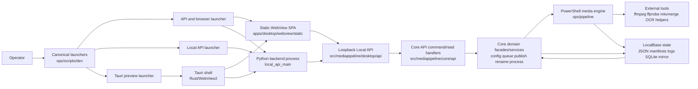
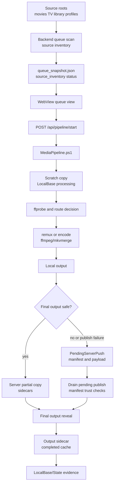
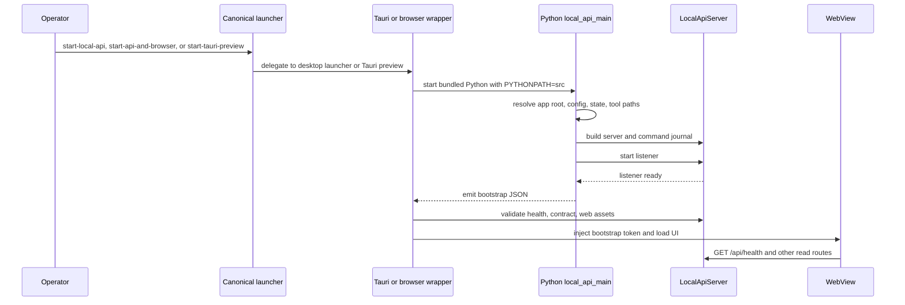
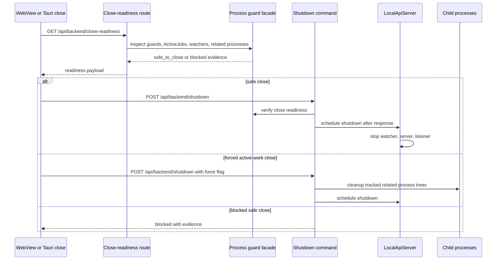
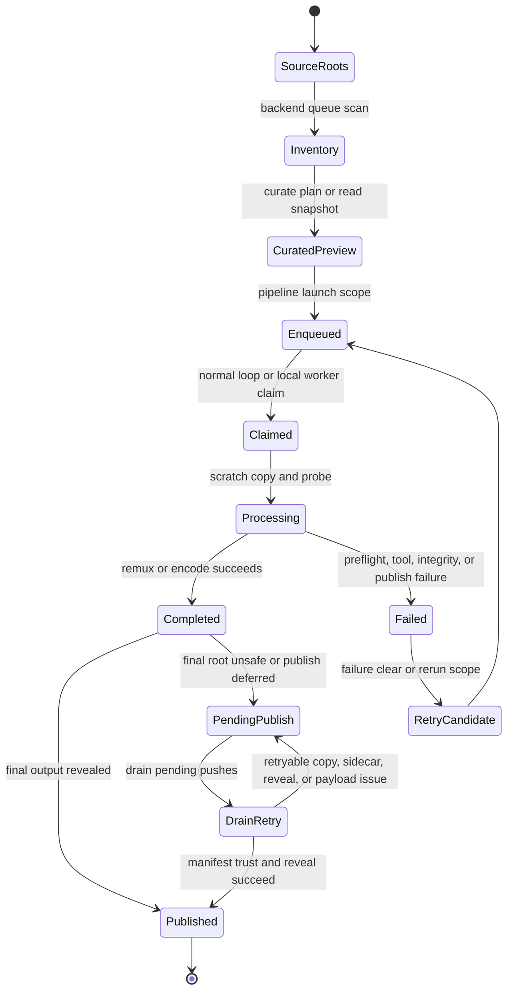
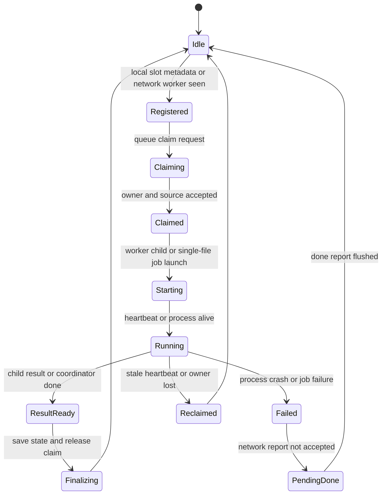
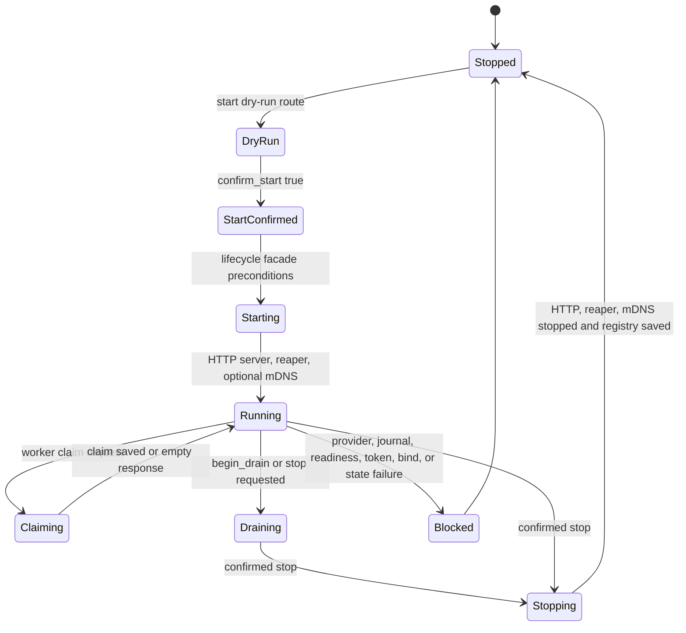
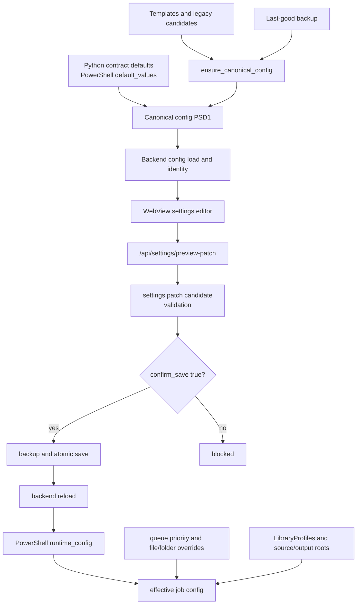
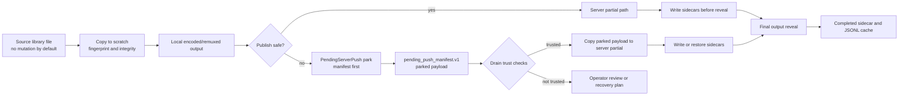
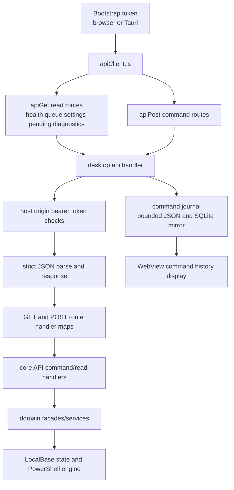

# Full Architecture Audit

Date: 2026-06-17

Repository path: local promoted workspace under `C:\Users\lmmye\Documents\Codex`

Task: Full Architecture Audit

Change packet: `MP-CHANGE-2026-0617-008`

Report type: source-backed documentation audit only. No runtime behavior, source code, config, generated contracts, schemas, tests, launchers, or operator workflows were intentionally changed.

## Executive Summary

MediaPipelineRemuxEncodeAIO is currently a Windows-first, single-operator media pipeline with a promoted WebView/Tauri desktop surface, a Python local API, Python domain services, a PowerShell media execution engine, and JSON-first runtime state under `LocalBase`. The strongest architecture boundary is policy ownership: the backend owns media policy, filesystem mutation, settings persistence, queue mutation, pending-publish drain, rename apply, command journaling, duplicate guards, and close-readiness decisions. The WebView and Tauri shell are intended to render state, submit bounded backend commands, and manage shell lifecycle only. This boundary is stated in `AGENTS.md`, `docs/CURRENT_PROJECT_STATE.md`, `docs/operator/NO_TOUCH_BOUNDARY_REGISTER.md`, `docs/architecture/TAURI_BACKEND_LIFECYCLE_BOUNDARY.md`, and route ownership inventories.

The architecture is safety-oriented but cross-runtime. Launch and shutdown span batch files, PowerShell wrappers, Rust/Tauri, Python, static JavaScript, and subprocesses. Queue and publish execution span Python preview/read services and PowerShell mutation paths. State is persisted mainly as JSON files and manifests, with SQLite described as a diagnostic mirror. This makes drift and ownership ambiguity the main architectural risks, especially where media safety depends on exact agreement between Python contracts, PowerShell execution, JSON artifacts, sidecars, manifests, and WebView operator controls.

The highest-risk confirmed findings are cross-runtime policy/state coupling, pending-publish manifest complexity, partial distributed/network lifecycle integration, brittle startup/shutdown ordering across runtimes, and lack of implemented repair/reconcile mutation routes for some drift states. These do not mean the system is unsafe today; they identify where future changes need the strictest validation.

## Scope and Exclusions

### Included scan areas

- `src/mediapipeline/core/`
- `src/mediapipeline/contracts/`
- `src/mediapipeline/desktop/`
- `src/mediapipeline/pipeline/`
- `src/mediapipeline/tools/`
- `ops/pipeline/`
- `apps/desktop/`
- `ops/scripts/`
- `ops/release/`
- `LocalBase` assumptions through state inventories, docs, config, and code references
- Active architecture, operator rules, generated summaries, inventories, route contracts, and validation docs

### Exclusions

- No media samples were processed.
- No local API, Tauri shell, browser, or PowerShell pipeline was launched for dynamic behavior proof.
- No source, config, contract, schema, generated API, launcher, test, or workflow files were modified.
- This audit did not attempt a full line-by-line review of every source file. It used the mandated generated summaries first, then opened full source only where high priority, incomplete for the task, or needed for exact evidence.
- Existing untracked and modified files outside this report and its change packet were treated as unrelated work and were not edited.

## Methodology and Exact Search Strategy

This audit followed `AGENTS.md` startup order:

1. `AGENTS.md`
2. `docs/CURRENT_PROJECT_STATE.md`
3. `docs/OPEN_WORK_CHECKLIST.md`
4. `docs/generated/PROJECT_INDEX.md`

The task matched the `ecc:agent-architecture-audit` skill, so the audit was structured around evidence-first subsystem mapping, lifecycle mapping, ranked architecture findings, ownership risks, and remediation guidance.

Before opening source files, generated summaries under `docs/generated/summaries/` were checked where available. Full source files were opened when the summary was high priority, did not list enough symbols, or exact source evidence was required.

Representative searches performed:

- `rg -n "NO_TOUCH|source mutation|pending publish|close-readiness|command journal|duplicate" docs`
- `rg -n "COMMAND_ROUTE_METHODS|LOCAL_API_.*ROUTE_CONTRACT|/api/backend/close-readiness|/api/queue|/api/pending-publish|/api/settings|/api/network|/api/pipeline" src/mediapipeline`
- `rg -n "backend/shutdown|close-readiness|force_active|beforeunload" apps/desktop/webview/static/assets/app.js`
- `rg -n "settings/save-patch|confirm_save|previewSettingsPatch|saveSettingsPatch" apps/desktop/webview/static/assets`
- `rg -n "queue/scan|queue/preview|pending|drain|pipeline/start|apiPost" apps/desktop/webview/static/assets`
- `rg -n "Invoke-MediaPipelineRound|WorkerChild|DrainPendingPushes|Invoke-MediaPipelineProcessFile" ops/pipeline`
- `rg -n "pending_push_manifest|Invoke-PendingDrainTransaction|Invoke-PendingParkTransaction|Write-Sidecar" ops/pipeline/engine/publish src/mediapipeline/core/publish`
- `rg -n "CoordinatorDispatcher|WorkerDispatcher|heartbeat|claim|pending_done_report|InFlightRegistry" src/mediapipeline/desktop/network`
- `rg -n "ensure_canonical_config|save_settings_patch|LibraryProfiles|runtime_config|default_values" src/mediapipeline ops/pipeline`
- `rg -n "ffmpeg|ffprobe|mkvmerge|mkvextract|Invoke-NativeProcess|ChildProcessGuard" src/mediapipeline ops/pipeline`

Important generated and documentary evidence:

- `docs/generated/PROJECT_INDEX.md`
- `docs/generated/DEPENDENCY_GRAPH.md`
- `docs/generated/FEATURE_FILE_MAP.md`
- `docs/generated/PIPELINE_MAP.md`
- `docs/architecture/MODULE_MAP.md`
- `docs/architecture/FILE_LIFECYCLE_MAP.md`
- `docs/architecture/CONFIG_KEY_GLOSSARY.md`
- `docs/inventories/API_ROUTE_INVENTORY.md`
- `docs/inventories/LOCAL_API_ROUTE_OWNERSHIP_MAP.md`
- `docs/inventories/COMMAND_OWNERSHIP_MATRIX.md`
- `docs/inventories/RUNTIME_ARTIFACT_INVENTORY.md`
- `docs/inventories/STATE_FILE_SCHEMA_REFERENCE.md`
- `docs/operator/NO_TOUCH_BOUNDARY_REGISTER.md`
- `docs/testing/VALIDATION_LADDER_RUNBOOK.md`

## Architecture Inventory

### 1. Major Subsystems and Responsibilities

| Subsystem | Responsibility | Primary evidence |
| --- | --- | --- |
| Canonical developer/operator launchers | Stable entrypoints under `ops/scripts/dev`, `ops/scripts/release`, and `ops/scripts/operator`; no legacy root launcher reintroduction | `AGENTS.md`, `ops/scripts/dev/start-local-api.bat`, `ops/scripts/dev/start-api-and-browser.bat`, `ops/scripts/dev/start-tauri-preview.bat` |
| Desktop launch wrappers | Resolve repo/app roots, set `PYTHONPATH`, choose bundled Python, launch local API or Tauri preview | `apps/desktop/launchers/Launch-MediaPipelineRemuxEncodeAIO-LocalApi.bat`, `apps/desktop/launchers/Launch-MediaPipelineRemuxEncodeAIO-ApiAndBrowser.ps1`, `apps/desktop/tauri/Launch-MediaPipelineRemuxEncodeAIO-TauriPreview.ps1` |
| Tauri shell | Owns shell window, Python backend process spawn, bootstrap token injection, single-instance guard, backend lifecycle monitor, close-readiness query, safe/force shutdown orchestration | `docs/architecture/TAURI_BACKEND_LIFECYCLE_BOUNDARY.md`, `apps/desktop/tauri/src-tauri/src/lib.rs`, `apps/desktop/tauri/src-tauri/src/backend_process.rs`, `apps/desktop/tauri/src-tauri/src/close_readiness.rs`, `apps/desktop/tauri/src-tauri/src/backend_lifecycle_monitor.rs`, `apps/desktop/tauri/src-tauri/src/single_instance_guard.rs` |
| WebView SPA | Static vanilla-JS operator UI; renders state, stages settings/queue/pending/network commands, submits backend routes with bearer token | `apps/desktop/webview/static/assets/apiClient.js`, `apps/desktop/webview/static/assets/app.js`, `apps/desktop/webview/static/assets/queueView.js`, `apps/desktop/webview/static/assets/launchView.js`, `apps/desktop/webview/static/assets/settingsView.js`, `apps/desktop/webview/static/assets/pendingPublishView.js`, `apps/desktop/webview/static/assets/networkView.js` |
| Local API host | Loopback HTTP server, static assets, token auth, strict JSON, route dispatch, command journal, background lifecycle | `src/mediapipeline/desktop/local_api_main.py`, `src/mediapipeline/desktop/api/server.py`, `src/mediapipeline/desktop/api/handler.py`, `src/mediapipeline/desktop/api/command_journal.py` |
| Route contracts and adapters | Read/command route contract exposure, command registry, GET/POST route handler maps | `src/mediapipeline/desktop/api/contract.py`, `src/mediapipeline/desktop/api/contract_read.py`, `src/mediapipeline/desktop/api/contract_command.py`, `src/mediapipeline/core/api/commands.py`, `src/mediapipeline/desktop/api/routes_command.py`, `docs/inventories/API_ROUTE_INVENTORY.md` |
| Core domain services | Backend-owned settings, queue, publish, rename, metrics, diagnostics, maintenance, process, schedule, storage, and orchestration policies | `src/mediapipeline/core/`, `docs/generated/FEATURE_FILE_MAP.md`, `docs/architecture/MODULE_MAP.md` |
| Contracts | Pydantic config and generated schema contracts for backend/UI/runtime agreement | `src/mediapipeline/contracts/config.py`, `src/mediapipeline/contracts/`, `docs/generated/FEATURE_FILE_MAP.md` |
| PowerShell media engine | Actual media processing, ffprobe/ffmpeg/mkvmerge execution, scratch copies, queue rounds, local workers, publish/park/drain, sidecars | `ops/pipeline/entrypoints/MediaPipeline.ps1`, `ops/pipeline/engine/queue/pipeline_engine.ps1`, `ops/pipeline/engine/process/pipeline_processing.ps1`, `ops/pipeline/engine/storage/scratch_copy.ps1`, `ops/pipeline/engine/publish/` |
| Pipeline helper CLIs | Python helpers used by pipeline, especially ASS-to-SRT subtitle conversion | `src/mediapipeline/pipeline/ass_to_srt_cli.py` |
| Distributed network mode | Coordinator/worker lifecycle, HMAC worker HTTP endpoints, claims, heartbeat, reclaim, worker state | `docs/architecture/NETWORK_LIFECYCLE_COMMAND_CONTRACT.md`, `src/mediapipeline/core/network/lifecycle_facade.py`, `src/mediapipeline/desktop/network/coordinator.py`, `src/mediapipeline/desktop/network/coordinator_http_handlers.py`, `src/mediapipeline/desktop/network/worker.py`, `src/mediapipeline/desktop/network/worker_loops.py`, `src/mediapipeline/desktop/network/worker_state.py` |
| Tools and change control | Developer tooling, generated summaries, release/change packets, validators | `src/mediapipeline/tools/`, `ops/release/changes/unreleased/`, `AGENTS.md` |
| LocalBase runtime state | JSON authoritative state, JSONL manifests, logs, command history, pending manifests, SQLite diagnostic mirror | `docs/inventories/RUNTIME_ARTIFACT_INVENTORY.md`, `docs/inventories/STATE_FILE_SCHEMA_REFERENCE.md`, `docs/architecture/MODULE_MAP.md` |
| Active architecture and operator rules | Safety invariants, validation ladder, no-touch boundaries, current promotion state | `AGENTS.md`, `docs/CURRENT_PROJECT_STATE.md`, `docs/OPEN_WORK_CHECKLIST.md`, `docs/operator/NO_TOUCH_BOUNDARY_REGISTER.md`, `docs/testing/VALIDATION_LADDER_RUNBOOK.md` |

### 2. Module and Package Dependency Map

The intended dependency shape is a layered runtime with file-based integration at the backend/PowerShell boundary:

1. Operator starts canonical launchers in `ops/scripts/dev/`.
2. Launchers call desktop wrappers under `apps/desktop/launchers/` or `apps/desktop/tauri/`.
3. Tauri or browser surfaces use the Python local API over loopback HTTP.
4. `src/mediapipeline/desktop/api/` owns HTTP concerns: auth, static files, handler maps, route contracts, strict JSON responses, and command journaling.
5. `src/mediapipeline/core/api/` maps command routes to aggregate backend command handler methods. `src/mediapipeline/core/api/commands.py` is the canonical POST route registry, and `src/mediapipeline/desktop/api/routes_command.py` consumes it to build POST handler specs.
6. Core API handlers call facades and services under `src/mediapipeline/core/<domain>/`.
7. Media mutation is executed mainly by `ops/pipeline/entrypoints/MediaPipeline.ps1` and `ops/pipeline/engine/<domain>/`.
8. Python and PowerShell exchange state through `LocalBase/State`, manifests, command outputs, queue snapshots, progress logs, and config files.

`docs/architecture/MODULE_MAP.md` explicitly describes this layering: Tauri calls backend HTTP and OS dialogs, not PowerShell; HTTP API calls application facades, not services/PowerShell directly; facades call services; services may use filesystem and PowerShell config readers; PowerShell uses state/tools/shares, not HTTP; frontend calls only backend HTTP/window APIs.

`docs/generated/DEPENDENCY_GRAPH.md` confirms the API domain is a high-fan-in surface, with generated aggregate edges such as tests to API, scripts to API, config to API, process to API, queue to API, and network to API. This supports the finding that route/API ownership is a central coupling point even where module imports do not form a direct circular import.

Confirmed cross-runtime state couplings from `docs/architecture/MODULE_MAP.md` include:

- `priority_manifest.json`: Python writes, PowerShell queue plan reads.
- `queue_strategy.json`: Python writes, PowerShell reads.
- `file_overrides.json`: Python writes, PowerShell reads.
- `queue_snapshot.json`, progress, events, ActiveJobs, Completed, Failures, Pending: PowerShell writes, Python reads.
- flags: Python writes, PowerShell reads.
- config PSD1: PowerShell imports and Python reads through helper paths.

No source-level Python import cycle was confirmed by this audit. The confirmed cycle is operational rather than import-based: Python creates or previews state consumed by PowerShell, while Python also reads PowerShell-produced runtime evidence to drive WebView decisions.

### 3. Startup Paths from Canonical Launchers to API/UI Readiness

#### Local API launcher

`ops/scripts/dev/start-local-api.bat` resolves the repository root and delegates to `apps/desktop/launchers/Launch-MediaPipelineRemuxEncodeAIO-LocalApi.bat`. The desktop launcher sets `PYTHONPATH=%PROJECT_ROOT%\src`, prefers `apps\desktop\runtime\Python\python.exe`, and starts `-m mediapipeline.desktop.local_api_main --app-root "%DESKTOP_ROOT%"`.

In `src/mediapipeline/desktop/local_api_main.py`, `build_backend` resolves app root and repository root, creates the desktop service, ensures canonical config with `ensure_canonical_config`, resolves state, verifies key tool paths including FFmpeg, ffprobe, and mkvmerge, creates the local API facade/server, and configures the command journal under `RunLogs/local_api_command_history.json`.

`local_api_main.main` starts background tasks, calls `server.start()`, records `server_listening`, prints bootstrap JSON, then starts the watcher only after the listener/bootstrap path is live. This sequencing matters because WebView/Tauri readiness depends on a real listener and bootstrap evidence before background watchers begin.

#### API plus browser launcher

`ops/scripts/dev/start-api-and-browser.bat` delegates to `apps/desktop/launchers/Launch-MediaPipelineRemuxEncodeAIO-ApiAndBrowser.ps1`. That script resolves the desktop root, validates Python import posture, starts the local API on port `8765`, polls `/api/health`, and opens the browser. Token auth is enabled unless explicit development bypass is configured.

#### Tauri preview launcher

`ops/scripts/dev/start-tauri-preview.bat` delegates to `apps/desktop/tauri/Launch-MediaPipelineRemuxEncodeAIO-TauriPreview.ps1`. `-CheckOnly` validates Node/npm/cargo/Visual Studio/Python posture. Normal mode runs the Tauri dev command.

In `apps/desktop/tauri/src-tauri/src/lib.rs`, setup acquires a single-instance guard, resolves the desktop root, starts the Python backend, builds the bootstrap initialization script, validates the loopback URL, manages backend state, starts the lifecycle monitor, and creates the WebView against the backend URL. `backend_process.rs` starts Python with `-m mediapipeline.desktop.local_api_main --app-root ... --shell-surface tauri --emit-startup-progress`, injects `PYTHONPATH=src`, reads bootstrap schema `desktop_local_api_bootstrap.v1`, and validates health, route contract, and web assets before considering the backend ready.

### 4. Shutdown and Close-Readiness Paths

The backend owns close readiness. `docs/operator/NO_TOUCH_BOUNDARY_REGISTER.md` and `docs/architecture/TAURI_BACKEND_LIFECYCLE_BOUNDARY.md` treat close-readiness, command journal, duplicate-command guards, and backend shutdown as release-critical safety mechanisms.

The read route `/api/backend/close-readiness` is exposed in `src/mediapipeline/desktop/api/contract_read.py`. `src/mediapipeline/core/processes/guard_facade.py` and `src/mediapipeline/core/processes/guard_policy.py` compute readiness by inspecting launch guards, related processes, promotion state, queue scan posture, schedule watcher, ActiveJobs, progress, and audit state. Unsafe or unknown evidence blocks normal close.

The WebView reads close readiness in `apps/desktop/webview/static/assets/app.js`, renders readiness state, warns on `beforeunload`, and only enables the WebView backend shutdown button when lifecycle evidence allows it. The WebView POSTs `/api/backend/shutdown` with a safe-close reason.

The Tauri shell queries close readiness through `apps/desktop/tauri/src-tauri/src/close_readiness.rs`. Close handling in `lib.rs` calls a close-request decision path. Safe close triggers safe backend shutdown; confirmed force close maps to a force-active-work mode. `backend_process.rs` POSTs `/api/backend/shutdown` and treats blocked safe-only shutdown distinctly from confirmed force shutdown.

`src/mediapipeline/core/api/commands_process.py` implements `_backend_shutdown_payload`. It checks `shutdown_request`, asks the backend for close readiness, returns blocked if active work is unsafe and `force_active_work_shutdown` is not true, and schedules shutdown after the response when allowed. For force shutdown it attempts cleanup of tracked/related pipeline processes.

`src/mediapipeline/desktop/api/server.py` stops the HTTP server, cancels schedule watcher state, stops watch folders, calls server shutdown/close, and joins the listener thread. This gives the process a bounded local shutdown path, but it relies on the higher layers to ask at the right time.

### 5. Queue Lifecycle: Discovery, Enqueue, Claim, Process, Complete, Fail, Retry

The queue lifecycle is split between Python read/preview/control services and the PowerShell execution engine.

Discovery and preview:

- `src/mediapipeline/core/queue/service.py` owns backend queue source scanning. `start_queue_source_scan` requires `LocalBase/State`, supports `inventory_then_curate`, `inventory_only`, and `curate_only`, rejects unsupported scope, observes duplicate active scan state, starts a worker thread, and writes `desktop_queue_scan_status.v1`.
- `src/mediapipeline/core/queue/source_inventory.py` labels scan evidence authority as `backend_queue_scan_service` and states the mutation guardrail: reads source metadata and writes state artifacts only; it does not process, rename, delete, move, publish, drain, or mutate source media.
- `src/mediapipeline/core/queue/service.py` builds queue preview from fresh `queue_snapshot.json` or by spawning the PowerShell pipeline with `-EmitQueuePlan`.
- `src/mediapipeline/core/queue/facade.py` merges queue scan status, source inventory, `queue_snapshot.json`, priority manifest, file overrides, and runtime events for the WebView queue view.
- `apps/desktop/webview/static/assets/queueView.js` submits `/api/queue/scan`, shows a mutation guardrail, and treats UI filtering as display-only. The same file posts queue priority and strategy routes.

Execution:

- `ops/pipeline/engine/queue/pipeline_engine.ps1` runs `Invoke-MediaPipelineRound`. The round checks flags, retries parked outputs before source discovery, refreshes pending-publish index, scans/loads the queue plan, writes `queue_snapshot`, and then processes files through local worker slots or the normal path.
- `ops/pipeline/entrypoints/MediaPipeline.ps1` is the stable PowerShell entrypoint. Its `-DrainPendingPushes` branch refreshes pending indexes and runs `Invoke-RetryPendingPushes -Force`. Its worker-child branch validates the single-file path, resolves library context, loads processed indexes, and calls `Invoke-MediaPipelineProcessFile`.
- `ops/pipeline/engine/process/pipeline_processing.ps1` performs file-level preflight, parse, processed/failure checks, stability checks, output path planning, ActiveJob/progress setup, ffprobe probing, route planning, override application, and then calls remux/encode functions. It emits completed, failed, or stopped evidence with publish details.

Completion, failure, and retry:

- `ops/pipeline/engine/publish/publish_completion.ps1` publishes successful local outputs, or parks them when final root is unsafe or publish reveal/copy/sidecar preflight fails.
- Completed jobs are recorded via sidecar and append-only JSONL cache in `ops/pipeline/engine/publish/sidecar.ps1`.
- Failures are tracked under the failure state files described by `docs/inventories/RUNTIME_ARTIFACT_INVENTORY.md`.
- Pending publish retry/drain is driven by pending manifests and `Invoke-RetryPendingPushes`, with automatic drain trust checks described in `docs/inventories/STATE_FILE_SCHEMA_REFERENCE.md`.

### 6. Worker Lifecycle: Registration, Start, Heartbeat, Work, Exit, Reclaim

There are two worker models.

#### Local PowerShell worker slots

`ops/pipeline/engine/queue/worker_claim_store.ps1` implements a local worker claim schema `local_worker_claims.v1`. Active statuses include `claimed`, `starting`, `running`, `result_ready`, and `finalizing`. It verifies process liveness, start time, metadata schema, claim id, owner pid, and result paths. It uses a mutex-protected claim path, prevents duplicate active claims for the same source, and releases or archives stale claims.

`ops/pipeline/engine/queue/worker_process.ps1` starts child PowerShell workers with `Start-Process -WindowStyle Hidden`, passes `-WorkerChild`, `-WorkerSlotId`, `-WorkerRunId`, `-WorkerClaimId`, and result path arguments, redirects stdout/stderr, writes metadata, and stops child trees after a grace period when needed.

`ops/pipeline/entrypoints/MediaPipeline.ps1` implements worker-child mode. It resolves the source path, maps it to movie or TV context, processes a single file, writes a worker-child result, and exits.

#### Network coordinator/worker mode

`src/mediapipeline/core/network/lifecycle_facade.py` owns backend network lifecycle commands. It validates role/action, dry-run versus confirmed start/stop, provider availability, duplicate start guards, close-readiness active-work posture, coordinator bind/port/heartbeat/token posture, worker URL/name/token/path map/pending-done posture, and strict journal recording.

`src/mediapipeline/desktop/network/coordinator.py` creates `CoordinatorDispatcher`, an HTTP server with HMAC-signed worker requests, `InFlightRegistry`, stale reaper, optional mDNS, and serialized claim handling.

`src/mediapipeline/desktop/network/coordinator_http_handlers.py` handles claim, done, heartbeat, and worker routes. Claim handling records worker identity, rejects claims when not accepting work, serializes scan-and-claim under `_claim_lock`, saves inflight state before responding, and rolls back on save/send failure. Done handling validates worker/job ownership and can record late terminal reports.

`src/mediapipeline/desktop/network/coordinator_lifecycle.py` starts/stops HTTP, reaper, and mDNS. The reaper reclaims stale jobs after heartbeat timeout and persists registry state.

`src/mediapipeline/desktop/network/worker.py` creates `WorkerDispatcher`, polls the coordinator, launches backend-owned single-file jobs through the app, heartbeats every 30 seconds, and persists crash recovery state in `worker_state.json`.

`src/mediapipeline/desktop/network/worker_loops.py` keeps one active network claim at a time. It flushes pending done reports before accepting new work, resolves source paths by library-relative/manual path mapping, releases unstartable claims, posts heartbeats, and handles coordinator reclaim responses.

`src/mediapipeline/desktop/network/worker_state.py` writes worker state atomically with temp/fsync/replace and blocks new claims while unreadable or pending done evidence needs repair. This is a safety-first single-slot model, not a high-throughput distributed scheduler.

### 7. Coordinator Lifecycle and Ownership Boundaries

Coordinator lifecycle is backend-owned and route-guarded:

- The public API routes are `/api/network/coordinator/start-dry-run`, `/api/network/coordinator/start`, `/api/network/coordinator/stop-dry-run`, and `/api/network/coordinator/stop`, listed in `src/mediapipeline/core/api/commands.py` and `src/mediapipeline/desktop/api/contract_command.py`.
- `docs/architecture/NETWORK_LIFECYCLE_COMMAND_CONTRACT.md` defines route exposure gates, dry-run/no-mutation behavior, confirmation requirements, provider guards, state preservation, and fail-closed semantics.
- `src/mediapipeline/core/network/lifecycle_facade.py` enforces the role/action contract, strict journaling, duplicate lifecycle guards, close-readiness checks, and cleanup if journaling fails after start.
- `CoordinatorDispatcher` owns claim state through `InFlightRegistry`; WebView does not claim/reclaim/release work. `apps/desktop/webview/static/assets/networkView.js` explicitly displays mutation guardrail text saying the dashboard reads queue and worker evidence only and cannot claim, reclaim, release, retry, drain, publish, rename, save settings, or touch media files.

### 8. Configuration Lifecycle: Defaults, Templates, Profiles, Overrides, Persistence

Configuration exists in both Python contract space and PowerShell runtime space.

Python contract and validation:

- `src/mediapipeline/contracts/config.py` defines the canonical Pydantic contract, flat PSD1 field names, required config keys, and PowerShell config key order.
- `src/mediapipeline/core/config/validation.py` validates contract values, rejects display/evidence-only keys, checks required/numeric/options/root path/OCR tool/library profile constraints, and warns about transitional `LibraryProfiles` mirrors of `SourceMovies`, `SourceTV`, and `Outsource`.
- `src/mediapipeline/core/config/settings_patch_candidate_facade.py` builds candidate settings patches. It only permits allowed keys, rejects spelling problems, sensitive redacted placeholders, source/original-file mutation settings, and unregistered keys, and normalizes `LibraryProfiles`.

Config discovery and recovery:

- `src/mediapipeline/core/config/recovery.py` implements `ensure_canonical_config`, finds user config candidates, copies legacy/canonical config into durable user config when safe, avoids deleting or overwriting existing canonical config, and can restore last-good config if safe.

Persistence:

- `src/mediapipeline/core/orchestration/settings_patch_facade.py` implements `save_settings_patch`. It requires `confirm_save is True`, blocks on config identity issues, uses a nonblocking settings save lock, builds and validates a candidate, serializes PSD1, writes via a saver with backup, hot-applies network worker settings where available, and returns evidence.
- `src/mediapipeline/core/api/commands_settings.py` implements `/api/settings/save-patch` by calling the facade and then reloading backend config on success.
- `src/mediapipeline/core/config/save_runner.py` validates the document before save, rejects directory targets, backs up existing files, and writes atomically.

PowerShell runtime:

- `ops/pipeline/engine/config/default_values.ps1` defines defaults, including incoming/movie/TV/processed roots, default library profiles, and `LocalBase` scratch assumptions.
- `ops/pipeline/engine/config/runtime_config.ps1` initializes script-scope config used by processing, including subtitle/audio/FFmpeg/timeouts/OCR/Dovi/HDR tool paths.

UI:

- `apps/desktop/webview/static/assets/settingsView.js` posts `/api/settings/save-patch` with `confirm_save: true`.
- `apps/desktop/webview/static/assets/settings/patchReview.js` provides local hints and readiness text but warns operators to run backend Preview Patch before Save Patch.
- `apps/desktop/webview/static/assets/settingsLibraries.js` stages `LibraryProfiles` changes and sends them through backend preview/save routes.

Effective processing configuration is then further modified by queue priority, file overrides, folder/series overrides, and per-job active overrides, as shown by `src/mediapipeline/core/queue/facade.py`, `src/mediapipeline/core/api/file_overrides/`, and `ops/pipeline/engine/process/pipeline_processing.ps1`.

### 9. File Movement Lifecycle: Source, Scratch, Output, Pending Publish, Drain, Sidecars, Manifests

The active documented lifecycle is:

`source_library -> scratch_copy -> processing -> local_output -> pending_publish or final_output -> failure_review`

This comes from `docs/architecture/FILE_LIFECYCLE_MAP.md` and is reinforced by `docs/operator/NO_TOUCH_BOUNDARY_REGISTER.md`: source mutation is forbidden by default, source files are copied to scratch, and deletion/overwrite of source files requires a specifically named intentionally enabled safe-delete setting.

Scratch:

- `ops/pipeline/engine/storage/scratch_copy.ps1` creates a scratch container, validates scratch paths remain under the processing directory boundary, copies the source with `Copy-FileRobocopy`, checks fingerprint/integrity, distinguishes transient scratch errors from source integrity problems, and writes the fingerprint only after scratch integrity passes.

Output planning:

- `ops/pipeline/engine/paths/output_path_planning.ps1` computes local and server output paths from library profiles or defaults. It returns `LocalOut`, `ServerOut`, `RelativePath`, and library evidence.

Processing:

- `ops/pipeline/engine/process/pipeline_processing.ps1` performs route planning and calls encode/remux paths after source probe and preflight.

Immediate publish:

- `ops/pipeline/engine/publish/publish_completion.ps1` writes publish evidence, performs TX3G sidecar preflight, copies local output to a partial server path, writes sidecars before final media reveal, and calls partial publish helpers. On copy/reveal/sidecar failure it parks output rather than forcing an unsafe publish.
- `ops/pipeline/engine/publish/publish_partial.ps1` uses `.mp-publish-partial` paths and reveal operations with backup/restore logic.

Pending publish:

- `ops/pipeline/engine/publish/pending_park_transaction.ps1` writes schema `pending_push_manifest.v1`, validates manifest round-trip before moving media, copies sidecars atomically, moves local output into pending storage, marks `manifest_state` as `parked`, and cleans up sidecar/manifest artifacts if media was not parked.
- `ops/pipeline/engine/publish/pending_manifest_store.ps1` validates pending manifests, required fields, states, sidecars, trusted source/destination boundaries, and drain eligibility. It ensures server output is under configured output root and outside source roots, `LocalBase`, and pending roots.
- `ops/pipeline/engine/publish/pending_drain_transaction.ps1` trusts the manifest first, publishes to partial server paths, writes/restores sidecars, reveals final media, leaves manifest/local payload for retry on failure, and removes pending local artifacts only under the artifact root boundary after success.

Sidecars and manifests:

- `ops/pipeline/engine/publish/sidecar.ps1` writes sidecar JSON through temp/replace with round-trip validation and appends completed job JSONL cache entries. It documents the outsource sidecar as source of truth and the local completed manifest as cache.
- `src/mediapipeline/core/publish/pending_manifest.py`, `src/mediapipeline/core/publish/pending_facade.py`, and `src/mediapipeline/core/publish/pending_service.py` are read/preview/reporting surfaces for pending state and do not drain or mutate files directly.

### 10. UI and Backend Communication

The static UI uses a bootstrap token and loopback API:

- `apps/desktop/webview/static/assets/apiClient.js` reads bootstrap from script data and `window.MEDIA_PIPELINE_BOOTSTRAP` or `window.MEDIA_PIPELINE_TAURI_BOOTSTRAP`, extracts `apiBase` and token, scrubs/freezes tokenless bootstrap objects, sends `Authorization: Bearer <token>`, uses no-store GET requests, parses JSON, and exposes `window.mediaPipelineApi` plus transitional `window.apiGet` and `window.apiPost`.
- `apps/desktop/tauri/src-tauri/src/lib.rs` injects the Tauri bootstrap object into WebView.
- `apps/desktop/webview/static/assets/tauriLifecycleBridge.js` listens to Tauri backend lifecycle events and dispatches browser events.

The local API handles HTTP discipline:

- `src/mediapipeline/desktop/api/handler.py` treats `/api/health` and static assets specially, validates host/origin/auth for other routes, enforces strict JSON parsing for POST, validates payload shape, dispatches through route handler maps, returns strict JSON with `allow_nan=False`, and records command journal entries unless suppressed or already strictly recorded.
- `src/mediapipeline/desktop/api/handler_policy.py` and `src/mediapipeline/desktop/api/command_journal_policy.py` define route metadata and bounded command evidence redaction/summarization.
- `src/mediapipeline/desktop/api/command_journal.py` writes a bounded command-result journal, trims to 50 entries, saves JSON atomically with temp/fsync/replace retry, and mirrors entries to SQLite through `open_state_db(...).record_command`.

Backend command ownership is documented by:

- `docs/inventories/API_ROUTE_INVENTORY.md`: 116 routes, 46 GET and 70 POST, with mutation classes.
- `docs/inventories/LOCAL_API_ROUTE_OWNERSHIP_MAP.md`: mutation routes are backend-owned; WebView never resolves paths, selects output paths, chooses encode settings, or launches processing independently.
- `docs/inventories/COMMAND_OWNERSHIP_MATRIX.md`: backend route groups, confirmation requirements, strict JSON handling, command journaling, duplicate guards, and close-readiness requirements.
- `docs/architecture/LOCAL_API_EVIDENCE_MUTATION_MATRIX.md`: frontend prohibited actions include arbitrary file reads/writes, config/manifest/journal/log/state writes, media mutation, media policy selection, and guard bypasses.

### 11. State Persistence: JSON, SQLite Mirror, Manifests, Logs, Queue Files, Settings

`docs/inventories/RUNTIME_ARTIFACT_INVENTORY.md` states that JSON state files are authoritative and SQLite is a diagnostic mirror. Important state families include:

- `LocalBase/State/queue_snapshot.json`
- queue scan status and source inventory
- queue priority, queue strategy, and file overrides
- ActiveJobs state
- progress and event state
- Completed job JSONL cache and output sidecars
- Failures state
- PendingServerPush manifests and payloads
- command journal under `RunLogs/local_api_command_history.json`
- schedule/watch-folder flags
- sample validation and audit/rerun state
- UI preferences
- live config and saved settings
- `State/mediapipeline_state.sqlite3` diagnostic mirror

`docs/inventories/STATE_FILE_SCHEMA_REFERENCE.md` describes completed job sidecars, pending push manifest fields, drain states, and auto-drain trust requirements.

The architecture assumes manual deletion of these runtime artifacts can be unsafe. This is especially true for PendingServerPush, ActiveJobs, command journal, completed sidecars, queue snapshot, failure state, and worker state.

### 12. External Tools and Subprocesses

External process ownership is concentrated in the backend and PowerShell engine:

- `src/mediapipeline/desktop/local_api_main.py` verifies FFmpeg, ffprobe, and mkvmerge paths during backend startup evidence collection.
- `ops/pipeline/entrypoints/MediaPipeline.ps1` resolves ffmpeg, ffprobe, mkvmerge, and mkvextract through shared executable resolution.
- `ops/pipeline/engine/shared/executable_resolution.ps1` prefers bundled relative candidates and only uses system tools when `AllowSystemTools` permits it.
- `ops/pipeline/engine/shared/native.ps1` centralizes native process launching through `Invoke-NativeProcess`, `Invoke-FFprobeCommand`, `Invoke-FFmpegCommand`, `Invoke-MkvmergeCommand`, `Invoke-MkvextractCommand`, OCR wrappers, Python tool wrappers, repro command capture, timeout handling, stop flag polling, stdout/stderr capture, and process tree termination.
- `ops/pipeline/engine/process/ffmpeg_progress.ps1` wraps FFmpeg progress, probes duration with ffprobe, writes tool-started events, handles pause/stop/timeout, saves stderr tails and repro commands, and classifies mkvmerge warnings that risk stream loss.
- `ops/pipeline/engine/process/pipeline_plan_executor.ps1` is dry-run only for native command shape modeling; production execution remains on the existing PowerShell path.
- `src/mediapipeline/pipeline/ass_to_srt_cli.py` extracts ASS subtitles through FFmpeg with timeout handling and `ChildProcessGuard`, then uses `pysubs2` parsing and style filters.
- `ops/pipeline/engine/config/runtime_config.ps1` carries OCR, Dovi, HDR10Plus, and timeout/tool path settings.

### 13. Safety Mechanisms

Confirmed safety mechanisms include:

- Source mutation forbidden by default: `AGENTS.md`, `docs/operator/NO_TOUCH_BOUNDARY_REGISTER.md`, `ops/pipeline/engine/storage/scratch_copy.ps1`.
- Scratch-copy integrity and boundary checks: `ops/pipeline/engine/storage/scratch_copy.ps1`.
- Backend-owned media policy and mutation: `AGENTS.md`, `docs/inventories/LOCAL_API_ROUTE_OWNERSHIP_MAP.md`, `docs/architecture/LOCAL_API_EVIDENCE_MUTATION_MATRIX.md`.
- Pending publish park/drain flow with manifest evidence: `ops/pipeline/engine/publish/pending_park_transaction.ps1`, `pending_manifest_store.ps1`, `pending_drain_transaction.ps1`, `docs/inventories/STATE_FILE_SCHEMA_REFERENCE.md`.
- Strict JSON request/response handling: `src/mediapipeline/desktop/api/handler.py`.
- Command journal and bounded evidence redaction: `src/mediapipeline/desktop/api/command_journal.py`, `src/mediapipeline/desktop/api/command_journal_policy.py`.
- Duplicate/in-flight guards: queue scan duplicate observation in `src/mediapipeline/core/queue/service.py`, settings save lock in `src/mediapipeline/core/orchestration/settings_patch_facade.py`, network lifecycle lock/duplicate start guards in `src/mediapipeline/core/network/lifecycle_facade.py`, and UI in-flight guards in files such as `apps/desktop/webview/static/assets/app.js`, `queueView.js`, and `pendingPublishView.js`.
- Close-readiness checks before safe shutdown: `src/mediapipeline/core/processes/guard_facade.py`, `src/mediapipeline/core/processes/guard_policy.py`, `src/mediapipeline/core/api/commands_process.py`, Tauri close readiness files.
- Route confirmation requirements for high-risk actions: `docs/inventories/COMMAND_OWNERSHIP_MATRIX.md`, `src/mediapipeline/core/network/lifecycle_facade.py`, `src/mediapipeline/core/orchestration/settings_patch_facade.py`, `apps/desktop/webview/static/assets/launchView.js`.
- Validation ladder for high-risk media changes: `docs/testing/VALIDATION_LADDER_RUNBOOK.md`.

## Evidence-Backed Findings Ranked by Severity

Classification meanings:

- Confirmed: directly evidenced in source, generated docs, inventories, or active architecture docs.
- Likely: supported by multiple evidence points but needs targeted dynamic validation or broader source review.
- Needs verification: plausible risk that requires runtime validation, generated audit output, or cleanup of unrelated worktree noise.

### F-01 High Confirmed - Cross-runtime policy and state coupling is the main architecture risk

Category: hidden coupling, duplicated policy logic, media/data safety risk.

Evidence:

- `docs/architecture/MODULE_MAP.md` lists Python-written files consumed by PowerShell and PowerShell-written files consumed by Python, including `priority_manifest.json`, `queue_strategy.json`, `file_overrides.json`, `queue_snapshot.json`, progress/events, ActiveJobs, Completed, Failures, Pending, and flags.
- `src/mediapipeline/core/queue/service.py` previews queue data from `queue_snapshot.json` or by invoking `-EmitQueuePlan`, while `ops/pipeline/engine/queue/pipeline_engine.ps1` performs the actual queue round.
- `src/mediapipeline/contracts/config.py`, `src/mediapipeline/core/config/validation.py`, `ops/pipeline/engine/config/default_values.ps1`, and `ops/pipeline/engine/config/runtime_config.ps1` all participate in config meaning.
- `src/mediapipeline/core/publish/pending_manifest.py` reads pending manifests, while `ops/pipeline/engine/publish/pending_manifest_store.ps1` and `pending_drain_transaction.ps1` enforce mutation safety.

Risk:

Small changes to Python preview logic, PowerShell execution logic, or JSON schema assumptions can drift without compile-time feedback. In media workflows, this can misrepresent launch scope, output targets, pending publish eligibility, or effective config.

Remediation:

Promote shared contracts for the highest-risk state files into generated schemas or Python/PowerShell round-trip tests. Keep Python preview and PowerShell execution covered by paired tests for queue plan, file override, pending manifest, config, and publish evidence.

### F-02 High Confirmed - Pending publish correctness depends on a complex manifest and sidecar state machine

Category: runtime state assumptions, unclear ownership, media/data safety risk.

Evidence:

- `ops/pipeline/engine/publish/pending_park_transaction.ps1` writes `pending_push_manifest.v1`, copies sidecars, validates manifest round-trip, then moves local media into pending storage.
- `ops/pipeline/engine/publish/pending_manifest_store.ps1` validates required fields, drainable states, trusted server destinations, trusted sidecars, and repair trust.
- `ops/pipeline/engine/publish/pending_drain_transaction.ps1` publishes from pending to server partial path, writes sidecars, reveals final output, and leaves artifacts for retry on failure.
- `ops/pipeline/engine/publish/sidecar.ps1` treats outsource sidecar as source of truth and completed JSONL as local cache.
- `docs/inventories/STATE_FILE_SCHEMA_REFERENCE.md` defines required pending manifest fields and auto-drain trust requirements.

Risk:

The safety model is robust but intricate. A change that weakens manifest trust, sidecar ordering, server root checks, or cleanup boundaries could strand outputs, duplicate publishes, or reveal media to an unsafe destination.

Remediation:

Create focused fixture tests for each pending manifest state transition: park success, park rollback, copy failure, reveal failure, sidecar failure, missing payload, already published, and successful cleanup. Treat these as release-gate tests for any publish/drain change.

### F-03 High Confirmed - Network lifecycle is exposed through routes but remains heavily guarded and operationally partial

Category: unclear ownership, scalability limits, brittle lifecycle ordering.

Evidence:

- `docs/architecture/NETWORK_LIFECYCLE_COMMAND_CONTRACT.md` defines dry-run/confirmed route gates, provider guards, confirmation booleans, command journal requirements, and fail-closed behavior.
- `src/mediapipeline/core/network/lifecycle_facade.py` checks provider methods, role/action, duplicate starts, close readiness, coordinator and worker preconditions, pending done reports, and strict journaling.
- `src/mediapipeline/desktop/network/coordinator.py` owns HMAC HTTP worker endpoints, `InFlightRegistry`, reaper, and mDNS.
- `src/mediapipeline/desktop/network/worker.py` and `worker_loops.py` implement a single-slot worker polling model with pending-done flushing before new claims.
- `apps/desktop/webview/static/assets/networkView.js` says the UI reads queue and worker evidence only and cannot claim/reclaim/release work.

Risk:

Distributed mode has careful safety posture but spans lifecycle routes, provider availability, coordinator registry state, worker state, network tokens, path maps, heartbeat, and pending done recovery. It is more fragile than the single-operator local path and can fail in ways that leave claims held until repair.

Remediation:

Keep network lifecycle behind dry-run and explicit confirmation. Add end-to-end coordinator/worker simulations for start, claim, heartbeat, done, stale reclaim, pending done retry, path-map rejection, and shutdown. Avoid expanding distributed mutation routes until those tests are stable.

### F-04 High Confirmed - Startup and shutdown ordering spans too many runtimes to rely on manual reasoning alone

Category: brittle startup/shutdown ordering, hidden coupling.

Evidence:

- Startup paths include `ops/scripts/dev/start-local-api.bat`, desktop `.bat` launcher, `local_api_main.py`, local API server, Tauri `lib.rs`, `backend_process.rs`, bootstrap script injection, health checks, route contract validation, and web asset validation.
- `local_api_main.py` starts background tasks, `server.start()`, records bootstrap/listening state, then starts watchers.
- Shutdown paths include WebView close-readiness UI, Tauri close readiness, backend shutdown route, process cleanup, server stop, watcher stop, and Tauri process-tree termination fallback.
- `src/mediapipeline/core/processes/guard_facade.py` and `guard_policy.py` determine safe-to-close from multiple runtime artifacts.

Risk:

A sequencing regression can create false readiness, fail to open the UI, orphan FFmpeg/PowerShell processes, leave stale launch guards, or block safe close after work has actually stopped.

Remediation:

Maintain a startup/shutdown integration smoke that proves listener readiness, bootstrap schema, health, route contract, static asset serving, watcher start timing, close-readiness state, safe backend shutdown, and no related child processes after shutdown.

### F-05 High Confirmed - Repair/reconcile mutation routes are design-only while runtime drift states exist

Category: unclear ownership, media/data safety risk.

Evidence:

- `docs/architecture/REPAIR_RECONCILE_MUTATION_CONTRACT.md` states repair/reconcile mutation routes are design-only and not current mutation routes.
- `docs/inventories/API_ROUTE_INVENTORY.md` lists pending publish recovery plan and read/report routes, but not implemented repair/reconcile mutation routes for every drift.
- `src/mediapipeline/core/publish/pending_service.py` and `pending_facade.py` provide pending summaries, inventories, open commands, and dry-run recovery planning.
- `ops/pipeline/engine/publish/pending_manifest_store.ps1` defines repair trust posture for `pending_move`, which shows some drift states are recognized at the execution layer.

Risk:

When pending or publish state enters an orphan/missing/partial condition, operators may need manual cleanup unless a safe backend repair path exists. Manual cleanup is explicitly risky for pending manifests, sidecars, and state files.

Remediation:

Either keep these states explicitly operator/manual with detailed runbooks, or implement backend-owned dry-run-first repair routes with manifest backup, atomic updates, command journal, rollback plan, and real-media validation.

### F-06 Medium Confirmed - JSON authoritative state plus SQLite and cache mirrors create ownership ambiguity

Category: runtime state assumptions, unclear ownership.

Evidence:

- `docs/inventories/RUNTIME_ARTIFACT_INVENTORY.md` says JSON files are authoritative and `State/mediapipeline_state.sqlite3` is diagnostic only.
- `src/mediapipeline/desktop/api/command_journal.py` writes JSON command history and mirrors command entries to SQLite.
- `ops/pipeline/engine/publish/sidecar.ps1` treats outsource sidecar as source of truth and completed JSONL as local cache.
- `docs/inventories/STATE_FILE_SCHEMA_REFERENCE.md` defines completed job sidecar and pending manifest semantics.

Risk:

Operators and future code may read a mirror/cache as truth, especially when JSON and SQLite disagree or when completed JSONL append fails but sidecar succeeds.

Remediation:

Add "authority" fields to read payloads where practical and keep UI labels explicit: authoritative JSON/sidecar/manifests versus diagnostic mirror/cache. Add stale-cache tests for command history, completed jobs, and pending publish views.

### F-07 Medium Confirmed - Local worker slots and network workers duplicate claim lifecycle concepts

Category: duplicated policy logic, scalability limits.

Evidence:

- Local worker claims use `ops/pipeline/engine/queue/worker_claim_store.ps1` with `local_worker_claims.v1`, metadata files, process liveness, stale claim repair, and source duplicate prevention.
- Network workers use `src/mediapipeline/desktop/network/coordinator.py`, `coordinator_http_handlers.py`, `worker.py`, `worker_loops.py`, and `worker_state.py` with `InFlightRegistry`, HTTP claims, heartbeat, stale reaper, pending done, and single-slot worker state.

Risk:

Both implementations solve claim, owner, heartbeat/liveness, result, stale repair, and duplicate work problems with different files and state models. Fixes to one lifecycle can fail to transfer to the other.

Remediation:

Document a shared worker lifecycle contract and build a crosswalk test matrix: claim uniqueness, owner mismatch, worker crash, result write failure, stale reclaim, and duplicate source suppression for both local and network workers.

### F-08 Medium Confirmed - API route ownership is central and broad, making boundary mistakes easy

Category: hidden coupling, unclear ownership.

Evidence:

- `src/mediapipeline/core/api/commands.py` maps 70 POST command routes to handler method names.
- `src/mediapipeline/desktop/api/routes_command.py` derives POST route handlers directly from the core command registry.
- `src/mediapipeline/desktop/api/contract_command.py` exposes route metadata across file, maintenance, metrics, diagnostics, rename, settings, schedule, sample validation, UI, network, and process route groups.
- `docs/generated/DEPENDENCY_GRAPH.md` shows the API domain as a high-fan-in area.

Risk:

The API layer is both transport-facing and command-owning. Without constant discipline, route payload validation, command journaling, policy ownership, and domain behavior can become mixed in the wrong layer.

Remediation:

Keep route registry files declarative. Move domain-specific validation into domain facades where possible, and require route ownership inventory updates for any new POST route.

### F-09 Medium Likely - WebView contains substantial advisory validation that must remain subordinate to backend policy

Category: backend policy leaking into UI.

Evidence:

- `apps/desktop/webview/static/assets/settings/patchReview.js` includes local validation hints and save-readiness logic, while also warning that backend Preview Patch must run before Save Patch.
- `apps/desktop/webview/static/assets/settingsView.js` stages patches and posts `/api/settings/save-patch` with `confirm_save: true`.
- `apps/desktop/webview/static/assets/queueView.js` displays queue mutation guardrails and backend launch-scope previews.
- `apps/desktop/webview/static/assets/launchView.js` implements pending drain guard and confirmation before posting a backend pipeline start in drain mode.
- `docs/architecture/LOCAL_API_EVIDENCE_MUTATION_MATRIX.md` prohibits frontend ownership of media policy and mutation.

Risk:

The UI appears intentionally advisory, but its breadth increases the chance that future UI changes will be treated as authoritative policy. Divergence between UI hints and backend checks can mislead operators.

Remediation:

Keep all dangerous commands backed by backend validation even when the UI blocks early. Add tests that prove backend rejection still occurs when UI-side conditions are bypassed.

### F-10 Medium Confirmed - Configuration defaults and validation exist in both Python and PowerShell

Category: duplicated policy logic, runtime state assumptions.

Evidence:

- `src/mediapipeline/contracts/config.py` defines required keys and PowerShell key order.
- `src/mediapipeline/core/config/validation.py` enforces Python-side settings constraints.
- `ops/pipeline/engine/config/default_values.ps1` defines default roots and profiles.
- `ops/pipeline/engine/config/runtime_config.ps1` computes script-scope runtime values used by the PowerShell engine.
- `docs/architecture/CONFIG_KEY_GLOSSARY.md` documents key risk and drift guards.

Risk:

A new config key can pass UI/backend validation but be ignored or interpreted differently by PowerShell, or vice versa.

Remediation:

Generate a config compatibility report from Python contract plus PowerShell default/runtime readers. Require it for settings changes and surface missing/extra keys in validation.

### F-11 Medium Confirmed - Scalability is intentionally limited by single-instance and file-state coordination

Category: scalability limits.

Evidence:

- `apps/desktop/tauri/src-tauri/src/single_instance_guard.rs` uses a Windows mutex for one Tauri shell instance.
- `src/mediapipeline/desktop/network/worker_loops.py` avoids new claims while active work or pending done reports exist.
- `ops/pipeline/engine/queue/worker_claim_store.ps1` uses local file/metadata claim stores and mutex protection.
- `src/mediapipeline/desktop/network/coordinator_http_handlers.py` serializes scan-and-claim under `_claim_lock`.
- `src/mediapipeline/desktop/api/command_journal.py` keeps only a bounded 50-entry command journal.

Risk:

These constraints are appropriate for safety-first local operation, but they limit multi-operator, high-throughput, or distributed scaling. Attempts to scale by parallel launch or manual state edits would bypass core safety assumptions.

Remediation:

Treat scaling as a separate architecture project. Do not increase concurrency until queue claim, pending publish, command journal, ActiveJobs, and close-readiness semantics are load-tested.

### F-12 Low Confirmed - Generated summaries are incomplete for some high-value files

Category: architectural debt, auditability.

Evidence:

- `docs/generated/summaries/src/mediapipeline/desktop/api/routes.py.md` has no module purpose beyond "no module docstring".
- `docs/generated/summaries/src/mediapipeline/desktop/api/contract_command.py.md` similarly lacks symbol detail.
- Several large static JS files required targeted source searches because summaries do not expose enough behavior for UI/backend ownership analysis.

Risk:

Future agents will need to open large source files more often, increasing context cost and the chance of missing relevant behavior.

Remediation:

Improve summary extraction for route contracts, JavaScript modules, and PowerShell entrypoints. Keep summaries concise but include exported globals, routes called, mutation guardrails, and lifecycle symbols.

### F-13 Low Needs verification - Existing unrelated dirty/untracked work can obscure change-control coverage

Category: process risk.

Evidence:

- `git status --short` before report creation showed many unrelated untracked change packets and existing audit reports under `docs/ai-audits/`, plus unrelated modified packet state.
- The current audit creates only `docs/ai-audits/2026-06-17-full-architecture-audit.md` and `ops/release/changes/unreleased/MP-CHANGE-2026-0617-008.json`.

Risk:

Strict change-control coverage may fail or produce noisy output because unrelated worktree changes are outside this audit packet.

Remediation:

Keep this packet scoped to the audit report. Do not absorb unrelated dirty files. Report strict coverage results and uncovered unrelated files separately.

## Diagrams

### System Architecture Diagram



### Data Flow Diagram



### Startup Sequence Diagram



### Shutdown Sequence Diagram



### Queue Lifecycle State Diagram



### Worker Lifecycle State Diagram



### Coordinator Lifecycle Diagram



### Configuration Precedence and Lifecycle Diagram



### File Movement Lifecycle Diagram



### UI and Backend Communication Diagram



## Risk Analysis

### Media and data safety

The strongest safety mechanisms are source no-mutation, scratch-copy integrity, manifest-first pending publish, sidecar before reveal, strict destination trust, backend-owned mutation, and close-readiness. The biggest media-safety risks are changes that cross these boundaries: FFmpeg stream mapping, subtitles/audio policy, output path planning, publish/drain, config roots, source movement, cleanup, and repair.

### Availability and operability

Startup/shutdown spans several runtimes and therefore needs integration smokes. The local API can be healthy while some background watcher or process state is stale, and the Tauri shell can need to decide between safe close, force close, and blocked close. Command journal evidence helps, but a 50-entry bounded history cannot be the only operational audit trail.

### State integrity

JSON-first state is transparent and operator-friendly but fragile under manual edits, partial writes by multiple runtimes, or stale mirrors. Atomic writes, round-trip checks, and manifest validation reduce risk, but state authority must remain explicit.

### Distributed scalability

The system is still optimized for a single operator and local execution. Network mode introduces coordinator/worker claims, heartbeat, path maps, and pending done semantics, but remains single-slot per worker and heavily guarded. Treat it as a constrained extension, not a general distributed scheduler.

### UI/backend boundary

The WebView contains many UX guardrails and local hints. This improves operator clarity but creates policy-shadow risk. Backend checks must remain authoritative and test-covered.

## Remediation Roadmap

### Low-risk work

- Improve generated summaries for route contracts, static JS modules, and key PowerShell entrypoints.
- Add an authority label to read payloads and UI text where mirrors/caches appear: JSON authoritative, SQLite diagnostic, sidecar source of truth, JSONL cache.
- Add diagrams from this report to an active architecture doc if the team wants a maintained reference.
- Add a lightweight route inventory check that fails when a new POST route lacks ownership/mutation classification.
- Add documentation examples for safe pending publish review without touching runtime artifacts.

### Medium-risk work

- Build paired Python/PowerShell contract tests for queue snapshot, priority manifest, file overrides, config keys, pending manifest, and completed sidecars.
- Add startup/shutdown integration smoke coverage for bootstrap, health, contract, static asset serving, close readiness, shutdown, and child process cleanup.
- Create local-worker and network-worker lifecycle fixture tests with the same scenarios: duplicate source, owner mismatch, stale process/heartbeat, result write failure, reclaim, and pending done.
- Add backend rejection tests that bypass WebView validation for settings save, pending drain, queue/file overrides, network lifecycle, and shutdown.
- Generate a config drift report from Python contract keys plus PowerShell runtime/default keys.

### High-risk work

- Any FFmpeg, ffprobe, subtitle, audio, route decision, stream mapping, output path, publish/drain, source/scratch movement, cleanup, or repair/reconcile mutation change must follow the media-policy validation ladder and include representative real-media validation.
- If repair/reconcile mutation routes are implemented, require dry-run-first design, manifest backups, command journal, atomic writes, rollback evidence, and real-media or fixture-backed failure-mode tests.
- If distributed network mode is expanded, treat it as an architecture project with persistent queue ownership, stronger coordinator/worker contract tests, load tests, token/path-map threat review, and close-readiness integration.

## Suggested Validation Ladder for Future Changes

| Change type | Minimum validation |
| --- | --- |
| Docs-only architecture or audit changes | Markdown link/path existence checks when links changed; change-control packet validation |
| Generated summaries only | Summary refresh command for touched paths; change-control validation |
| WebView static JS/HTML/CSS | Targeted JS or Python smokes, WebView smoke scripts, browser screenshot/interaction where UI changed |
| Local API route/read contract changes | Targeted route tests, strict JSON tests, command journal tests, `Test-LocalApi*` smokes |
| Settings/config changes | Candidate/validation/save/reload tests, config drift report, affected WebView smokes |
| Queue/priority/file override changes | Unit tests, queue snapshot/plan fixtures, queue scan smoke, launch-scope proof |
| Shutdown/close-readiness changes | Close-readiness unit tests, local API startup/shutdown smoke, Tauri close check |
| Worker or network lifecycle changes | Dry-run and confirmed lifecycle tests, coordinator/worker simulated claim/heartbeat/done/reclaim, command journal proof |
| Publish/pending drain/sidecar changes | Unit tests for manifest states, sidecar/reveal rollback tests, pending drain smoke, representative media validation |
| FFmpeg/subtitle/audio/media policy changes | Release gate plus representative real-media validation, route/stream mapping evidence, no source mutation proof |
| Broad launcher/package/operator-surface changes | Local API bootstrap/listening proof, app-opening smoke or documented substitute, release validation |

This aligns with `docs/testing/VALIDATION_LADDER_RUNBOOK.md`, `docs/testing/TEST_COVERAGE_MATRIX.md`, `docs/testing/WEBVIEW_SMOKE_TEST_CATALOG.md`, and `docs/testing/BROWSER_SMOKE_TEST_RUNBOOK.md`.

## Open Questions

1. Should `docs/architecture/MODULE_MAP.md` become the maintained home for the diagrams in this audit, or should generated architecture reports remain separate snapshots?
2. Should route contracts include machine-readable mutation ownership and validation-rung metadata so new POST routes cannot bypass the ownership matrix?
3. Should pending publish repair stay operator/manual with stronger runbooks, or should backend-owned dry-run-first repair routes be implemented?
4. Should config key definitions be generated from a single source to reduce Python/PowerShell drift?
5. Should SQLite mirror reads expose staleness and authority metadata in every UI payload that uses them?
6. Should local worker slots and network worker claims share a documented common claim lifecycle contract?
7. Should network lifecycle routes remain visible when provider methods are unavailable, or should visibility reflect provider readiness?
8. What is the required cadence for re-running representative real-media validation after non-media but lifecycle-adjacent changes?

## Appendix A: Important Files Reviewed

Entry and active architecture docs:

- `AGENTS.md`
- `docs/CURRENT_PROJECT_STATE.md`
- `docs/OPEN_WORK_CHECKLIST.md`
- `docs/generated/PROJECT_INDEX.md`
- `docs/operator/NO_TOUCH_BOUNDARY_REGISTER.md`
- `docs/architecture/MODULE_MAP.md`
- `docs/architecture/TAURI_BACKEND_LIFECYCLE_BOUNDARY.md`
- `docs/architecture/NETWORK_LIFECYCLE_COMMAND_CONTRACT.md`
- `docs/architecture/REPAIR_RECONCILE_MUTATION_CONTRACT.md`
- `docs/architecture/LOCAL_API_EVIDENCE_MUTATION_MATRIX.md`
- `docs/architecture/CONFIG_KEY_GLOSSARY.md`
- `docs/architecture/FILE_LIFECYCLE_MAP.md`

Generated maps and inventories:

- `docs/generated/DEPENDENCY_GRAPH.md`
- `docs/generated/FEATURE_FILE_MAP.md`
- `docs/generated/PIPELINE_MAP.md`
- `docs/inventories/API_ROUTE_INVENTORY.md`
- `docs/inventories/LOCAL_API_ROUTE_OWNERSHIP_MAP.md`
- `docs/inventories/COMMAND_OWNERSHIP_MATRIX.md`
- `docs/inventories/RUNTIME_ARTIFACT_INVENTORY.md`
- `docs/inventories/STATE_FILE_SCHEMA_REFERENCE.md`

Launch and desktop lifecycle:

- `ops/scripts/dev/start-local-api.bat`
- `ops/scripts/dev/start-api-and-browser.bat`
- `ops/scripts/dev/start-tauri-preview.bat`
- `apps/desktop/launchers/Launch-MediaPipelineRemuxEncodeAIO-LocalApi.bat`
- `apps/desktop/launchers/Launch-MediaPipelineRemuxEncodeAIO-ApiAndBrowser.ps1`
- `apps/desktop/tauri/Launch-MediaPipelineRemuxEncodeAIO-TauriPreview.ps1`
- `apps/desktop/tauri/src-tauri/src/lib.rs`
- `apps/desktop/tauri/src-tauri/src/backend_process.rs`
- `apps/desktop/tauri/src-tauri/src/close_readiness.rs`
- `apps/desktop/tauri/src-tauri/src/backend_lifecycle_monitor.rs`
- `apps/desktop/tauri/src-tauri/src/single_instance_guard.rs`

Local API and contracts:

- `src/mediapipeline/desktop/local_api_main.py`
- `src/mediapipeline/desktop/api/server.py`
- `src/mediapipeline/desktop/api/handler.py`
- `src/mediapipeline/desktop/api/handler_policy.py`
- `src/mediapipeline/desktop/api/command_journal.py`
- `src/mediapipeline/desktop/api/command_journal_policy.py`
- `src/mediapipeline/desktop/api/contract.py`
- `src/mediapipeline/desktop/api/contract_read.py`
- `src/mediapipeline/desktop/api/contract_command.py`
- `src/mediapipeline/desktop/api/routes.py`
- `src/mediapipeline/desktop/api/routes_command.py`
- `src/mediapipeline/core/api/commands.py`
- `src/mediapipeline/core/api/commands_process.py`
- `src/mediapipeline/core/api/commands_settings.py`
- `src/mediapipeline/core/api/commands_network.py`

Core config and settings:

- `src/mediapipeline/contracts/config.py`
- `src/mediapipeline/core/config/recovery.py`
- `src/mediapipeline/core/config/save_runner.py`
- `src/mediapipeline/core/config/settings_patch_candidate_facade.py`
- `src/mediapipeline/core/config/settings_facade.py`
- `src/mediapipeline/core/config/validation.py`
- `src/mediapipeline/core/orchestration/settings_patch_facade.py`
- `ops/pipeline/engine/config/default_values.ps1`
- `ops/pipeline/engine/config/runtime_config.ps1`

Queue and processing:

- `src/mediapipeline/core/queue/service.py`
- `src/mediapipeline/core/queue/source_inventory.py`
- `src/mediapipeline/core/queue/facade.py`
- `ops/pipeline/entrypoints/MediaPipeline.ps1`
- `ops/pipeline/engine/queue/pipeline_engine.ps1`
- `ops/pipeline/engine/queue/worker_claim_store.ps1`
- `ops/pipeline/engine/queue/worker_process.ps1`
- `ops/pipeline/engine/process/pipeline_processing.ps1`
- `ops/pipeline/engine/process/ffmpeg_progress.ps1`
- `ops/pipeline/engine/process/pipeline_plan_executor.ps1`
- `ops/pipeline/engine/probe/media_probe.ps1`
- `ops/pipeline/engine/storage/scratch_copy.ps1`
- `ops/pipeline/engine/paths/output_path_planning.ps1`

Publish and pending publish:

- `ops/pipeline/engine/publish/publish_completion.ps1`
- `ops/pipeline/engine/publish/publish_partial.ps1`
- `ops/pipeline/engine/publish/pending_park_transaction.ps1`
- `ops/pipeline/engine/publish/pending_manifest_store.ps1`
- `ops/pipeline/engine/publish/pending_drain_transaction.ps1`
- `ops/pipeline/engine/publish/sidecar.ps1`
- `src/mediapipeline/core/publish/pending_manifest.py`
- `src/mediapipeline/core/publish/pending_facade.py`
- `src/mediapipeline/core/publish/pending_service.py`

Network coordinator and worker:

- `src/mediapipeline/core/network/lifecycle_facade.py`
- `src/mediapipeline/desktop/network/coordinator.py`
- `src/mediapipeline/desktop/network/coordinator_lifecycle.py`
- `src/mediapipeline/desktop/network/coordinator_http_handlers.py`
- `src/mediapipeline/desktop/network/coordinator_queue.py`
- `src/mediapipeline/desktop/network/worker.py`
- `src/mediapipeline/desktop/network/worker_loops.py`
- `src/mediapipeline/desktop/network/worker_claims.py`
- `src/mediapipeline/desktop/network/worker_state.py`

WebView:

- `apps/desktop/webview/static/assets/apiClient.js`
- `apps/desktop/webview/static/assets/app.js`
- `apps/desktop/webview/static/assets/tauriLifecycleBridge.js`
- `apps/desktop/webview/static/assets/queueView.js`
- `apps/desktop/webview/static/assets/launchView.js`
- `apps/desktop/webview/static/assets/settingsView.js`
- `apps/desktop/webview/static/assets/settingsLibraries.js`
- `apps/desktop/webview/static/assets/settings/patchReview.js`
- `apps/desktop/webview/static/assets/pendingPublishView.js`
- `apps/desktop/webview/static/assets/networkView.js`

External tools and helpers:

- `ops/pipeline/engine/shared/executable_resolution.ps1`
- `ops/pipeline/engine/shared/native.ps1`
- `src/mediapipeline/pipeline/ass_to_srt_cli.py`
- `src/mediapipeline/tools/`
- `ops/release/changes/unreleased/`

## Appendix B: Searches Performed

The audit used `rg`, `Get-Content`, and generated summary reads. Key searches included:

```powershell
rg -n "NO_TOUCH|source mutation|pending publish|close-readiness|command journal|duplicate" docs
rg -n "COMMAND_ROUTE_METHODS|LOCAL_API_.*ROUTE_CONTRACT|/api/backend/close-readiness|/api/queue|/api/pending-publish|/api/settings|/api/network|/api/pipeline" src/mediapipeline
rg -n "backend/shutdown|close-readiness|force_active|beforeunload" apps/desktop/webview/static/assets/app.js
rg -n "settings/save-patch|confirm_save|previewSettingsPatch|saveSettingsPatch" apps/desktop/webview/static/assets
rg -n "queue/scan|queue/preview|pending|drain|pipeline/start|apiPost" apps/desktop/webview/static/assets
rg -n "Invoke-MediaPipelineRound|WorkerChild|DrainPendingPushes|Invoke-MediaPipelineProcessFile" ops/pipeline
rg -n "pending_push_manifest|Invoke-PendingDrainTransaction|Invoke-PendingParkTransaction|Write-Sidecar" ops/pipeline/engine/publish src/mediapipeline/core/publish
rg -n "CoordinatorDispatcher|WorkerDispatcher|heartbeat|claim|pending_done_report|InFlightRegistry" src/mediapipeline/desktop/network
rg -n "ensure_canonical_config|save_settings_patch|LibraryProfiles|runtime_config|default_values" src/mediapipeline ops/pipeline
rg -n "ffmpeg|ffprobe|mkvmerge|mkvextract|Invoke-NativeProcess|ChildProcessGuard" src/mediapipeline ops/pipeline
```

## Appendix C: Audit Limitations

- The report is static and source-backed. It did not prove runtime behavior by launching the API, Tauri shell, browser, or PowerShell pipeline.
- It did not process real media and therefore does not refresh representative media validation.
- Some generated summaries were incomplete, so targeted full-source reads were required for route maps, lifecycle code, and WebView behavior.
- The worktree already contained many unrelated modified or untracked files and packets. This report intentionally does not classify or absorb them.
- Findings are architecture risks and maintenance priorities, not evidence that current production behavior is broken.
