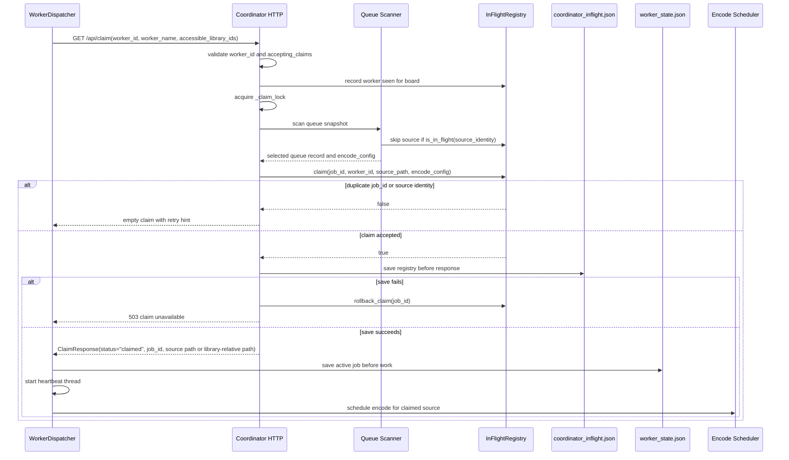
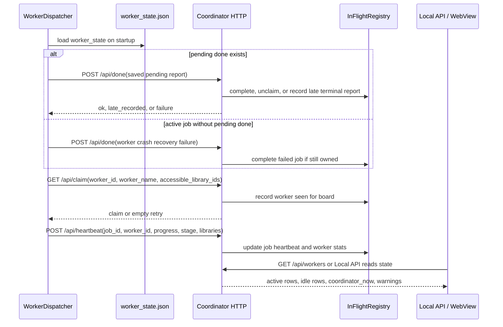
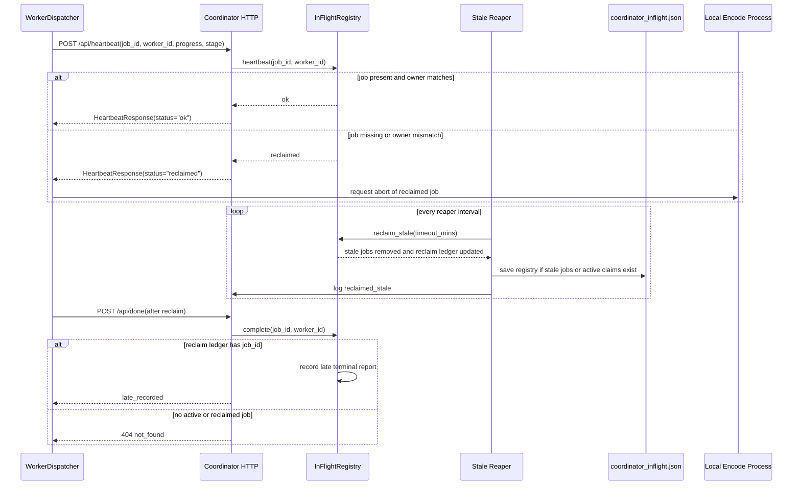
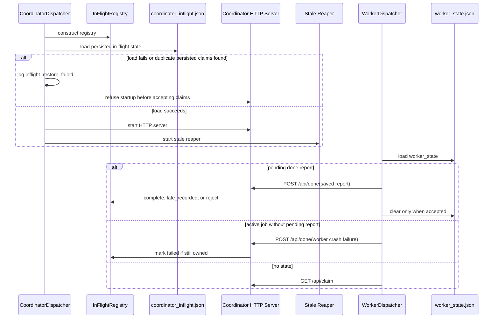

# Network Coordinator Deep Dive

Date: 2026-06-17

Change packet: `MP-CHANGE-2026-0617-099`

Scope: report-only audit of the network coordinator path from queue claim through completion, recovery, and operator visibility. No coordinator, worker, queue, state, UI, API, or test behavior was changed.

## Executive Summary

The network coordinator is a backend-owned, single-coordinator lease system. The active implementation is centered on `CoordinatorDispatcher`, `InFlightRegistry`, the coordinator HTTP handlers, and the worker-side `WorkerDispatcher`. The design has strong in-process protections: queue scan plus claim is serialized by `_claim_lock`, registry mutation is guarded by a registry lock, claims are durably saved before they are sent to workers, startup refuses to accept claims when the persisted in-flight file cannot be safely loaded, and worker crash completion is retried from `worker_state.json`.

The largest remaining risks are not the ordinary "two threads claim the same queue record" path. That path is directly guarded and currently covered by tests. The higher risks are lease-boundary and distributed-system cases:

1. A stale heartbeat can be reclaimed while the original worker is still encoding if the network is partitioned or the worker cannot receive the reclaimed response.
2. Duplicate worker IDs are not uniquely registered or cryptographically bound to a worker session.
3. A second coordinator can be started against the same media roots or the same state directory, because there is no cross-process or cross-host coordinator lease.
4. Completion is not fully idempotent when the coordinator accepts completion but the worker misses the response. A retry can become a 404 and hold the worker in pending-done recovery.
5. Restored active claims can be reclaimed quickly after coordinator restart if persisted heartbeat age is stale, even if the worker is still running.

The current design is suitable for the intended single-operator, single-coordinator model when the coordinator URL, auth token, and library path mappings are correct. It is not yet a fully fenced distributed queue with coordinator election, per-worker sessions, or output ownership tokens.

## Evidence Map

Primary coordinator and worker code inspected:

- `src/mediapipeline/desktop/network/coordinator.py`
  - `CoordinatorDispatcher` owns coordinator lifecycle, shared `_claim_lock`, in-flight registry, HTTP server, reaper, and local-encode claim path.
- `src/mediapipeline/desktop/network/coordinator_http_handlers.py`
  - HTTP claim, done, heartbeat, workers, and cluster-log endpoints.
- `src/mediapipeline/desktop/network/coordinator_queue.py`
  - Local coordinator claim, done, release, queue scan, queue removal, and done outcome emission.
- `src/mediapipeline/desktop/network/registry.py`
  - Authoritative in-memory and JSON-backed in-flight registry, worker stats, failure ledger, reclaim ledger, late terminal reports, and recent-completion quarantine.
- `src/mediapipeline/desktop/network/coordinator_state.py`
  - In-flight state restore, state path selection, and cluster-log append path.
- `src/mediapipeline/desktop/network/coordinator_lifecycle.py`
  - HTTP server startup, reaper loop, drain, shutdown, and periodic registry save.
- `src/mediapipeline/desktop/network/worker.py`
  - Worker identity, polling startup, heartbeat state, and crash recovery entry point.
- `src/mediapipeline/desktop/network/worker_loops.py`
  - Claim polling, mapped-source resolution, heartbeat loop, reclaimed abort path, and worker shutdown.
- `src/mediapipeline/desktop/network/worker_claims.py`
  - Worker active-job state write, heartbeat startup, encode scheduling, done, release, and pending completion persistence.
- `src/mediapipeline/desktop/network/worker_state.py`
  - Atomic worker-state save, unreadable-state handling, crash recovery, and pending done flushing.
- `src/mediapipeline/desktop/network/use_cases/done_outcome.py`
  - Shared done outcome service for registry save, queue removal, failure ledger, and cluster logging.
- `src/mediapipeline/desktop/network/protocol.py`
  - Claim, done, heartbeat, workers, and library protocol DTOs.
- `src/mediapipeline/desktop/network/auth.py`
  - HMAC request signing, timestamp skew checks, and nonce replay cache.
- `src/mediapipeline/core/network/facade.py`
  - Local API read surface for coordinator and worker runtime state.
- `src/mediapipeline/core/workspaces/read_payloads_workspace.py`
  - `/api/network/workers` payload construction.
- `apps/desktop/webview/static/assets/networkView.js`
  - read-only network state display and lifecycle route usage.

Key supporting docs inspected:

- `docs/architecture/NETWORK_LIFECYCLE_COMMAND_CONTRACT.md`
- `docs/architecture/NETWORK_WORKER_HARDENING_PLAN.md`
- `docs/testing/TEST_COVERAGE_MATRIX.md`
- `docs/inventories/TEST_SUITE_SUBSYSTEM_INVENTORY.md`
- `docs/reviews/network-coordinator-worker-mode-2026-06-15/workers/W12-network-test-suite-coverage.md`

## Coordinator Architecture Summary

The active network coordinator is a backend-owned dispatcher, not a WebView-owned workflow.

The coordinator has these main layers:

| Layer | Code | Responsibility |
| --- | --- | --- |
| Coordinator dispatcher | `desktop/network/coordinator.py` | Owns registry, claim lock, lifecycle, HTTP server, local-encode claim path, and local heartbeat/done delegation. |
| HTTP protocol handlers | `desktop/network/coordinator_http_handlers.py` | Implements `/api/claim`, `/api/done`, `/api/heartbeat`, `/api/workers`, and `/api/log`. |
| Queue bridge | `desktop/network/coordinator_queue.py` | Scans the application queue, filters inaccessible or quarantined records, emits done outcome side effects, and removes completed terminal records. |
| In-flight registry | `desktop/network/registry.py` | Authoritative claim map, claimed source identity map, worker stats, failure ledger, reclaim ledger, late terminal reports, and JSON persistence. |
| Lifecycle/reaper | `desktop/network/coordinator_lifecycle.py` | Starts/stops HTTP, mDNS, stale-claim reaper, drain mode, and registry saves. |
| Worker dispatcher | `desktop/network/worker.py`, `worker_loops.py`, `worker_claims.py`, `worker_state.py` | Polls for claims, persists active job before work starts, heartbeats, reports done/release, and recovers pending completion after restart. |
| Local API surface | `core/network/facade.py` and read-payload workspace | Exposes persisted coordinator, worker, cluster log, lifecycle, and warning state through read-only DTOs. |
| WebView surface | `apps/desktop/webview/static/assets/networkView.js` | Displays state and calls backend lifecycle routes; does not own claim, done, or queue mutation. |

Coordinator paths:

- Remote worker path:
  1. Worker starts and performs crash recovery.
  2. Worker polls `GET /api/claim`.
  3. Coordinator validates worker identity and capabilities.
  4. Coordinator scans the queue under `_claim_lock`.
  5. Registry claims the source identity and writes `coordinator_inflight.json`.
  6. Worker receives the claim, writes `worker_state.json`, starts heartbeat, then schedules encode.
  7. Worker posts heartbeats until completion, release, or reclaim.
  8. Worker posts `/api/done`; coordinator removes registry claim, saves state, emits success/failure outcome, updates queue/failure ledger, and logs.

- Local coordinator encode path:
  1. Local coordinator `claim_next()` uses the same `_claim_lock` and registry.
  2. The claim is persisted before local work begins.
  3. `mark_done()`, `release()`, and `heartbeat()` delegate to the same registry ownership checks and done outcome service.

The architecture deliberately keeps media policy and mutation in backend services. The WebView and Tauri shell are read/command surfaces, not independent queue or filesystem actors.

## State Model And Ownership Guarantees

### Authoritative State Files

| State | Path | Authority | Write pattern | Recovery behavior |
| --- | --- | --- | --- | --- |
| In-flight coordinator state | `coordinator_inflight.json` near the app service state path | Authoritative for active claims, claimed source identities, worker stats, failure ledger, reclaim ledger, and late terminal reports | Registry writes JSON via same-directory temp file, fsync, and `os.replace` | Coordinator startup loads before accepting claims. Load failure causes startup refusal. |
| Worker active/pending state | `worker_state.json` near the app service state path | Authoritative for one worker's active claim and pending done/release report | Worker writes JSON via temp file, fsync, `os.replace`, with retry for permission errors | Worker startup retries pending done. Unreadable state is preserved and blocks new claims. |
| Cluster log | `cluster.log` near the app service state path | Audit/diagnostic evidence only | Append under coordinator log lock with best-effort rotation | Failures are warnings, not claim authority. |
| Application queue | App-owned in-memory and persisted queue state | Source of queue records that can be claimed | Queue mutation remains app/backend-owned | Completion can schedule queue removal; failure can keep or remove depending retry policy. |
| SQLite mirror | LocalBase SQLite, where present | No evidence found that it is authoritative for network claim ownership | Outside direct claim path for this audit | JSON files remain the network claim authority. |

### Ownership Guarantees That Exist

The implementation currently guarantees these properties inside one live coordinator process:

1. Queue scan and registry claim are serialized by one coordinator `_claim_lock`.
2. Registry mutation is protected by an `RLock`.
3. A source identity cannot be claimed twice in the same registry while in flight.
4. Recently completed, released, or reclaimed source identities are quarantined for a short TTL so async queue removal cannot immediately allow a duplicate claim.
5. A claim is saved to `coordinator_inflight.json` before the coordinator sends the claim response.
6. If registry save fails before claim response, the claim is rolled back and no claim response should be sent.
7. Heartbeat, done, and release require the same `worker_id` that owns the job.
8. Coordinator startup refuses to proceed when in-flight state cannot be safely loaded.
9. Worker startup retries saved pending done/release before accepting new claims.
10. Worker unreadable state blocks new claims instead of silently abandoning pending work.

### Ownership Guarantees That Do Not Exist

These properties are not currently guaranteed:

1. There is no cross-process or cross-host coordinator lease.
2. There is no coordinator election or shared transactional queue claim across multiple coordinators.
3. A `worker_id` is not cryptographically bound to a unique worker session.
4. A stale-reclaimed job is not fenced at the output/media side if the original worker continues processing.
5. Completion is not fully idempotent if the coordinator accepted completion but the worker missed the response.
6. Heartbeats are not durably saved on every heartbeat; the reaper loop periodically saves active registry state.
7. Source files and queue records are not locked against external moves/deletes between claim and completion.

## Claim Lifecycle Sequence Diagram



Important claim properties:

- The scan and claim are one serialized coordinator operation.
- A durable registry save happens before claim delivery.
- Worker state is saved before encode scheduling.
- If claim response serialization fails before send, the coordinator rolls back.
- If response write fails after a partial network write, the coordinator attempts rollback, but the worker may have received enough data to begin an unowned job. This is a residual ambiguity.

## Worker Registration Sequence Diagram

There is no separate durable "register worker" endpoint. Worker presence is inferred from claim, heartbeat, log, and persisted worker stats.



Registration properties:

- Worker identity is a string, usually machine ID or generated UUID.
- Worker stats track last seen time, worker name, accessible library IDs, current job, progress, and idle rows.
- The coordinator does not issue a per-process session token.
- Duplicate `worker_id` values collapse identity and can confuse ownership.

## Heartbeat And Reclaim Sequence Diagram



Important heartbeat properties:

- Heartbeat timestamps are written by the coordinator, not trusted from worker clocks.
- Reclaim age is computed from coordinator-stored `last_heartbeat`.
- Malformed heartbeat timestamps are treated as infinitely stale and reclaimed.
- A reclaimed worker only aborts after it receives a successful heartbeat response with status `reclaimed`; network partitions can delay that signal.

## Restart Recovery Sequence Diagram



Important restart properties:

- Coordinator state is restored before any claim can be handed out.
- Corrupt or duplicate in-flight state is a hard startup stop, which favors safety over availability.
- Workers preserve pending done evidence and block new claims until the coordinator accepts it.
- A restarted coordinator may see an old `last_heartbeat` and reclaim an active worker quickly unless there is a startup grace period or the worker heartbeats before the reaper acts.

## Failure Mode Table

| Scenario | Evidence | Severity | Likelihood | Detection signal | Current recovery behavior | Recommended remediation |
| --- | --- | --- | --- | --- | --- | --- |
| Worker dies after claim before heartbeat | Claim sets `last_heartbeat` at claim time in `InFlightRegistry.claim`; reaper removes stale jobs in `reclaim_stale`; worker state recovery reports crash if state exists. | Medium | Medium | `reclaimed_stale` cluster event; active claim ages past timeout; worker disappears from heartbeat rows. | Coordinator reclaims after timeout and short recent-completion quarantine; queue can be claimed again. If worker restarts with state, it sends crash failure or pending done. | Add a distinct "claimed but never heartbeated" diagnostic and optionally shorter first-heartbeat timeout before full encode work starts. |
| Worker completes but coordinator misses completion response | Worker saves pending done when `_http_post` fails; retry can hit 404 if coordinator already completed and has no reclaim-ledger entry. | High | Low to Medium | Worker `worker_state.json` retains pending done; coordinator may show completed job removed; repeated pending flush failures. | Worker holds new claims until pending done clears. Coordinator returns `late_recorded` only for jobs in reclaim ledger, not ordinary already-completed duplicates. | Make `/api/done` idempotent for recently completed job IDs and source identities. Persist a recent terminal job ledger long enough for duplicate done retries. |
| Coordinator restarts during active work | Coordinator loads `coordinator_inflight.json` before accepting claims; worker continues heartbeating and retries done on post failure. | Medium to High | Medium | Coordinator startup log, old `last_heartbeat` values, possible immediate stale reclaim after restart. | Startup restores active claims if state loads; workers continue and heartbeat. Corrupt state blocks coordinator startup. | Add coordinator restart grace for restored active jobs, or persist heartbeat updates more frequently when active remote jobs exist. |
| Two workers claim same item from one coordinator | `_claim_lock` serializes scan plus claim; registry rejects duplicate source identity; current tests include concurrent HTTP claim coverage. | Low | Low | One worker receives claim, other receives empty retry response; no duplicate active source identity in registry. | Duplicate claim is denied in the same coordinator process. | Keep the existing concurrency test and add a process-level stress test around HTTP claim. |
| Stale heartbeat reclaimed while worker still running | Reaper removes jobs based on heartbeat age; worker aborts only after receiving `status="reclaimed"` on a later successful heartbeat. | High | Medium | `reclaimed_stale`, later `heartbeat_reclaimed`, late terminal report, duplicate source/output evidence. | Reclaimed job is removed and source identity is briefly quarantined. Original worker requests abort only after the next successful heartbeat response. Late done is recorded as evidence if job is in reclaim ledger. | Add fencing: coordinator-issued lease epoch in claim, output manifest, and done request. Keep a reclaimed job blocked until the old worker acknowledges reclaim or an operator resolves it. |
| Network path disappears | Worker resolves library-relative or mapped source before encode; missing source paths can release or fail the claim with structured reason. | Medium to High | Medium on LAN shares | Source-not-found reason, worker log event, failure ledger/quarantine, accessible-library mismatch warnings. | Worker releases unstartable claims or reports failure. Repeated same-reason failures suppress redispatch. | Add pre-claim or pre-encode path health checks for network roots and display share availability in coordinator state. |
| LocalBase state partially written or corrupted | Registry and worker state use temp file, fsync, and `os.replace`; load is strict. Coordinator startup refuses unsafe load. Worker unreadable state preserves file and blocks claims. | High | Low | `inflight_restore_failed`, unreadable state warning in Local API, worker startup error, no new claims. | Safety-first stop: coordinator refuses start, worker holds claims. Operator must repair or confirm idle before clearing. | Add last-known-good backup with checksum and a guided repair/inspect tool that can emit a safe recovery packet. |
| Clock skew or timestamp parsing issue | Auth validates timestamp skew with HMAC request signing; heartbeat stale uses coordinator-written timestamps; malformed registry heartbeat timestamp is stale. | Medium | Medium across machines | 401 `clock_skew`, worker operator status message, auth error, immediate stale reclaim for malformed persisted timestamp. | Skewed requests are rejected. Malformed persisted heartbeat is reclaimed as stale. | Add a clock-skew preflight in network setup and treat malformed persisted timestamps as startup repair candidates instead of immediate reclaim where feasible. |
| Duplicate worker IDs | Worker ID is configured or generated locally; coordinator ownership checks use `worker_id`; no session-issued identity found. | High | Low to Medium | Same `worker_id` with different names/hosts or impossible activity transitions; collapsed idle/active stats. | No explicit duplicate-ID prevention. A duplicate ID with the shared token can appear as the same owner. | Add coordinator-issued `worker_session_id` and require it on heartbeat, done, and release. Detect and block simultaneous sessions for the same worker ID unless explicitly allowed. |
| Queue item moved or deleted mid-claim | Queue scan snapshots records under app queue lock, but source files and queue records can change externally after claim. | Medium | Medium | Worker source resolution failure, done failure reason, queue removal warning, state/file mismatch in Local API. | Worker releases or reports failure; failure ledger can suppress redispatch. Source mutation by pipeline remains forbidden, but external mutation is not prevented. | Add source identity snapshot fields such as size, mtime, and optional content hash to claims, and verify before encode and before publish. |
| Partial claim response write ambiguity | Coordinator saves registry before send and rolls back on `_send_json` failure; partial network writes can be ambiguous. | Medium to High | Low | Worker has active `worker_state.json` but coordinator has no matching claim; heartbeat returns reclaimed or done returns 404. | Coordinator attempts rollback and save. Worker may later release/fail/preserve pending state. | Add two-phase claim ack or require first heartbeat success before encode starts. |
| Split-brain coordinators | No cross-host coordinator lease, election, or shared transactional queue claim was found. Registry locks are process-local. | Critical | Low in intended operation, Medium if manually misconfigured | Two `coordinator_inflight.json` files or two active coordinators claiming same media roots; duplicate output attempts. | No general recovery. Per-process protections do not coordinate between coordinators. | Add a coordinator lease in shared state, with host/session/process identity and expiry, or move claims into a transactional shared store. |
| Shared state file with two coordinator processes | `InFlightRegistry.save` writes a full JSON snapshot atomically but does not lock across processes. | Critical | Low | State file claims appear to disappear or regress; cluster logs from multiple coordinator hosts. | Last writer wins. Startup duplicate detection does not prevent concurrent save races. | Add OS/file lease or SQLite transaction around coordinator leadership and registry writes. |
| Registry save failure after done or release | HTTP done uses rollback snapshot on save failure; local release logs save failure. | Medium | Low | 503 from `/api/done`, `inflight_save_failed`, worker pending done state. | HTTP path restores snapshot and asks worker to retry. Local path may log and continue depending call path. | Keep failure injection tests and add operator alerting when save failures repeat. |
| Cluster log append failure | Cluster log writes are best effort and not claim-authoritative. | Low | Low | Missing cluster evidence or log write warning. | Claim behavior continues. | Surface log write failure in `/api/network/workers` warnings if repeated. |

## Race Condition Analysis

### Claim Race In One Coordinator

Risk: two workers poll at the same time and receive the same source.

Current controls:

- HTTP claim holds `_claim_lock` around queue scan and registry claim.
- Registry claim holds its own lock.
- `_claimed_paths` rejects duplicate normalized source identity.
- Current test inventory includes a named concurrent HTTP claim test for a single source.

Residual risk: low for a single coordinator process.

### Queue Removal Versus Reclaim

Risk: worker completes, registry removes job, but async queue removal has not yet removed the record, so another claim scans the same queue row.

Current controls:

- Registry records recent completions, releases, and reclaims by source identity.
- `is_in_flight()` treats recent terminal source identities as blocked until TTL expiry.
- Done outcome service warns if queue removal appears incomplete.

Residual risk: medium if queue removal remains broken past the TTL or a source identity changes representation.

### Completion Save Versus Side Effects

Risk: completion removes the registry job but registry save or queue side effects fail.

Current controls:

- `CoordinatorDoneOutcomeService` saves the registry before success/failure side effects.
- HTTP done keeps a registry rollback snapshot and restores it if outcome handling raises.
- Worker saves pending done on post failure.

Residual risk: medium. This is reasonably protected, but idempotent duplicate completion is incomplete when a response is lost after coordinator acceptance.

### Heartbeat Reclaim Race

Risk: reaper decides a job is stale while a worker heartbeat is in flight.

Current controls:

- Both heartbeat and reclaim mutate the same registry under lock.
- If reclaim wins, heartbeat receives `reclaimed` and worker requests abort.
- If heartbeat wins before timeout check, `last_heartbeat` is refreshed.

Residual risk: high when the worker is still running but cannot receive the reclaimed response or abort does not stop the encode promptly.

### Coordinator Restart Race

Risk: coordinator crashes or restarts while workers are active.

Current controls:

- Claims are saved before response.
- Restored state loads before accepting new claims.
- Workers preserve pending done and retry after coordinator outage.

Residual risk: medium to high. The restored `last_heartbeat` may be stale enough for the reaper to reclaim live work shortly after restart.

### Partial Response Race

Risk: coordinator writes enough of a claim response for the worker to parse it, then sees a socket error and rolls back the claim.

Current controls:

- Coordinator attempts rollback and save on send exception.
- Worker heartbeat to missing claim gets `reclaimed`.

Residual risk: medium. Work can start without coordinator ownership until heartbeat detects the issue.

### Cross-Process State Race

Risk: two coordinator processes write the same in-flight state file.

Current controls:

- Atomic replace protects a single write from being torn.

Residual risk: critical. Atomic replace does not provide distributed mutual exclusion or merge semantics.

## Duplicate Processing Analysis

### Duplicate Source Claims

Within one coordinator process, duplicate source claims are well controlled. The source path is normalized into a source identity, stored in `_claimed_paths`, and rejected on duplicate claim. Recent terminal source identities also block immediate redispatch while queue removal catches up.

Remaining duplicate-source paths:

1. Two coordinators with independent registries can claim the same source.
2. A stale-reclaimed worker can continue encoding after the coordinator reassigns the source.
3. A source path representation change can bypass a path-only identity if the same file is reachable through multiple unresolved aliases.
4. Queue removal failure after recent-completion TTL can allow a completed record to become claimable again.

### Duplicate Job IDs

Job IDs are UUIDs generated per claim. Registry load rejects duplicate job IDs in persisted state, and `claim()` rejects duplicate active job IDs.

Residual risk is low for one coordinator. Cross-coordinator duplicate processing is not solved by unique job IDs because each coordinator can create a different job ID for the same source.

### Duplicate Worker IDs

Duplicate worker IDs are a material risk. The coordinator uses `worker_id` as the ownership credential for heartbeat, release, and done, but workers share the cluster auth token and there is no coordinator-issued per-session secret in the inspected code.

Consequence:

- Two worker processes with the same `worker_id` collapse into one worker row.
- A duplicate worker ID can appear to own another process's job if it knows the job ID.
- Operator diagnosis becomes difficult because worker stats and lifecycle state are merged.

Recommended fix: add a coordinator-issued `worker_session_id` on first contact or claim, persist it in worker state, and require it on heartbeat, release, and done. Treat simultaneous sessions for the same worker ID as a warning or a hard conflict.

### Duplicate Completion

Completion is partially duplicate-tolerant for reclaimed jobs through the reclaim ledger and `late_recorded` response. It is not fully idempotent for the normal "done accepted but response lost" case. A retry after normal completion can receive 404 and keep the worker in pending done recovery.

Recommended fix: persist a short terminal job ledger keyed by job ID and source identity. Repeated done with matching worker ID and terminal payload should return an idempotent accepted response.

## Split-Brain Scenario Analysis

### Scenario A: Two Coordinators, Different State Directories, Same Media Roots

Both coordinators scan their own queue and keep their own registry. Since `_claim_lock` and registry locks are process-local, both can claim the same media source with different job IDs.

Severity: critical.

Current detection:

- Duplicate output attempts.
- Two cluster logs.
- Two network coordinator lifecycle states.
- Possible pending publish conflicts.

Current recovery:

- No automatic recovery found.

Recommendation:

- Establish a cluster-level coordinator lease with a unique cluster ID, coordinator session ID, host identity, and expiry.
- Refuse to start coordinator mode if an active lease exists unless an operator explicitly breaks it.
- Long term, store claims in a transactional shared backend or SQLite database with write locking suitable for the deployment topology.

### Scenario B: Two Coordinators, Same State File

Both coordinators can load the same state and write full snapshots. Atomic `os.replace` prevents torn JSON but not lost updates. Last writer wins.

Severity: critical.

Current detection:

- State file claims may disappear or regress.
- Cluster log may contain events from two coordinator processes if they share the same log.

Current recovery:

- Startup duplicate detection catches corrupt duplicate rows at load time, but not concurrent leadership.

Recommendation:

- Add a leadership file lock or lease before creating the HTTP coordinator.
- Include coordinator session ID in the state file and reject saves from non-leader sessions.

### Scenario C: Worker Points At Old Coordinator URL

This was observed historically in the hardening plan as a stale dispatcher URL class of problem. The worker can continue polling a stale coordinator if configuration is wrong.

Severity: high if the stale coordinator has access to the same queue or media roots.

Current detection:

- Test connection output.
- Runtime status in network UI.
- Cluster log host and token mismatch evidence.

Current recovery:

- Auth/token mismatch blocks unauthorized workers.
- Correcting settings and hot-apply can redirect the worker.

Recommendation:

- Display coordinator cluster ID and session ID in the worker UI/status and require it to match the saved join blob.

## Data Corruption And Lost-Work Risk Ranking

| Rank | Risk | Corruption or lost-work mechanism | Current protection | Residual severity |
| --- | --- | --- | --- | --- |
| 1 | Split-brain coordinators | Same source can be processed by two coordinators with independent leases; state can be last-writer-wins if shared. | None beyond intended single-coordinator operation. | Critical |
| 2 | Stale reclaim while worker still running | Original worker may continue writing output after coordinator reclaims and redispatches source. | Heartbeat `reclaimed` response requests abort; late terminal evidence recorded. | High |
| 3 | Duplicate worker IDs | Ownership checks rely on `worker_id`, so duplicate IDs can collapse identity and potentially affect another job. | Worker ID validation only. | High |
| 4 | Completion response lost after acceptance | Worker can preserve pending done, retry, receive 404, and block future claims even though work finished. | Pending done retry; late terminal report only for reclaimed jobs. | High |
| 5 | Corrupt or partially written LocalBase JSON state | Coordinator or worker cannot prove ownership state. | Atomic writes; strict load; coordinator refuses unsafe startup; worker blocks claims. | High for availability, medium for data loss |
| 6 | Coordinator restart with stale heartbeat | Active work can be reclaimed soon after restart if saved heartbeat is old. | Restored claims, worker heartbeat retry, reaper interval. | Medium to High |
| 7 | Network path disappears or queue item moves | Worker can fail after claim or source can change between claim and encode/publish. | Failure reason, release/failure done, quarantine, source mutation boundary. | Medium |
| 8 | Partial claim response rollback | Worker may start unowned work if it parsed a partially delivered claim that coordinator rolled back. | Heartbeat/done returns reclaimed or not found; worker state preservation. | Medium |
| 9 | Clock skew | Auth rejects requests or malformed persisted timestamps trigger reclaim. | HMAC timestamp skew check; coordinator-written heartbeat times. | Medium |
| 10 | Cluster log failure | Operator loses evidence, but claims remain governed by registry. | Best-effort logging and warnings. | Low |

## UI And API Surfaces

The coordinator state is exposed as read-only operational evidence.

Backend surfaces:

- `/api/network/workers` is the Local API read route. It is documented as effect-free and returns `NetworkWorkersDto`.
- The facade reads persisted coordinator state through `InFlightRegistry().load()` rather than mutating live coordinator state.
- The DTO includes active rows, idle rows, state file statuses, worker state, coordinator connectivity, lifecycle state, token posture, warnings, and `read_only=true`.
- Lifecycle command routes are backend-owned and documented to preserve `coordinator_inflight.json`, `worker_state.json`, and `cluster.log`.

WebView surface:

- `networkView.js` consumes `/api/network/workers`, renders state files, coordinator runtime labels, worker rows, warnings, lifecycle affordances, and diagnostic actions.
- The architecture contract explicitly prohibits WebView from authoring queue state, releasing claims, sending done reports, touching media paths, or writing network state files.

Risk:

- UI state can be stale or partial because it is read-only evidence from files and facade snapshots.
- This is the correct failure mode for the no-backend-policy-in-WebView boundary.

## Tests And Smokes Covering Coordinator Behavior

Observed current coverage includes:

- `tests/python/desktop/test_network_workflow.py`
  - HTTP claim, done, heartbeat, drain, stale reclaim, claim save failures, claim serialization rollback, response write rollback, accessible libraries, invalid worker IDs, failure ledger behavior, late terminal reports, and concurrent claim coverage.
- `tests/python/desktop/test_network_inflight_registry.py`
  - Duplicate job/source rejection, normalized source identities, persisted failure/reclaim ledgers, malformed row loading, idle worker rows, and concurrent saves.
- `tests/python/desktop/test_network_worker_runtime.py`
  - Worker claim polling, heartbeat post failure, reclaimed heartbeat abort, corrupt worker state blocking claims, heartbeat thread startup failure, unsafe source resolution, and release behavior.
- `tests/python/desktop/test_network_worker_state.py`
  - Worker state save/load and error handling.
- `tests/python/desktop/test_network_crash_recovery.py`
  - Pending done retry, crash recovery done, failure preservation, unreadable state handling.
- `tests/python/desktop/test_network_done_release.py`
  - Worker done/release payloads, pending report persistence, active job cleanup.
- `tests/python/desktop/test_network_coordinator_startup.py`
  - Startup failure cleanup, bind validation, thread start failure, mDNS failure handling, refused startup on unsafe restore.
- `tests/python/desktop/test_network_protocol_runtime.py`
  - Strict DTO behavior, heartbeat progress normalization, done reason semantics, reclaimed heartbeat status.
- `tests/python/desktop/test_application_facade_network.py`
  - Local API/facade network workers payload behavior.
- `tests/webview/test_webview_network_read_only_boundary.py`
  - WebView read-only network boundary expectations.
- `docs/testing/TEST_COVERAGE_MATRIX.md`
  - Lists current network test files and notes live LAN and two-machine execution remain operator-side validation gaps.

Suggested targeted command from the test inventory:

```powershell
& .\apps\desktop\runtime\Python\python.exe -m unittest discover -s tests\python\desktop -p "test_network*.py" -q
```

This audit did not run the network test suite because the task was report-only and did not change runtime behavior. The final validation run should be change-control coverage validation only.

## Missing Tests

The following tests would materially improve confidence before treating the coordinator as a stronger distributed queue:

| Missing test | Why it matters | Suggested level |
| --- | --- | --- |
| Two coordinator processes against the same queue/media roots | Current locks are process-local and cannot prevent split brain. | Integration test with two coordinator instances and one shared queue fixture. |
| Two coordinator processes sharing the same `coordinator_inflight.json` | Atomic replace does not prevent lost-update state races. | Integration or stress test with isolated temp shared state. |
| Duplicate `worker_id` from two worker processes | Owner checks currently use worker ID without session binding. | Unit/integration test showing collision detection once session IDs are added. |
| Done response accepted by coordinator but lost to worker | Current retry can become 404 and hold pending done. | HTTP fault injection test that drops response after coordinator side effects. |
| Reclaimed stale heartbeat while encode continues | Shows output fencing and late terminal behavior under partition. | Worker integration test with fake long encode and blocked heartbeat response. |
| Coordinator restart grace for active workers | Prevents immediate reclaim of live work after restored stale heartbeat. | Startup/reaper test with old heartbeat and worker reconnect window. |
| Queue record deleted or edited after scan but before worker starts | External queue mutation can invalidate source identity assumptions. | Queue mutation race unit test. |
| Network share disappears after claim but before publish | LAN path availability is a real operational failure mode. | Operator-side smoke or fault-injection integration test. |
| Malformed persisted heartbeat timestamp policy | Current behavior reclaims as stale; test should document whether that is intended. | Registry load/reaper unit test. |
| Browser smoke with real backend `/api/network/workers` | WebView fixture tests are useful but do not fully prove live wiring. | Existing `Test-WebViewBrowserNetworkSmoke.ps1` with backend fixture or live local API. |
| Live LAN mDNS and two-machine worker execution | Current docs mark this as operator-side validation. | Manual validation worksheet and release gate evidence. |

## Scenario Analysis Required By Prompt

### Worker Dies After Claim Before Heartbeat

Evidence:

- Claim initializes `last_heartbeat`.
- Worker writes `worker_state.json` before scheduling encode.
- Reaper reclaims based on stale `last_heartbeat`.
- Worker crash recovery posts a failure done if state remains.

Severity: medium.

Likelihood: medium.

Detection signal:

- Claim exists with no later heartbeat progress.
- `reclaimed_stale` event after timeout.
- Worker missing or crash recovery event on restart.

Current recovery:

- Coordinator reclaims after timeout and saves registry.
- Worker restart attempts crash recovery done or pending report.

Recommended remediation:

- Add first-heartbeat-specific diagnostics and a shorter "never started" timeout. Consider requiring a first heartbeat/claim ack before expensive encode work.

### Worker Completes But Coordinator Misses Completion

Evidence:

- Worker persists pending done on POST failure.
- Coordinator removes claim and saves before done side effects complete.
- Reclaim ledger handles late terminal reports only for reclaimed jobs.

Severity: high.

Likelihood: low to medium.

Detection signal:

- Worker pending done repeatedly retries.
- Coordinator no longer has active job.
- Done retry returns 404 instead of idempotent success.

Current recovery:

- Worker holds new claims while pending done remains.
- Operator may need to inspect and clear state.

Recommended remediation:

- Persist recent terminal completions keyed by job ID and source identity. Return idempotent accepted for duplicate done with matching owner and terminal payload.

### Coordinator Restarts During Active Work

Evidence:

- Coordinator loads registry before HTTP start.
- Worker heartbeat and done continue retrying across outage.
- Reaper can act on restored `last_heartbeat`.

Severity: medium to high.

Likelihood: medium.

Detection signal:

- Coordinator startup event followed by old heartbeat ages.
- Stale reclaim soon after restart.
- Worker heartbeat reconnect events.

Current recovery:

- Active claims restore if JSON is readable.
- Corrupt state refuses startup.
- Workers retry heartbeat/done.

Recommended remediation:

- Add restart grace for restored active jobs or persist heartbeat updates more frequently for active remote jobs.

### Two Workers Claim Same Item

Evidence:

- `_claim_lock` covers scan and claim.
- Registry rejects duplicate source identity.
- Current tests include a concurrent claim case.

Severity: low inside one coordinator, critical across split-brain coordinators.

Likelihood: low inside one coordinator.

Detection signal:

- One claim response and one retry-empty response.
- No duplicate source identity in registry.

Current recovery:

- Second claim is denied.

Recommended remediation:

- Keep current tests and add process-level HTTP stress coverage. Split-brain prevention is handled separately.

### Stale Heartbeat Reclaimed While Worker Still Running

Evidence:

- Reaper removes jobs after stale heartbeat.
- Worker abort depends on receiving a later `reclaimed` heartbeat response.
- Late terminal reports are recorded after reclaim.

Severity: high.

Likelihood: medium.

Detection signal:

- `reclaimed_stale`, followed by `late_terminal_recorded` or duplicate output attempts.

Current recovery:

- Source identity is quarantined briefly.
- Original worker is told to abort only on successful heartbeat response.
- Late done is evidence, not normal completion.

Recommended remediation:

- Add lease epoch fencing and extend quarantine until old worker acknowledges reclaim or an operator resolves the job.

### Network Path Disappears

Evidence:

- Worker resolves mapped paths and can release unstartable claim.
- Failure ledger and worker quarantine suppress repeated same-reason failures.

Severity: medium to high.

Likelihood: medium.

Detection signal:

- Source-not-found or mapped-source errors.
- Repeated worker/source failure ledger entries.
- Accessible library mismatch warnings.

Current recovery:

- Worker releases or reports failure.
- Coordinator may retry or suppress based on failure policy.

Recommended remediation:

- Add network root health checks and source availability evidence to claim selection.

### LocalBase State Partially Written

Evidence:

- Atomic temp/fsync/replace writes exist for coordinator and worker state.
- Strict load refuses unsafe coordinator state.
- Worker unreadable state blocks claims.

Severity: high for availability, medium for data loss.

Likelihood: low.

Detection signal:

- Startup failure, unreadable state file warning, `inflight_restore_failed`.

Current recovery:

- Coordinator refuses startup.
- Worker preserves unreadable state and does not claim.

Recommended remediation:

- Add checksum, backup, and guided repair tooling for coordinator and worker state files.

### Clock Skew Or Timestamp Parsing Issue

Evidence:

- Auth uses signed timestamp and skew window.
- Cluster log rewrites receive timestamp while preserving worker timestamp.
- Registry stale parsing treats malformed timestamps as stale.

Severity: medium.

Likelihood: medium.

Detection signal:

- 401 `clock_skew`.
- Worker status message about clocks exceeding five minutes.
- Immediate reclaim of malformed persisted heartbeat.

Current recovery:

- Reject skewed requests; operator must fix clocks.
- Malformed persisted heartbeat reclaims.

Recommended remediation:

- Add setup-time clock skew check and repair guidance. Consider startup validation for malformed heartbeat timestamps.

### Duplicate Worker IDs

Evidence:

- Worker ID is locally generated/configured.
- Owner checks use `worker_id`.
- No coordinator-issued session token was found.

Severity: high.

Likelihood: low to medium.

Detection signal:

- Same worker ID with changing worker names, host evidence, or implausible state transitions.

Current recovery:

- None specific.

Recommended remediation:

- Add worker sessions and require session ID on heartbeat/done/release. Warn or block duplicate active sessions.

### Queue Item Moved Or Deleted Mid-Claim

Evidence:

- Queue scan snapshots records, but source path can change externally after claim.
- Worker can fail source resolution or encode start.

Severity: medium.

Likelihood: medium.

Detection signal:

- Queue removal warning, source-not-found failure, pending record mismatch.

Current recovery:

- Worker release/failure path and failure ledger.

Recommended remediation:

- Include source metadata snapshot in claims and verify it before encode and before publish.

## Recommendations

Priority 1:

- Add coordinator leadership fencing so only one coordinator can own a cluster/state directory at a time.
- Add worker session IDs and require them on heartbeat, done, and release.
- Add idempotent terminal completion handling for response-lost retries.

Priority 2:

- Add lease epochs to claims and output manifests so stale-reclaimed work cannot publish as current work.
- Add restart grace for restored active claims.
- Add a state repair/backup tool for corrupt coordinator and worker JSON.

Priority 3:

- Add network share health checks to claim selection and operator state.
- Extend live LAN/two-machine validation and browser smoke coverage.
- Add source metadata snapshots to detect moved/deleted queue items.

## Limitations

This was a static source and documentation audit. I did not run a live coordinator, remote worker, browser smoke, network share fault injection, real-media encode, or the full network test suite. The analysis is based on inspected source, generated summaries, current docs, and test inventory names. Recommendations that alter coordinator, worker, queue, publish, FFmpeg, subtitle, audio, source/scratch/output, or pending-publish behavior require the project validation ladder before implementation.
