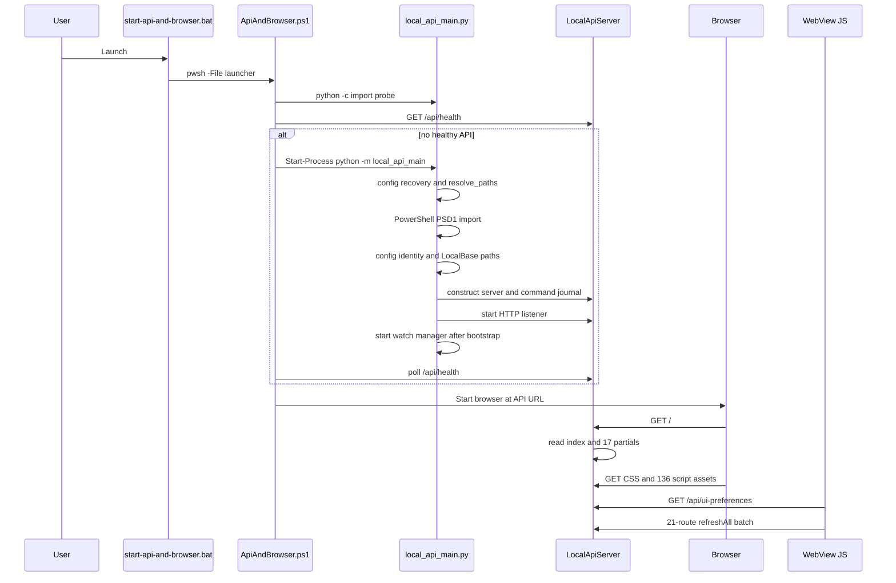
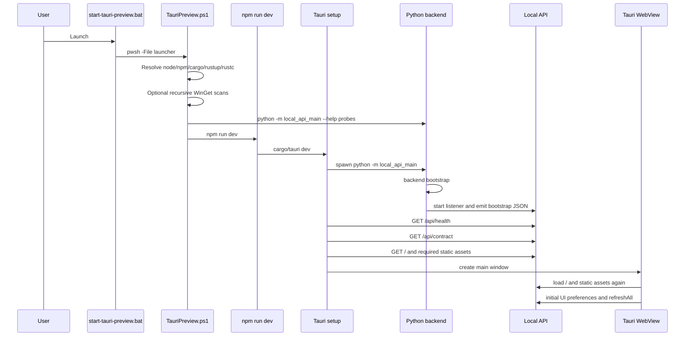
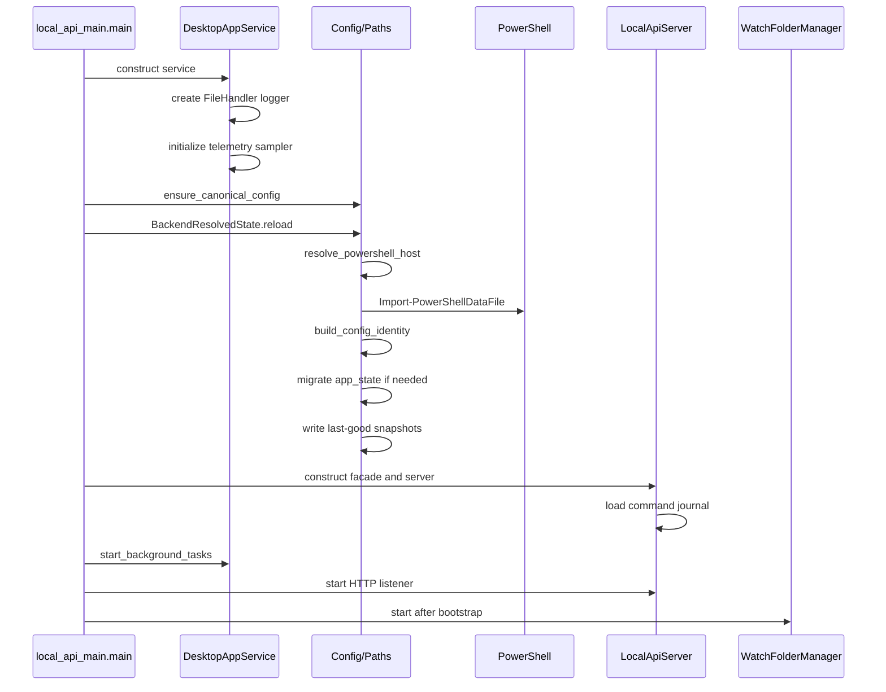

# Startup Performance Investigation

Date: 2026-06-17

Change packet: `MP-CHANGE-2026-0617-005`

Scope: report-only audit of launch behavior. No startup behavior, launcher code,
backend code, WebView assets, Tauri code, media policy, queue policy, publish
policy, or state behavior was modified.

## Method

Required entry documents were read first:

- `AGENTS.md`
- `docs/CURRENT_PROJECT_STATE.md`
- `docs/OPEN_WORK_CHECKLIST.md`
- `docs/generated/PROJECT_INDEX.md`

Generated summaries were checked before full source reads when available. Full
sources were opened only where the summary was high priority or where a function
body was needed to confirm startup behavior.

Readiness terms used in this report:

- API readiness: the Python Local API listener is bound and `/api/health` can
  respond.
- First paint: a browser/WebView can receive and parse the index shell and
  static JavaScript.
- First usable data: the WebView's initial `refreshAll({ automatic: true })`
  has settled enough route payloads to render current application state.
- Pipeline run startup: `ops/scripts/dev/run.bat` launches the PowerShell media
  pipeline. This is distinct from Local API or Tauri shell startup.

The audit is static plus targeted command evidence. It does not include
wall-clock benchmarking.

## Executive Summary

The highest startup risks are not FFmpeg version checks or media probing during
Local API bootstrap. The main costs are:

1. Python backend pre-listen config resolution, especially PowerShell PSD1
   import with a 30 second timeout and config identity/snapshot work.
2. Tauri startup validation before the window opens: backend bootstrap, health,
   route contract, and 35 Web UI validation HTTP/file reads before the actual
   WebView load.
3. WebView first data load: 136 blocking script tags and a broad 21-route
   refresh batch. The queue route can spawn a PowerShell dry-run with a 120
   second timeout when the queue snapshot is stale or absent.
4. Dev Tauri launcher preflight: recursive WinGet package scans for Node/npm,
   Visual Studio discovery, duplicated Python module checks, and tool version
   subprocesses before `npm run dev`.
5. Post-readiness contention: the watch-folder manager intentionally starts
   after the listener, but its first cycle can re-run config resolution and
   recursively scan source roots if watch folders are enabled.

## Severity Ranking

| Severity | Finding | Why it matters | Primary files |
| --- | --- | --- | --- |
| S1 | Tauri pre-window validation blocks first paint | The Tauri shell waits for backend bootstrap, health, contract validation, and Web UI validation before the window is built. Web UI validation alone makes 35 `request_backend_json(...)` reads. | `apps/desktop/tauri/src-tauri/src/backend_process.rs`, `apps/desktop/tauri/src-tauri/src/backend_contract.rs` |
| S1 | Config import is on the Local API pre-listen path | `local_api_main.build_backend()` resolves config before `LocalApiServer.start()`. PSD1 loading shells out to PowerShell with a 30 second timeout. | `src/mediapipeline/desktop/local_api_main.py`, `src/mediapipeline/core/paths/resolution_runner.py`, `src/mediapipeline/core/config/load.py` |
| S1 | Initial WebView refresh can wait on queue dry-run | `refreshAllNow()` waits for a 21-route `Promise.allSettled`. `/api/queue` can invoke `MediaPipeline.ps1 -EmitQueuePlan` with a 120 second timeout if no fresh snapshot exists. | `apps/desktop/webview/static/assets/app.js`, `src/mediapipeline/core/queue/preview_builder.py`, `src/mediapipeline/core/queue/dry_run_runner.py` |
| S2 | Dev Tauri launcher performs expensive discovery | The PowerShell launcher may recursively scan WinGet package trees, invoke `vswhere`, run duplicated Python `--help` probes, and run tool version commands before starting Tauri dev. | `apps/desktop/tauri/Launch-MediaPipelineRemuxEncodeAIO-TauriPreview.ps1` |
| S2 | Static shell loads many blocking assets | `index.html` includes 17 partials and 136 blocking script tags. Tauri validates a subset, then the actual WebView loads them again. | `apps/desktop/webview/static/index.html`, `src/mediapipeline/desktop/api/static_files_policy.py`, `apps/desktop/tauri/src-tauri/src/backend_contract.rs` |
| S2 | Watch-folder first cycle can contend immediately after readiness | `WatchFolderManager.start()` runs one cycle synchronously after the API listener/bootstrap line. If enabled, it can re-resolve settings and scan roots. | `src/mediapipeline/desktop/local_api_main.py`, `src/mediapipeline/desktop/watch/manager.py`, `src/mediapipeline/desktop/watch/scanner.py` |
| S3 | Snapshot and diagnostics duplicate bounded file reads | `/api/snapshot`, `/api/diagnostics`, and `/api/backend/close-readiness` each build or consume snapshot state in the broad refresh. ActiveJobs, log tails, event tails, and latest artifact lookups can repeat. | `src/mediapipeline/desktop/api/read_payloads_status.py`, `src/mediapipeline/core/status/snapshot_runner.py` |
| S3 | Telemetry starts before the listener | CPU sampling starts before server bind; GPU telemetry can later shell out to `nvidia-smi` with a 2 second timeout. Usually small, but it can contend on cold startup. | `src/mediapipeline/core/telemetry/service.py`, `src/mediapipeline/desktop/local_api_main.py` |

## Startup Timeline

### `ops/scripts/dev/start-local-api.bat`

1. Batch resolves the repo root and calls
   `apps/desktop/launchers/Launch-MediaPipelineRemuxEncodeAIO-LocalApi.bat`.
2. The launcher changes to `apps/desktop`, sets `PYTHONPATH` to `src`, and
   probes Python candidates by running `python -c "import
   mediapipeline.desktop.local_api_main"`.
3. The first valid candidate runs `python -m
   mediapipeline.desktop.local_api_main --app-root <apps/desktop>`.
4. `local_api_main.build_backend()` resolves app root, canonical config,
   PowerShell host, PSD1 config data, config identity, state paths, and tool
   existence checks.
5. `DesktopAppService` opens a log file and initializes telemetry state.
6. `MediaPipelineApplicationFacade` and `LocalApiServer` are constructed.
   `LocalApiServer` loads the command journal from
   `apps/desktop/RunLogs/local_api_command_history.json` if present.
7. `service.start_background_tasks()` starts telemetry before the HTTP server.
8. `server.start()` binds the `ThreadingHTTPServer` and starts the listener
   thread. API readiness begins here.
9. Bootstrap JSON is printed to stdout.
10. The watch-folder manager is started after readiness. Its first cycle can be
    synchronous and expensive if watch folders are enabled.

### `ops/scripts/dev/start-api-and-browser.bat`

1. Batch resolves the repo root and invokes
   `apps/desktop/launchers/Launch-MediaPipelineRemuxEncodeAIO-ApiAndBrowser.ps1`
   through bundled PowerShell when available.
2. PowerShell resolves Python candidates, probes the Local API import, and
   checks whether an existing API is healthy via `/api/health`.
3. If no healthy API exists, it tests port availability and starts the API with
   `Start-Process`.
4. It polls `/api/health` every 400 ms up to 30 seconds unless `-NoWait`.
5. It opens the browser at the API URL.
6. Browser first paint requires `/`, expanded partials, CSS, and static assets.
7. `DOMContentLoaded` awaits `/api/ui-preferences` with a 5 second timeout
   before wiring most UI behavior.
8. `refreshAll({ automatic: true })` starts the 21-route first data batch.

### `ops/scripts/dev/start-tauri-preview.bat`

1. Batch resolves the repo root and invokes
   `apps/desktop/tauri/Launch-MediaPipelineRemuxEncodeAIO-TauriPreview.ps1`.
2. The PowerShell launcher resolves Node, npm, cargo, rustc, rustup, Visual
   Studio dev command, and Python. Node/npm fallback can recursively scan
   `%LOCALAPPDATA%\Microsoft\WinGet\Packages`.
3. Python candidates are checked by running `python -m
   mediapipeline.desktop.local_api_main --help`; the winning candidate is
   checked again after resolution.
4. Tool versions are printed by running `node --version`, `npm --version`, and
   `cargo --version`.
5. `-CheckOnly` exits here. Normal launch runs `npm run dev`.
6. Tauri setup resolves the desktop root, acquires a single-instance guard, and
   starts the Python backend process.
7. Rust reads backend stdout up to 20 seconds until the final bootstrap payload.
8. Rust validates `/api/health`, `/api/contract`, `/`, `/assets/app.js`, and a
   required static asset set before opening the window.
9. The Tauri WebView loads the same backend URL and static assets for actual UI
   paint.
10. A lifecycle monitor thread checks `/api/health` every 5 seconds after
    backend startup.

### `ops/scripts/dev/run.bat`

1. Batch resolves project and pipeline roots.
2. It searches for config in this order: per-user canonical, per-user legacy,
   `ops/pipeline/config/MediaPipeline_config.psd1`,
   `apps/desktop/config/MediaPipeline_config.psd1`,
   `ops/pipeline/config/MediaPipeline_config_chatgpt.psd1`, and
   `apps/desktop/config/MediaPipeline_config_chatgpt.psd1`.
3. It prepends discovered FFmpeg, MKVToolNix, pipeline Python, and desktop
   Python paths to `PATH`.
4. It resolves PowerShell from bundled runtime, then runtime folders, then
   `where pwsh.exe`.
5. It runs `ops/pipeline/entrypoints/MediaPipeline.ps1 -ConfigPath <config>`.
   This is full pipeline startup, not Local API readiness. Worker slots and
   FFmpeg activity happen later according to pipeline config and queue state.

## Sequence Diagrams

### API and Browser



### Tauri Preview



### Backend Bootstrap



## Call Graph

### Local API

```text
ops/scripts/dev/start-local-api.bat
  -> apps/desktop/launchers/Launch-MediaPipelineRemuxEncodeAIO-LocalApi.bat
    -> python -c "import mediapipeline.desktop.local_api_main"
    -> python -m mediapipeline.desktop.local_api_main --app-root <apps/desktop>
      -> main()
        -> parse_args()
        -> build_backend()
          -> DesktopAppService.__init__()
            -> find_repo_root()
            -> _create_logger()
            -> _initialize_telemetry_sampler()
          -> ensure_canonical_config()
          -> BackendResolvedState.reload()
            -> DesktopAppService.resolve_paths()
              -> resolve_paths_for_service()
                -> resolve_powershell_host_for_service()
                -> load_config_data_for_service()
                  -> load_psd1_mapping()
                    -> run_capture(pwsh Import-PowerShellDataFile)
                -> build_config_identity()
                -> _migrate_app_state_path()
                -> write_last_good_config_snapshot()
          -> verify config and PowerShell host
          -> record ffmpeg/ffprobe/mkvmerge path existence steps
          -> MediaPipelineApplicationFacade()
          -> LocalApiServer()
            -> CommandJournal._load()
        -> service.start_background_tasks()
        -> server.start()
        -> print backend bootstrap JSON
        -> facade._start_watch_folder_manager()
          -> WatchFolderManager.start()
            -> run_single_cycle()
```

### API and Browser

```text
ops/scripts/dev/start-api-and-browser.bat
  -> apps/desktop/launchers/Launch-MediaPipelineRemuxEncodeAIO-ApiAndBrowser.ps1
    -> Resolve-PythonCandidates()
    -> python -c import probes
    -> Test-ApiHealth()
    -> Test-LocalApiPortAvailable()
    -> Start-Process python -m mediapipeline.desktop.local_api_main
    -> health polling loop
    -> Start-Process browser URL
      -> LocalApiServer._send_index()
        -> render_index()
          -> render_static_includes()
      -> read_static_asset()
      -> WebView DOMContentLoaded
        -> restoreSharedUiPreferences()
        -> refreshAll()
          -> refreshAllNow()
```

### Tauri

```text
ops/scripts/dev/start-tauri-preview.bat
  -> apps/desktop/tauri/Launch-MediaPipelineRemuxEncodeAIO-TauriPreview.ps1
    -> Resolve-ToolPath(node/npm/cargo/rustc/rustup)
    -> Resolve-VsDevCmd()
    -> Resolve-TauriPython()
      -> Test-LocalApiBackendModule()
    -> Test-LocalApiBackendModule() again
    -> npm run dev
      -> apps/desktop/tauri/src-tauri/src/lib.rs
        -> setup()
          -> resolve_desktop_root()
          -> acquire_single_instance_guard()
          -> start_backend()
            -> resolve_python()
            -> spawn python -m mediapipeline.desktop.local_api_main
            -> wait for bootstrap JSON
            -> validate_backend_health()
            -> validate_backend_contract()
            -> validate_backend_web_ui()
          -> build initialization script
          -> start_backend_lifecycle_monitor()
          -> WebviewWindowBuilder::new(...)
```

### Pipeline Run

```text
ops/scripts/dev/run.bat
  -> resolve config candidates
  -> add FFmpeg/MKVToolNix/Python paths to PATH
  -> resolve pwsh
  -> ops/pipeline/entrypoints/MediaPipeline.ps1 -ConfigPath <config>
    -> module_loader.ps1
    -> runtime_paths.ps1
    -> startup_filesystem.ps1
    -> logging.ps1
    -> queue/pipeline engine
    -> optional local worker slots depending on config
```

## Blocking Operation Inventory

| Operation | File/symbol | When it runs | Why it may block | Expected cost | Required for first paint/API readiness | Safe deferral option | Validation needed |
| --- | --- | --- | --- | --- | --- | --- | --- |
| Python import probes | `Launch-MediaPipelineRemuxEncodeAIO-LocalApi.bat`, `Launch-MediaPipelineRemuxEncodeAIO-ApiAndBrowser.ps1` | Before backend process launch | Spawns a Python interpreter per candidate and imports package graph | Low to medium; multiplied by candidates | Yes for launcher confidence, not for backend itself | Cache last good bundled Python or prefer bundled path before probing fallbacks | Launcher smoke for all canonical launchers and missing bundled Python fallback |
| Tauri Python `--help` probes | `Launch-MediaPipelineRemuxEncodeAIO-TauriPreview.ps1` / `Test-LocalApiBackendModule` | Before `npm run dev` | Spawns Python and imports CLI module; repeated after winning candidate | Medium; duplicated | Yes for dev launcher preflight, not for Tauri runtime backend | Avoid duplicate winning-candidate probe; keep one verification | `start-tauri-preview.bat -CheckOnly` with bundled and fallback Python |
| Tool discovery and version commands | `Launch-MediaPipelineRemuxEncodeAIO-TauriPreview.ps1` | Before Tauri dev | `Get-Command`, `vswhere`, `node/npm/cargo --version`, possible recursive WinGet scans | Low normally; high if WinGet tree is large/cold | Yes for current dev launcher, not for app backend | Only do recursive WinGet fallback after direct candidates fail; cache per session | Tauri check-only smoke on clean dev machine and machine with no Node/npm in PATH |
| Canonical config selection | `ensure_canonical_config()` | Local API pre-listen | Checks `%LOCALAPPDATA%`, repo config files, backups, snapshots; may copy files | Low normally; medium on locked/slow profile disk | Yes | Keep seeding/recovery, but time each branch and avoid unnecessary snapshot searches once config is found | Local API startup with missing user config, legacy config, and last-good recovery |
| PowerShell PSD1 import | `load_psd1_mapping()` via `load_config_data_for_service()` | Local API pre-listen and some reload paths | Spawns PowerShell and imports PSD1 with `ConvertTo-Json`; timeout is 30 seconds | Medium to high; worst-case 30 seconds | Yes for current backend policy/settings readiness | Precompute/cache parsed config after successful import, or move noncritical config views after listener while preserving safety gates | Local API config tests, settings tests, startup recovery tests, invalid PSD1 tests |
| Config identity hashing and template hash checks | `build_config_identity()` | Local API pre-listen | Reads config file and template files for SHA256; repeated on reload | Low for small config; medium on slow disk | Yes for current safety validation | Cache template hashes by file mtime/size; avoid rehashing unchanged active config in same process | Config identity tests and recovery tests |
| Last-good config snapshot writes | `write_last_good_config_snapshot()` | During path resolution | Creates snapshot directories, hashes targets, copies config if changed | Low normally; medium on locked profile/LocalBase disk | Not strictly required for listener, but supports config recovery safety | Defer duplicate user snapshot writes after listener while keeping active config validation pre-listen | Config recovery tests, interrupted snapshot write tests |
| App state migration | `migrate_app_state_path_for_service()` | During path resolution | If preferred LocalBase app state is missing, copies legacy app state atomically with fsync | Usually zero; medium when migration triggers | Required only for first-run migration consistency | Keep one-time migration pre-listen or add explicit migration progress timing | Migration tests from legacy app root to LocalBase |
| Logger file handler | `DesktopAppService._create_logger()` | Service construction | Opens `MediaPipelineRemuxEncodeAIO_DesktopApp.log`; can block on locked/cold disk | Low | Yes for current observability | Leave pre-listen but add duration/error evidence | Local API smoke with existing locked log simulation if practical |
| Command journal load | `CommandJournal._load()` | `LocalApiServer` construction | Reads prior JSON history from `apps/desktop/RunLogs` | Low unless file is large/corrupt/cold | Yes for `/api/commands`, not for listener | Lazy-load on first `/api/commands`, or cap/compact before startup | Command journal route tests and corrupt/large journal tests |
| FFmpeg/ffprobe/mkvmerge path checks | `local_api_main.build_backend()` `record_startup_path_step` | Pre-listen | `Path.exists()` checks under configured tools root | Low local; medium if tools path is slow/networked | Not required for `/api/health`, useful for startup evidence | Move detailed checks to health/maintenance while preserving visible startup warnings | Tool missing/present startup tests and maintenance health tests |
| Telemetry background tasks | `TelemetryServiceMixin.start_background_tasks()` | Before `server.start()` | Starts a thread; first samples CPU/memory and may later resolve/spawn `nvidia-smi` | Low; GPU subprocess later has 2 second timeout | Not required for listener | Start after server bind or delay GPU probe until first telemetry route | Telemetry route tests and lifecycle shutdown tests |
| HTTP server bind | `LocalApiServer.start()` | API readiness boundary | Port bind can fail or hang at OS/network layer | Low; failure is fatal | Yes | No deferral | Local API smoke and port collision tests |
| Watch-folder initial cycle | `WatchFolderManager.start()` | After bootstrap JSON/listener | Runs `run_single_cycle()` synchronously; can reload config and scan roots if enabled | Low when disabled; high on large/remote roots | No for API readiness; may affect immediate UI responsiveness | Delay first scan until after first UI refresh or run fully async with visible pending state | Watch folder enabled/disabled tests, large-root representative validation |
| Index rendering and partial includes | `render_index()`, `render_static_includes()` | First browser/WebView request and Tauri validation | Reads index and 17 partial HTML files on each request | Low local; repeated by Tauri validation and actual load | Yes for first paint | Cache expanded index in-process with dev invalidation by mtime | WebView smoke, bootstrap placeholder/token tests |
| Static script reads | `read_static_asset()` and browser script loading | First paint and Tauri validation | 136 blocking script tags in `index.html`; each asset read synchronously | Medium on cold disk; blocks browser parse order | Yes for full UI script availability | Add `defer`/bundle/lazy page modules; cache static asset bytes in backend | WebView smoke and Playwright/Tauri UI load checks |
| Awaited UI preferences | `restoreSharedUiPreferences()` and `/api/ui-preferences` | DOMContentLoaded before most UI init | Reads and validates `LocalBase/State/ui_preferences.json`; client waits up to 5 seconds | Low normally; up to 5 second perceived delay on route stall | Blocks UI wiring, not backend first paint | Start UI wiring with defaults, merge preferences when payload arrives | UI preference persistence tests and first-load smoke |
| Initial 21-route refresh | `refreshAllNow()` | After DOMContentLoaded | Waits for all settled requests before rendering the batch | Medium; bounded by slowest route timeout | Required for first usable data, not first paint | Render critical routes as they settle; split heavy routes from initial batch | WebView smoke with slow optional route injection |
| Queue dry-run | `build_queue_preview_for_service()`, `_run_queue_dry_run()` | First `/api/queue` if snapshot missing/stale | Spawns PowerShell `MediaPipeline.ps1 -EmitQueuePlan`; timeout 120 seconds | High; worst-case 120 seconds | Not required for first paint; current first data waits on it | Use cached/stale snapshot on automatic refresh, explicit scan for fresh dry-run | Queue route tests, stale snapshot tests, release gate if queue behavior changes |
| Completed manifest read | `CompletedJobsServiceMixin.get_completed_history()` | `/api/completed` first refresh | Reads completed JSONL manifest; code comments estimate 50k jobs near 20 MB | Low to medium; cached 60 seconds | Not required for first paint | Keep manifest-backed path; consider rendering after critical status | Completed manifest tests with large fixture |
| Pending publish scan | `PendingPublishServiceMixin.scan_pending_publish()` | `/api/pending-publish`, and completed reconciliation | Iterates pending root files, sorts by mtime, reads manifests, stats payloads | Low for small pending root; medium if many parked files or slow LocalBase | Not required for first paint | Avoid duplicate completed+pending scan in same refresh; cache per refresh | Pending publish route tests and duplicate-target tests |
| Snapshot construction | `build_snapshot_for_service()` | `/api/snapshot`, `/api/diagnostics`, close readiness | Reconciles ActiveJobs, reads progress/audit JSON, tails logs/events, finds latest artifacts | Low to medium; duplicated in broad refresh | Snapshot is required for first usable status, not first paint | Per-refresh request cache or server-side snapshot cache with short TTL | Status/diagnostics route tests |
| Maintenance workspace health | `get_maintenance_workspace()` | `/api/maintenance` only, not broad first refresh | Runs environment health checker, including tool checks and helper subprocesses | Medium to high | No | Keep manual/on-demand; avoid adding to initial refresh | Maintenance health smoke |
| Network coordinator/worker lifecycle | `commands_network.py`, `coordinator_lifecycle.py`, `worker.py` | Explicit network start commands, not baseline startup | Starts HTTP/reaper/mDNS threads or worker poll/heartbeat threads; worker init may crash-recover state | Medium when invoked | No for baseline first paint/API readiness | Keep command-triggered; status route should remain read-only/light | Network lifecycle dry-run and start/stop tests |
| Pipeline worker slots | `ops/pipeline/entrypoints/MediaPipeline.ps1`, `ops/pipeline/engine/queue/local_worker_slots.ps1` | `run.bat` pipeline run, not Local API shell startup | Can spawn worker child processes and manage claim stores based on queue/config | High, by design | No for shell first paint/API readiness | Not a shell-startup target; instrument separately in pipeline run profiling | Release gate and real-media validation if changed |

## Filesystem Scan Inventory

| Scan/read pattern | File/symbol | Trigger | Notes |
| --- | --- | --- | --- |
| Ancestor repo-root walk | `find_repo_root()` callers in launch/bootstrap/static paths | App-root/default-root resolution | Bounded ancestor walk; low cost. |
| Config candidate checks | `ensure_canonical_config()` | API bootstrap | Checks per-user config, repo config, legacy config, backup, and snapshot candidates; can copy config. |
| Config and template hashing | `build_config_identity()` | API bootstrap and reloads | SHA256 over active config and template candidates. |
| LocalBase state path setup | `resolve_paths_for_service()` | API bootstrap | Constructs `LocalBase/State` paths for App, Queue, Completed, Pending, Audit, Workers, and snapshots. |
| App state migration | `migrate_app_state_path_for_service()` | API bootstrap | One-time atomic copy from legacy app-root state to LocalBase state. |
| Last-good snapshot copy | `write_last_good_config_snapshot()` | API bootstrap | Writes to LocalBase config snapshots and user config snapshot when changed. |
| WinGet recursive package scan | `Resolve-ToolPath()` | Tauri dev launcher fallback | `Get-ChildItem -Recurse` under `%LOCALAPPDATA%\Microsoft\WinGet\Packages` for `node.exe` and `npm.cmd`. |
| Index partial expansion | `render_static_includes()` | Browser/Tauri `GET /` and Tauri validation | Reads 17 HTML partials. |
| Static asset reads | `read_static_asset()` | Browser/Tauri assets and Tauri validation | `index.html` has 136 script tags; Tauri validation reads required subset before the window. |
| UI preferences read | `read_ui_preferences()` | DOMContentLoaded | Reads `LocalBase/State/ui_preferences.json`, up to 1,000,000 total chars after validation. |
| Queue source inventory | `build_queue_source_inventory()` | Explicit queue source scan, not baseline startup | Recursive `os.walk` over source movie/TV roots, capped at 5000 rows. |
| Queue snapshot read/write | `build_queue_preview_for_service()`, `_run_queue_dry_run()` | `/api/queue` | Reads fresh snapshot if available; dry-run writes temp and final snapshots plus SQLite mirror. |
| Watch-folder scan | `scan_root()` | Post-readiness watch manager cycle if enabled | Recursive `os.scandir` over watch roots. |
| Completed manifest | `read_completed_manifest_records()` via `get_completed_history()` | `/api/completed` | Reads append-only JSONL manifest; no SMB sidecar walk in current read path. |
| Pending publish inventory | `scan_pending_publish()` | `/api/pending-publish` and completed reconciliation | `pending_root.iterdir()`, manifest row reads, mtime sorting, orphan payload inventory. |
| Status files and tails | `build_snapshot_for_service()` | `/api/snapshot`, diagnostics, close readiness | Reads progress/audit JSON, tail of log/events, ActiveJobs JSON, latest reports/CSVs. |
| Change ledger scan | `change_ledger_payload()` | Maintenance change ledger route | Globs unreleased and released change packets; not initial refresh unless route is opened. |

## Subprocess Invocation Inventory

| Subprocess | Trigger | Timeout/limit evidence | Startup relevance |
| --- | --- | --- | --- |
| `python -c "import mediapipeline.desktop.local_api_main"` | Local API and API+Browser launchers | Per candidate, no explicit timeout in batch/PowerShell wrappers | Blocks process selection before backend launch. |
| `powershell.exe -NoProfile -Command Get-Command python -All ...` | Local API batch fallback | No explicit timeout | Only fallback path when bundled candidates fail. |
| `python -m mediapipeline.desktop.local_api_main` | Local API backend process | Long-running process | Main backend. |
| `Invoke-WebRequest /api/health` | API+Browser launcher | Health polling up to 30 seconds, 400 ms interval | Blocks browser open until API healthy. |
| `Start-Process <browser>` | API+Browser launcher | OS launch | Opens first paint surface. |
| `Get-Command`, recursive `Get-ChildItem`, `vswhere.exe` | Tauri dev launcher | No explicit timeout | Blocks dev launcher before Tauri starts. |
| `python -m mediapipeline.desktop.local_api_main --help` | Tauri dev launcher Python validation | Per candidate, no explicit timeout | Blocks dev launcher; duplicated for winning candidate. |
| `node --version`, `npm --version`, `cargo --version` | Tauri dev launcher | No explicit timeout | Preflight evidence only. |
| `npm run dev` | Tauri dev launcher | Long-running process | Starts Tauri dev. |
| Python backend process | Tauri Rust `start_backend()` | Reads stdout up to 20 seconds waiting for bootstrap | Blocks Tauri window creation. |
| PowerShell PSD1 import | `load_psd1_mapping()` | 30 second timeout via config import | Blocks Local API listener. |
| PowerShell queue dry-run | `_run_queue_dry_run()` | 120 second timeout | Can block first WebView data refresh on `/api/queue`. |
| `nvidia-smi` | Telemetry sampler | 2 second timeout, minimum 12 second interval | Background, not required for first listener. |
| PowerShell/tool/helper checks | `check_environment_health()` | Per maintenance helper checks; helper script timeout observed at 15 seconds for ASS-to-SRT check | Maintenance route only, not baseline first paint. |
| `taskkill` | Tauri backend shutdown fallback | Shutdown only | Not startup. |
| FFmpeg/ffprobe media commands | Pipeline execution | Later media run | Not used by Local API bootstrap; only path existence is checked pre-listen. |

## Duplicate Initialization Candidates

1. Python backend verification is repeated across launchers. Local API and
   API+Browser import-probe candidates; Tauri dev uses `--help` probes and then
   repeats the winning probe.
2. Config resolution can run at backend bootstrap and again immediately in the
   watch-folder startup cycle through settings reload if the watch manager is
   enabled.
3. Tauri validates `/`, `/assets/app.js`, and required assets before creating
   the window; the WebView then requests `/` and assets again for actual paint.
4. Health checks are layered: API+Browser checks/polls `/api/health`, Tauri Rust
   validates health after bootstrap, and the Tauri lifecycle monitor starts
   periodic health checks.
5. The first WebView refresh asks for `/api/completed` and
   `/api/pending-publish`. Completed preview also performs pending-publish
   reconciliation, making pending scans a duplicate candidate within one
   refresh.
6. `/api/snapshot`, `/api/diagnostics`, and `/api/backend/close-readiness`
   independently touch snapshot state in the same broad refresh.
7. Config identity hashing and last-good snapshot SHA checks are repeated on
   reload paths even when the active config has not changed.

## Lazy-Loading Opportunities

These are recommendations only. They require separate implementation packets and
validation before any behavior change.

| Opportunity | Benefit | Safety notes |
| --- | --- | --- |
| Keep config validation pre-listen but cache parsed config/identity in-process | Reduces duplicate PowerShell imports and hashing after bootstrap | Must preserve config recovery, block reasons, and settings safety evidence. |
| Move noncritical last-good duplicate snapshot writes after listener | Reduces pre-listen filesystem writes | Keep active config verification pre-listen; validate recovery semantics. |
| Delay telemetry GPU probing until first telemetry route or after server bind | Reduces background contention during listener start | CPU telemetry route should still return sane defaults. |
| Make watch-folder first scan fully asynchronous and slightly delayed | Protects immediate UI responsiveness after API readiness | Must preserve disabled/worker-role behavior and watch safety. |
| Cache expanded index and static assets with mtime invalidation | Removes repeated disk reads for Tauri validation and actual WebView load | Must preserve bootstrap token injection and avoid token leakage in caches. |
| Reduce Tauri pre-window Web UI validation to critical shell or run the full asset audit after first window | Improves Tauri first paint | Contract/static validation is release-critical; use a visible degraded state if deferred. |
| Add `defer` or split/lazy-load page scripts | Lets browser render shell before all page modules parse | Requires WebView smoke across all tabs and command controls. |
| Split `refreshAllNow()` into critical and heavy phases | Prevents queue dry-run or optional routes from delaying initial status render | Critical set should include health/snapshot/close-readiness; heavy set can show stale/loading. |
| Use stale queue snapshot for automatic refresh and reserve dry-run for explicit refresh | Avoids 120 second queue dry-run on first automatic UI load | Must preserve operator clarity that queue data is stale. |
| Per-refresh server-side snapshot cache | Removes duplicate status file reads across snapshot/diagnostics/close-readiness | Must be very short-lived and invalidate on command/pipeline state changes. |
| De-duplicate pending publish scan between completed and pending routes in one refresh | Reduces LocalBase directory scans | Preserve pending-publish reconciliation evidence. |
| Cache Tauri launcher tool paths for one process | Avoids repeated recursive WinGet scans and version checks | Cache must invalidate when explicit `-CheckOnly` or env changes require fresh evidence. |

## Instrumentation Gaps

1. Startup progress reports coarse steps, but not durations for each step.
   Missing timings include service construction, logger open, config recovery,
   PowerShell config import, config identity hashing, snapshot writes,
   command-journal load, server bind, and watch-manager first cycle.
2. There is no structured startup subprocess ledger summarizing command, label,
   timeout, duration, exit code, and whether it happened before API readiness.
3. WebView has no first-paint or first-data timings. The initial refresh logs
   are not correlated with route latencies by a request id.
4. Backend read routes do not expose consistent route-duration metadata for the
   first refresh. Queue dry-run exposes status text but should also emit timing,
   snapshot freshness, and subprocess duration.
5. Static serving does not report index render duration, partial count, asset
   read time, or cache hit/miss state.
6. Tauri backend validation does not expose per-phase and per-asset durations to
   the operator. A single slow asset or route would be hard to identify.
7. Watch-folder baseline scan does not expose enough scan metrics for startup
   contention analysis, such as roots scanned, directories visited, files
   considered, and duration.
8. LocalBase path health is visible through diagnostics/settings routes, but
   pre-listen code does not emit a concise "LocalBase is local/remote/slow"
   timing summary.
9. Duplicate snapshot construction within one UI refresh is not measured.

## LocalBase Assumptions

The backend treats configured `LocalBase` as the root for runtime state:

- `LocalBase/State/App/app_state.json`
- `LocalBase/State/Queue/queue_snapshot.json`
- `LocalBase/State/Completed/completed_jobs.jsonl`
- `LocalBase/State/PendingServerPush` and pending manifests
- `LocalBase/State/ActiveJobs`
- config snapshots and SQLite mirror storage

Startup assumes these paths are safe for local state I/O. If `LocalBase` is on a
slow disk, a synced profile directory, a locked antivirus path, or a network
share, nominally cheap operations can become visible startup stalls. Source
roots may be remote by design, but LocalBase should remain local and fast.

Current bootstrap does not perform real media scans before listener readiness.
Large source-root scans enter through watch folders, queue source inventory, or
pipeline runs.

## Coordinator and Worker Initialization

Baseline Local API startup does not start the network coordinator, network
worker, or PowerShell local worker slots.

- Network coordinator and worker routes are registered and validated by Tauri's
  route contract, but lifecycle start happens through explicit POST commands.
- `WorkerDispatcher` has crash-recovery and poll-thread behavior when
  constructed and started, but that is not part of baseline shell startup.
- PowerShell local worker slots are part of `run.bat` / `MediaPipeline.ps1`
  execution when queue/config enables them.
- `start_queue_source_scan()` creates a queue source scan worker only when the
  operator requests it.
- The always-started background worker in Local API startup is telemetry. The
  watch manager starts after listener readiness and can perform a synchronous
  first cycle.

## Remediation Roadmap

### Phase 1: Measure before changing behavior

- Add monotonic duration fields to startup progress events.
- Add a startup subprocess ledger for config import, queue dry-run, Tauri
  validation, and telemetry GPU checks.
- Add first paint and first data timing in WebView with route latency summaries.
- Add Tauri validation timing per phase and per asset.

Validation:

- Local API route tests for startup progress schema.
- WebView smoke confirming timing fields do not expose secrets.
- Tauri check-only and preview startup.

### Phase 2: Remove duplicate pre-window/pre-listen work

- Remove duplicate Tauri Python winning-candidate `--help` probe.
- Cache config identity/template hashes in-process.
- Cache expanded static index and asset reads with safe invalidation.
- Reuse one pending-publish scan inside a broad refresh.

Validation:

- `start-local-api.bat`
- `start-api-and-browser.bat`
- `start-tauri-preview.bat -CheckOnly`
- Static bootstrap/token tests.
- Pending publish and completed route tests.

### Phase 3: Split first data from heavy data

- Separate critical refresh routes from heavy optional routes.
- Keep `/api/queue` automatic refresh from spawning a dry-run when no fresh
  snapshot exists; show stale/missing state and require explicit refresh.
- Render route sections incrementally as each route settles.

Validation:

- WebView smoke tests.
- Queue preview tests for fresh, stale, missing, and forced-refresh snapshot
  states.
- Operator flow validation that stale queue data is clearly labeled.

### Phase 4: Defer post-readiness scans safely

- Make watch-folder first cycle fully asynchronous and delay it until after the
  UI has had a chance to request initial status.
- Add scan metrics and visible scan state.
- Preserve worker-role and disabled-watch-folder bypasses.

Validation:

- Watch-folder enabled/disabled tests.
- Queue/source scan tests.
- Representative large-root validation if behavior changes source-root scanning.

### Phase 5: Revisit Tauri pre-window gate

- Decide which Tauri validations are fatal before window creation versus
  background diagnostics after first paint.
- Keep route contract and token/bootstrap safety checks strict.
- If full Web UI validation is deferred, expose a visible shell state that
  blocks unsafe commands until validation completes.

Validation:

- Tauri preview/check-only.
- Contract tests.
- WebView smoke and close-readiness tests.
- Security review for token/bootstrap handling.

## Validation Recommendations

For any future startup optimization, use the smallest safe rung plus targeted
startup measurement:

1. Docs/instrumentation-only changes:
   - unit tests for timing schema or report link checks.
2. Launcher discovery changes:
   - `ops/scripts/dev/start-local-api.bat`
   - `ops/scripts/dev/start-api-and-browser.bat`
   - `ops/scripts/dev/start-tauri-preview.bat -CheckOnly`
3. Local API bootstrap/config changes:
   - targeted config recovery and route tests
   - `Test-LocalApi*` smoke
   - startup progress timing assertion
4. WebView static/loading changes:
   - WebView smoke catalog
   - browser/Tauri first-paint check
   - token/bootstrap no-leak checks
5. Queue/watch/source-scan changes:
   - queue preview tests
   - watch-folder tests
   - source-root scan tests
   - representative real-media validation if scan behavior affects media
     selection or queue launch
6. FFmpeg, subtitle, audio, publish/drain, or source movement changes:
   - release gate plus representative real-media validation. This audit did not
     recommend changing those policies.

## Limitations

- No stopwatch benchmark was run, so expected costs are based on code behavior,
  known timeout ceilings, and I/O/subprocess shape.
- The repository worktree was already dirty with many unrelated modified and
  untracked files; this report does not attribute those changes.
- This audit did not execute the launchers or open the GUI because the requested
  work was report-only and no behavior changes were made.
- PowerShell pipeline internals were traced only far enough to distinguish
  `run.bat` pipeline startup from Local API/Tauri first-paint startup.
- No source media, FFmpeg probe, encode, remux, publish, drain, or source
  cleanup paths were exercised.
