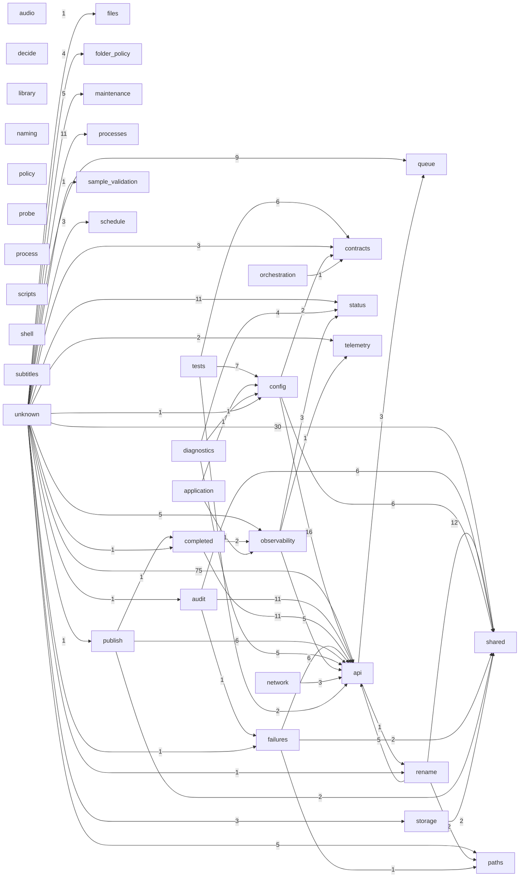

# DEPENDENCY_GRAPH

Generated by `scripts/dev/generate_project_index.py`. Do not hand-edit.
Edges aggregate cross-domain Python imports and PowerShell dot-includes.

## Edge counts

| From | To | Edges |
|---|---|---|
| unknown | api | 75 |
| unknown | shared | 30 |
| config | api | 16 |
| rename | shared | 12 |
| audit | api | 11 |
| completed | api | 11 |
| unknown | processes | 11 |
| unknown | status | 11 |
| unknown | queue | 9 |
| tests | config | 7 |
| audit | shared | 6 |
| config | shared | 6 |
| failures | api | 6 |
| publish | api | 6 |
| tests | contracts | 6 |
| diagnostics | api | 5 |
| observability | api | 5 |
| rename | api | 5 |
| unknown | maintenance | 5 |
| unknown | observability | 5 |
| unknown | paths | 5 |
| diagnostics | status | 4 |
| unknown | folder_policy | 4 |
| api | queue | 3 |
| network | api | 3 |
| observability | status | 3 |
| unknown | contracts | 3 |
| unknown | schedule | 3 |
| unknown | storage | 3 |
| completed | observability | 2 |
| config | contracts | 2 |
| failures | shared | 2 |
| publish | shared | 2 |
| rename | paths | 2 |
| storage | shared | 2 |
| tests | api | 2 |
| unknown | telemetry | 2 |
| api | rename | 1 |
| application | config | 1 |
| application | observability | 1 |
| audit | failures | 1 |
| diagnostics | config | 1 |
| failures | paths | 1 |
| observability | telemetry | 1 |
| orchestration | contracts | 1 |
| publish | completed | 1 |
| unknown | audit | 1 |
| unknown | completed | 1 |
| unknown | config | 1 |
| unknown | failures | 1 |
| unknown | files | 1 |
| unknown | publish | 1 |
| unknown | rename | 1 |
| unknown | sample_validation | 1 |
