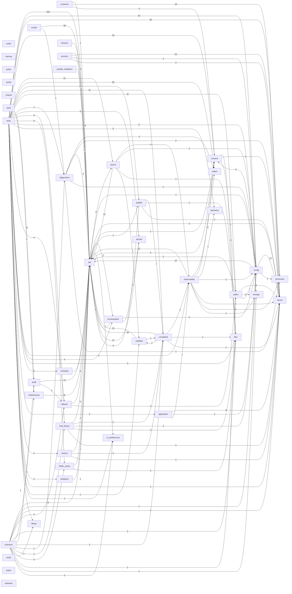

# DEPENDENCY_GRAPH

Generated by `apps/desktop/runtime/Python/python.exe ops/scripts/dev/run-python-tool.py mediapipeline.tools.dev.generate_project_index`. Do not hand-edit.
Edges aggregate cross-domain Python imports and PowerShell dot-includes.

## Edge counts

| From | To | Edges |
|---|---|---|
| tests | api | 615 |
| tests | config | 57 |
| scripts | api | 39 |
| tests | processes | 33 |
| config | api | 27 |
| observability | status | 27 |
| contracts | api | 26 |
| process | api | 23 |
| tests | rename | 23 |
| process | processes | 21 |
| tests | queue | 21 |
| tests | status | 20 |
| config | kernel | 17 |
| observability | api | 17 |
| tests | publish | 15 |
| audit | api | 14 |
| queue | api | 14 |
| subtitles | api | 13 |
| sample_validation | api | 12 |
| decide | api | 11 |
| tests | completed | 11 |
| tests | paths | 11 |
| completed | api | 10 |
| contracts | kernel | 10 |
| tests | audit | 10 |
| api | queue | 8 |
| maintenance | api | 8 |
| tests | maintenance | 8 |
| unknown | api | 8 |
| api | config | 7 |
| tests | diagnostics | 7 |
| unknown | config | 7 |
| application | kernel | 6 |
| diagnostics | api | 6 |
| failures | api | 6 |
| orchestration | api | 6 |
| publish | api | 6 |
| tests | decide | 6 |
| tests | final_library | 6 |
| tests | folder_policy | 6 |
| unknown | kernel | 6 |
| orchestration | config | 5 |
| rename | api | 5 |
| tests | storage | 5 |
| tests | telemetry | 5 |
| diagnostics | status | 4 |
| final_library | api | 4 |
| observability | rename | 4 |
| observability | telemetry | 4 |
| process | config | 4 |
| queue | observability | 4 |
| rename | files | 4 |
| schedule | api | 4 |
| tests | failures | 4 |
| tests | observability | 4 |
| tests | orchestration | 4 |
| config | rename | 3 |
| contracts | rename | 3 |
| metrics | api | 3 |
| metrics | completed | 3 |
| network | api | 3 |
| orchestration | decide | 3 |
| paths | kernel | 3 |
| tests | files | 3 |
| tests | schedule | 3 |
| api | kernel | 2 |
| api | orchestration | 2 |
| api | rename | 2 |
| completed | observability | 2 |
| diagnostics | kernel | 2 |
| paths | api | 2 |
| paths | storage | 2 |
| process | kernel | 2 |
| queue | config | 2 |
| rename | kernel | 2 |
| rename | paths | 2 |
| scripts | diagnostics | 2 |
| tests | application | 2 |
| tests | metrics | 2 |
| tests | validation | 2 |
| unknown | failures | 2 |
| unknown | files | 2 |
| unknown | maintenance | 2 |
| validation | api | 2 |
| api | publish | 1 |
| api | ui_preferences | 1 |
| application | config | 1 |
| application | observability | 1 |
| audit | failures | 1 |
| completed | files | 1 |
| completed | kernel | 1 |
| completed | subtitles | 1 |
| config | processes | 1 |
| diagnostics | config | 1 |
| diagnostics | processes | 1 |
| failures | paths | 1 |
| final_library | completed | 1 |
| final_library | config | 1 |
| final_library | files | 1 |
| final_library | kernel | 1 |
| folder_policy | api | 1 |
| folder_policy | files | 1 |
| metrics | kernel | 1 |
| observability | config | 1 |
| observability | kernel | 1 |
| observability | processes | 1 |
| observability | storage | 1 |
| paths | config | 1 |
| publish | completed | 1 |
| publish | files | 1 |
| publish | kernel | 1 |
| queue | files | 1 |
| queue | subtitles | 1 |
| subtitles | completed | 1 |
| tests | kernel | 1 |
| tests | library | 1 |
| tests | subtitles | 1 |
| tests | ui_preferences | 1 |
| unknown | audit | 1 |
| unknown | completed | 1 |
| unknown | diagnostics | 1 |
| unknown | final_library | 1 |
| unknown | folder_policy | 1 |
| unknown | library | 1 |
| unknown | paths | 1 |
| unknown | storage | 1 |
| unknown | ui_preferences | 1 |
