# DEPENDENCY_GRAPH

Generated by `apps/desktop/runtime/Python/python.exe ops/scripts/dev/run-python-tool.py mediapipeline.tools.dev.generate_project_index`. Do not hand-edit.
Edges aggregate cross-domain Python imports and PowerShell dot-includes.

```mermaid
graph LR
  api["api"]
  application["application"]
  audio["audio"]
  audit["audit"]
  completed["completed"]
  config["config"]
  contracts["contracts"]
  decide["decide"]
  diagnostics["diagnostics"]
  failures["failures"]
  files["files"]
  final_library["final_library"]
  folder_policy["folder_policy"]
  kernel["kernel"]
  library["library"]
  maintenance["maintenance"]
  metrics["metrics"]
  naming["naming"]
  network["network"]
  observability["observability"]
  orchestration["orchestration"]
  paths["paths"]
  policy["policy"]
  probe["probe"]
  process["process"]
  processes["processes"]
  publish["publish"]
  queue["queue"]
  rename["rename"]
  repair_reconcile["repair_reconcile"]
  sample_validation["sample_validation"]
  schedule["schedule"]
  scripts["scripts"]
  shared["shared"]
  shell["shell"]
  status["status"]
  storage["storage"]
  subtitles["subtitles"]
  telemetry["telemetry"]
  tests["tests"]
  ui_preferences["ui_preferences"]
  unknown["unknown"]
  validation["validation"]
  verify["verify"]
  watch["watch"]
  webview["webview"]
  tests -->|707| api
  tests -->|59| config
  scripts -->|46| api
  tests -->|33| processes
  config -->|27| api
  observability -->|27| status
  contracts -->|26| api
  tests -->|24| rename
  process -->|23| api
  process -->|23| processes
  tests -->|23| queue
  tests -->|20| status
  config -->|18| kernel
  observability -->|17| api
  tests -->|16| publish
  audit -->|14| api
  queue -->|14| api
  subtitles -->|13| api
  sample_validation -->|12| api
  unknown -->|12| kernel
  decide -->|11| api
  network -->|11| api
  tests -->|11| completed
  tests -->|11| paths
  completed -->|10| api
  contracts -->|10| kernel
  tests -->|10| audit
  api -->|9| queue
  tests -->|9| maintenance
  unknown -->|9| api
  application -->|8| kernel
  maintenance -->|8| api
  tests -->|8| diagnostics
  tests -->|7| decide
  unknown -->|7| config
  api -->|6| config
  diagnostics -->|6| api
  failures -->|6| api
  network -->|6| config
  network -->|6| kernel
  orchestration -->|6| api
  process -->|6| config
  publish -->|6| api
  tests -->|6| final_library
  tests -->|6| folder_policy
  tests -->|6| storage
  application -->|5| api
  orchestration -->|5| config
  rename -->|5| api
  scripts -->|5| diagnostics
  tests -->|5| application
  tests -->|5| kernel
  tests -->|5| orchestration
  tests -->|5| telemetry
  tests -->|5| validation
  config -->|4| rename
  contracts -->|4| rename
  diagnostics -->|4| status
  final_library -->|4| api
  network -->|4| processes
  observability -->|4| rename
  observability -->|4| telemetry
  queue -->|4| observability
  rename -->|4| files
  schedule -->|4| api
  tests -->|4| failures
  tests -->|4| observability
  api -->|3| rename
  config -->|3| validation
  diagnostics -->|3| kernel
  maintenance -->|3| kernel
  metrics -->|3| api
  metrics -->|3| completed
  orchestration -->|3| decide
  paths -->|3| kernel
  process -->|3| kernel
  publish -->|3| kernel
  tests -->|3| files
  tests -->|3| network
  tests -->|3| schedule
  unknown -->|3| completed
  unknown -->|3| maintenance
  api -->|2| kernel
  api -->|2| orchestration
  api -->|2| processes
  application -->|2| config
  completed -->|2| observability
  contracts -->|2| validation
  paths -->|2| api
  paths -->|2| storage
  queue -->|2| config
  rename -->|2| kernel
  rename -->|2| paths
  scripts -->|2| processes
  scripts -->|2| publish
  tests -->|2| metrics
  unknown -->|2| failures
  unknown -->|2| files
  unknown -->|2| repair_reconcile
  unknown -->|2| storage
  validation -->|2| api
  api -->|1| files
  api -->|1| maintenance
  api -->|1| network
  api -->|1| publish
  api -->|1| repair_reconcile
  api -->|1| ui_preferences
  api -->|1| validation
  application -->|1| network
  application -->|1| observability
  application -->|1| processes
  audit -->|1| failures
  completed -->|1| files
  completed -->|1| kernel
  completed -->|1| subtitles
  config -->|1| processes
  diagnostics -->|1| config
  diagnostics -->|1| processes
  failures -->|1| paths
  final_library -->|1| completed
  final_library -->|1| config
  final_library -->|1| files
  final_library -->|1| kernel
  folder_policy -->|1| api
  folder_policy -->|1| files
  maintenance -->|1| diagnostics
  maintenance -->|1| network
  maintenance -->|1| storage
  metrics -->|1| kernel
  observability -->|1| config
  observability -->|1| kernel
  observability -->|1| processes
  observability -->|1| storage
  paths -->|1| config
  process -->|1| files
  publish -->|1| completed
  publish -->|1| files
  queue -->|1| files
  queue -->|1| subtitles
  scripts -->|1| rename
  subtitles -->|1| completed
  tests -->|1| library
  tests -->|1| subtitles
  tests -->|1| ui_preferences
  unknown -->|1| audit
  unknown -->|1| diagnostics
  unknown -->|1| final_library
  unknown -->|1| folder_policy
  unknown -->|1| library
  unknown -->|1| ui_preferences
  watch -->|1| processes
```

## Edge counts

| From | To | Edges |
|---|---|---|
| tests | api | 707 |
| tests | config | 59 |
| scripts | api | 46 |
| tests | processes | 33 |
| config | api | 27 |
| observability | status | 27 |
| contracts | api | 26 |
| tests | rename | 24 |
| process | api | 23 |
| process | processes | 23 |
| tests | queue | 23 |
| tests | status | 20 |
| config | kernel | 18 |
| observability | api | 17 |
| tests | publish | 16 |
| audit | api | 14 |
| queue | api | 14 |
| subtitles | api | 13 |
| sample_validation | api | 12 |
| unknown | kernel | 12 |
| decide | api | 11 |
| network | api | 11 |
| tests | completed | 11 |
| tests | paths | 11 |
| completed | api | 10 |
| contracts | kernel | 10 |
| tests | audit | 10 |
| api | queue | 9 |
| tests | maintenance | 9 |
| unknown | api | 9 |
| application | kernel | 8 |
| maintenance | api | 8 |
| tests | diagnostics | 8 |
| tests | decide | 7 |
| unknown | config | 7 |
| api | config | 6 |
| diagnostics | api | 6 |
| failures | api | 6 |
| network | config | 6 |
| network | kernel | 6 |
| orchestration | api | 6 |
| process | config | 6 |
| publish | api | 6 |
| tests | final_library | 6 |
| tests | folder_policy | 6 |
| tests | storage | 6 |
| application | api | 5 |
| orchestration | config | 5 |
| rename | api | 5 |
| scripts | diagnostics | 5 |
| tests | application | 5 |
| tests | kernel | 5 |
| tests | orchestration | 5 |
| tests | telemetry | 5 |
| tests | validation | 5 |
| config | rename | 4 |
| contracts | rename | 4 |
| diagnostics | status | 4 |
| final_library | api | 4 |
| network | processes | 4 |
| observability | rename | 4 |
| observability | telemetry | 4 |
| queue | observability | 4 |
| rename | files | 4 |
| schedule | api | 4 |
| tests | failures | 4 |
| tests | observability | 4 |
| api | rename | 3 |
| config | validation | 3 |
| diagnostics | kernel | 3 |
| maintenance | kernel | 3 |
| metrics | api | 3 |
| metrics | completed | 3 |
| orchestration | decide | 3 |
| paths | kernel | 3 |
| process | kernel | 3 |
| publish | kernel | 3 |
| tests | files | 3 |
| tests | network | 3 |
| tests | schedule | 3 |
| unknown | completed | 3 |
| unknown | maintenance | 3 |
| api | kernel | 2 |
| api | orchestration | 2 |
| api | processes | 2 |
| application | config | 2 |
| completed | observability | 2 |
| contracts | validation | 2 |
| paths | api | 2 |
| paths | storage | 2 |
| queue | config | 2 |
| rename | kernel | 2 |
| rename | paths | 2 |
| scripts | processes | 2 |
| scripts | publish | 2 |
| tests | metrics | 2 |
| unknown | failures | 2 |
| unknown | files | 2 |
| unknown | repair_reconcile | 2 |
| unknown | storage | 2 |
| validation | api | 2 |
| api | files | 1 |
| api | maintenance | 1 |
| api | network | 1 |
| api | publish | 1 |
| api | repair_reconcile | 1 |
| api | ui_preferences | 1 |
| api | validation | 1 |
| application | network | 1 |
| application | observability | 1 |
| application | processes | 1 |
| audit | failures | 1 |
| completed | files | 1 |
| completed | kernel | 1 |
| completed | subtitles | 1 |
| config | processes | 1 |
| diagnostics | config | 1 |
| diagnostics | processes | 1 |
| failures | paths | 1 |
| final_library | completed | 1 |
| final_library | config | 1 |
| final_library | files | 1 |
| final_library | kernel | 1 |
| folder_policy | api | 1 |
| folder_policy | files | 1 |
| maintenance | diagnostics | 1 |
| maintenance | network | 1 |
| maintenance | storage | 1 |
| metrics | kernel | 1 |
| observability | config | 1 |
| observability | kernel | 1 |
| observability | processes | 1 |
| observability | storage | 1 |
| paths | config | 1 |
| process | files | 1 |
| publish | completed | 1 |
| publish | files | 1 |
| queue | files | 1 |
| queue | subtitles | 1 |
| scripts | rename | 1 |
| subtitles | completed | 1 |
| tests | library | 1 |
| tests | subtitles | 1 |
| tests | ui_preferences | 1 |
| unknown | audit | 1 |
| unknown | diagnostics | 1 |
| unknown | final_library | 1 |
| unknown | folder_policy | 1 |
| unknown | library | 1 |
| unknown | ui_preferences | 1 |
| watch | processes | 1 |
