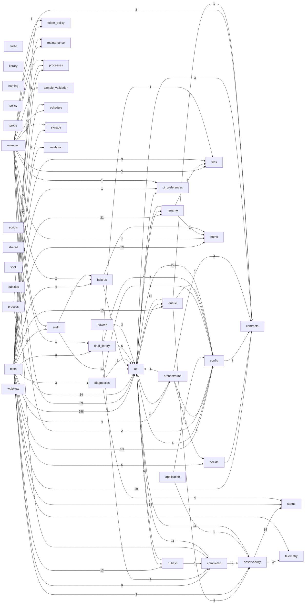

# DEPENDENCY_GRAPH

Generated by `scripts/dev/generate_project_index.py`. Do not hand-edit.
Edges aggregate cross-domain Python imports and PowerShell dot-includes.

## Edge counts

| From | To | Edges |
|---|---|---|
| tests | api | 298 |
| tests | config | 53 |
| tests | processes | 32 |
| tests | contracts | 29 |
| unknown | api | 29 |
| process | api | 24 |
| config | api | 22 |
| tests | rename | 21 |
| observability | status | 19 |
| process | processes | 18 |
| tests | status | 18 |
| observability | api | 16 |
| tests | queue | 15 |
| audit | api | 13 |
| tests | publish | 13 |
| queue | api | 12 |
| completed | api | 11 |
| tests | paths | 10 |
| tests | audit | 9 |
| tests | completed | 9 |
| decide | contracts | 8 |
| unknown | maintenance | 8 |
| config | contracts | 7 |
| unknown | folder_policy | 7 |
| unknown | paths | 7 |
| failures | api | 6 |
| publish | api | 6 |
| rename | api | 6 |
| tests | decide | 6 |
| tests | final_library | 6 |
| tests | folder_policy | 6 |
| diagnostics | api | 5 |
| final_library | api | 5 |
| tests | maintenance | 5 |
| tests | storage | 5 |
| unknown | files | 5 |
| unknown | schedule | 5 |
| api | config | 4 |
| diagnostics | status | 4 |
| observability | telemetry | 4 |
| orchestration | config | 4 |
| orchestration | contracts | 4 |
| queue | observability | 4 |
| tests | failures | 4 |
| tests | orchestration | 4 |
| tests | telemetry | 4 |
| api | contracts | 3 |
| api | queue | 3 |
| network | api | 3 |
| orchestration | decide | 3 |
| rename | files | 3 |
| tests | diagnostics | 3 |
| tests | files | 3 |
| tests | observability | 3 |
| tests | schedule | 3 |
| unknown | contracts | 3 |
| unknown | storage | 3 |
| completed | observability | 2 |
| rename | paths | 2 |
| tests | validation | 2 |
| unknown | config | 2 |
| unknown | failures | 2 |
| api | orchestration | 1 |
| api | publish | 1 |
| api | rename | 1 |
| api | ui_preferences | 1 |
| application | config | 1 |
| application | observability | 1 |
| audit | failures | 1 |
| diagnostics | config | 1 |
| failures | paths | 1 |
| final_library | completed | 1 |
| final_library | config | 1 |
| final_library | files | 1 |
| orchestration | api | 1 |
| publish | completed | 1 |
| queue | config | 1 |
| queue | contracts | 1 |
| tests | ui_preferences | 1 |
| unknown | audit | 1 |
| unknown | completed | 1 |
| unknown | final_library | 1 |
| unknown | processes | 1 |
| unknown | sample_validation | 1 |
| unknown | ui_preferences | 1 |
