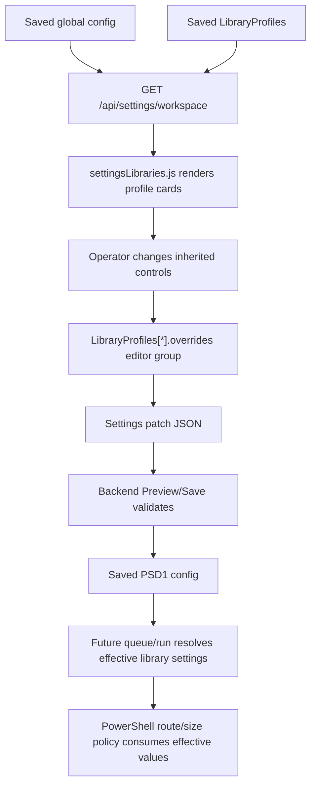

# Library Profile Routing And Size Replication Plan

Date: 2026-06-06
Status: investigation complete; implementation plan only
Change packet: MP-CHANGE-2026-0606-005

## Request

Replicate the current Settings routing and size controls in Library Profiles. The
Library Profiles experience should be very similar to the current Settings
builder shown in the operator screenshot, while remaining library-aware,
inheritance-aware, and backend-owned.

## Executive Summary

The backend already supports the relevant Library Profile overrides. The
problem is presentation and ergonomics, not a missing runtime policy model.

Current Settings has a domain-specific route and size builder:

- `Library goal`
- `What forces an encode?`
- `TV / Movie targets by height`
- editable 1080p / 1440p / 4K height boundaries
- per-bucket encoded output size targets
- per-bucket direct-copy bitrate caps
- `If encoded output is too large`
- quality and compatibility growth tolerances

Current Libraries uses the same underlying keys, but it renders them as a flat
metadata override grid inside `Default Editor Overrides`. That makes Libraries
functionally capable but visually unlike Settings, and it hides the most
important mental model: height chooses the route bucket, the bucket chooses both
the GB target and Mbps cap, and library overrides inherit global Settings unless
made explicit.

Recommended implementation:

1. Keep the existing backend data model and persisted keys.
2. Add a Library Profiles route/size editor that reuses the Settings visual
   language and route math.
3. Keep every Library control wired through the existing Library Profile
   override state model: inherited values display as inherited, changed values
   become explicit overrides, and reset removes the override key instead of
   writing the global value.
4. Preserve designation filtering:
   - Movie libraries show Movie target controls.
   - TV libraries show TV target controls.
   - Auto libraries show both Movie and TV target controls.
   - Shared route controls such as bitrate caps and height boundaries remain
     visible for all designations.
5. Do not move media policy into the WebView. The UI stages JSON only; backend
   Preview/Save remains authoritative.

No media behavior should change until a backend Preview/Save accepts the
staged LibraryProfiles patch and a future run consumes the saved library
override evidence.

## What Was Investigated

### Current Settings Surface

The Settings page already has the target UI pattern in
`apps/desktop/webview/static/partials/page-settings.html`.

Relevant existing sections:

- `What forces an encode?`
  - `RouteThresholdMode`
  - operator copy for `compatibility_advisory`, `size`, `bitrate`, and
    `size_or_bitrate`
- `TV / Movie targets by height`
  - route rail for the 1080p, 1440p, and 4K bucket boundaries
  - target cards for 1080p, 1440p, and 4K
  - Movie and TV target size fields
  - direct-copy max Mbps fields
  - derived height range readouts
- `If encoded output is too large`
  - `SizeGuardMode`
  - `MaxEncodeGrowthPercent`
  - `CompatibilityEncodeGrowthPercent`

The Settings route helper logic lives mainly in
`apps/desktop/webview/static/assets/settings/patchReview.js`.

Important existing helper responsibilities:

- convert route tolerance percentages to pixel boundaries
- keep the first boundary pair contiguous:
  - `Route1080pUpperHeightTolerancePercent`
  - `Route1440pLowerHeightTolerancePercent`
- keep the second boundary pair contiguous:
  - `Route1440pUpperHeightTolerancePercent`
  - `Route4KLowerHeightTolerancePercent`
- render bucket range summaries
- render route trigger summaries
- estimate constant-bitrate file sizes
- collect route and size controls into the root Settings patch

### Current Library Profiles Surface

The Library Profiles page is rendered by
`apps/desktop/webview/static/assets/settingsLibraries.js`.

Current behavior:

- `overrideLayouts.editor` lists all routing and size keys in a single grid.
- `renderOverrideField()` renders generic controls with:
  - `data-library-override-row`
  - `data-library-override-group`
  - `data-library-override-key`
  - `data-library-override`
  - `data-library-override-control`
- `profileFromCard()` collects only rows marked
  `data-library-override="true"` into `LibraryProfiles[*].overrides`.
- `settingOverrideEvidence()` reads backend-provided
  `library_profile_state[*].setting_overrides`.
- inherited values and explicit values are already distinguished.
- reset-to-inherited already removes the persisted override key.
- inapplicable designation-specific overrides are pruned before staging.

Current gap:

- Libraries does not render the route/size controls as a route policy builder.
- The current flat grid is not similar enough to Settings.
- The route rail and bucket summaries are not present.
- Per-library inherited versus explicit state is available, but the route
  controls do not present that state in the same operator workflow as Settings.

### Backend Metadata And Overrides

The backend already marks the relevant fields as library-overridable in
`src/mediapipeline/core/config/metadata_parts/field_scope.py`.

Relevant `editor` override keys:

- `RoutingProfile`
- `RouteThresholdMode`
- `SizeGuardMode`
- `EncodeTuningPreset`
- `EncodeLadder`
- `VideoCodec`
- `OutputContainer`
- `MovieRoute1080pTargetSizeGB`
- `MovieRoute1440pTargetSizeGB`
- `MovieRoute4KTargetSizeGB`
- `TVRoute1080pTargetSizeGB`
- `TVRoute1440pTargetSizeGB`
- `TVRoute4KTargetSizeGB`
- `Route1080pUpperHeightTolerancePercent`
- `Route1080pMaxVideoBitrateMbps`
- `Route1440pLowerHeightTolerancePercent`
- `Route1440pUpperHeightTolerancePercent`
- `Route1440pMaxVideoBitrateMbps`
- `Route4KLowerHeightTolerancePercent`
- `Route4KMaxVideoBitrateMbps`
- `MaxEncodeGrowthPercent`
- `CompatibilityEncodeGrowthPercent`

Display metadata in
`src/mediapipeline/core/config/metadata_parts/field_display.py` already defines:

- labels
- short labels
- sections
- help text
- units and min/max rules
- Library Profile designation filtering for Movie and TV target fields

Backend Library Profile defaults are derived from metadata in
`src/mediapipeline/core/config/library_profile_defaults.py`.

Backend effective library settings are resolved in
`src/mediapipeline/core/config/library_profile_state.py`.

Backend validation rejects unsupported or invalid Library Profile override keys
in `src/mediapipeline/core/config/library_profile_validation.py`.

Conclusion: do not add new config keys or duplicate the metadata registry.

### Runtime And Test Evidence

PowerShell routing already consumes Library Profile overrides and has coverage
in `ops/pipeline/tests/Unit/Invoke-LibraryProfileRoutingChecks.ps1`.

Important existing coverage:

- library overrides can promote route threshold behavior
- size guard evidence distinguishes GB targets from Mbps routing gates
- queue discovery snapshots effective library settings and override keys
- invalid route override values fail config validation

WebView tests already protect key Library Profile behaviors:

- `tests/webview/test_webview_settings_libraries.py`
  - layout coverage for backend override keys
  - metadata and override-group alignment
  - Library Profile designation filtering
  - inherited versus explicit state wiring
  - reset-to-inherited wiring
- `tests/webview/test_webview_browser_settings_launch_smoke.py`
  - Movie target rows are hidden for TV libraries
  - TV target rows are hidden for Movie libraries
  - Auto designation shows both
  - direct-copy bitrate rows render inherited values
  - hidden designation-specific edits are pruned before staging

Conclusion: the implementation can focus on changing Library Profiles layout
and preserving current data attributes/tests.

## Non-Negotiable Boundaries

This work is UI and settings-staging work only.

Do not:

- implement filesystem mutation in the WebView
- implement media policy decisions in the WebView
- bypass backend Preview/Save
- write root-level config keys from the Library Profiles editor
- invent new persisted setting names
- silently copy current global values into every library as explicit overrides
- change PowerShell FFmpeg routing behavior as part of the UI replication
- relax strict JSON save/preview confirmation behavior
- reintroduce legacy launcher or flat backend module paths

If a future implementation changes PowerShell routing, FFmpeg behavior,
subtitle behavior, audio behavior, publish/drain behavior, source/scratch/output
movement, or cleanup behavior, it must be treated as media-policy work and must
use the higher validation ladder, including representative real-media
validation.

## Data Flow To Preserve



Important distinction:

- `library_effective_settings` is global settings plus Library Profile overrides
  only.
- It does not include folder policy, show policy, per-file overrides, probe
  facts, verification facts, or publish facts.
- Runtime effective settings, where shown, are diagnostic evidence and should
  stay separate from persisted Library Profile state.

## Target User Experience

### Page-Level Behavior

The Libraries page keeps the existing structure:

- library tabs
- library profile identity fields
- source/output/promotion path fields
- override sections
- Stage Patch / Preview / Save buttons

Inside the selected library's `Default Editor Overrides`, replace the flat
routing/size grid with a route builder that looks and behaves like Settings.

Because the Library Profile itself is already rendered as a card-like surface,
avoid nested card visuals inside it. Use the same route rail, bucket grouping,
spacing, typography, and input style as Settings, but render bucket groups as
unframed sections or low-emphasis panels rather than full cards inside cards.

### Library Goal

Render `RoutingProfile` at the top of the Editor override section.

Behavior:

- value comes from library effective evidence
- inherited state is labeled `Inherited`
- explicit state is labeled `Library override`
- changing the select marks only `RoutingProfile` explicit
- reset removes only `RoutingProfile`

### What Forces An Encode

Render `RouteThresholdMode` with the same labels as Settings:

- `Bitrate strict, size flexible`
- `Target size strict`
- `Direct-copy bitrate strict`
- `Size or bitrate strict`

Render the same explanatory summary, but make it library-scoped:

- inherited summary uses the inherited effective value
- explicit summary uses the staged library value
- copy must say the value affects only content routed through this library

### TV / Movie Targets By Height

Render a 1080p / 1440p / 4K route bucket editor.

Each bucket should show:

- bucket name
- derived height range
- encoded output size controls
- direct-copy max Mbps control
- height range readout
- inherited/override state indicators
- reset-to-inherited controls

Bucket mapping:

| Bucket | Target fields | Bitrate field | Boundary fields |
|---|---|---|---|
| 1080p | `MovieRoute1080pTargetSizeGB`, `TVRoute1080pTargetSizeGB` | `Route1080pMaxVideoBitrateMbps` | `Route1080pUpperHeightTolerancePercent` |
| 1440p | `MovieRoute1440pTargetSizeGB`, `TVRoute1440pTargetSizeGB` | `Route1440pMaxVideoBitrateMbps` | `Route1440pLowerHeightTolerancePercent`, `Route1440pUpperHeightTolerancePercent` |
| 4K | `MovieRoute4KTargetSizeGB`, `TVRoute4KTargetSizeGB` | `Route4KMaxVideoBitrateMbps` | `Route4KLowerHeightTolerancePercent` |

Designation filtering:

| Library designation | Movie target controls | TV target controls | Shared bitrate/boundary controls |
|---|---:|---:|---:|
| `movie` | shown | hidden | shown |
| `tv` | hidden | shown | shown |
| `auto` | shown | shown | shown |

Do not persist hidden designation-specific controls.

If the operator edits a Movie field while a library is `auto`, then changes the
library back to `tv`, the existing prune behavior must remain:

- hidden Movie override keys are omitted from the staged patch
- the warning summary reports omitted designation-specific overrides
- no hidden override survives in `LibraryProfiles[*].overrides.editor`

### Height Boundary Rail

Replicate the Settings route rail in library-scoped form.

Settings currently treats the boundaries as paired tolerance values:

- first boundary:
  - updates `Route1080pUpperHeightTolerancePercent`
  - updates `Route1440pLowerHeightTolerancePercent`
- second boundary:
  - updates `Route1440pUpperHeightTolerancePercent`
  - updates `Route4KLowerHeightTolerancePercent`

Library behavior should match:

- compute displayed boundaries from the library effective values
- if no library override exists, effective values come from global Settings
- dragging the first boundary marks both first-boundary tolerance fields
  explicit
- dragging the second boundary marks both second-boundary tolerance fields
  explicit
- resetting the first boundary removes both first-boundary tolerance override
  keys
- resetting the second boundary removes both second-boundary tolerance override
  keys
- if a saved profile already has only one field in a pair explicitly set, show a
  `Partial boundary override` state and keep values truthful instead of
  inventing the missing override

The route rail must not write root Settings keys. It only stages fields inside
the selected library's `overrides.editor` object.

### Direct-Copy Limits

Render these controls in the bucket editor:

- `Route1080pMaxVideoBitrateMbps`
- `Route1440pMaxVideoBitrateMbps`
- `Route4KMaxVideoBitrateMbps`

Behavior:

- visible for all library designations
- use inherited/effective values from backend state
- changing a value marks only that key explicit
- reset removes only that key
- estimates use the same math as Settings:
  - 30 minute TV estimate
  - 2 hour movie estimate

### If Encoded Output Is Too Large

Render a Settings-like oversize block:

- `SizeGuardMode`
- `MaxEncodeGrowthPercent`
- `CompatibilityEncodeGrowthPercent`

Behavior:

- values inherit from global Settings unless overridden
- changing a value marks only that key explicit
- reset removes only that key
- copy should make clear this is post-encode verification behavior

### Video Encoding Alignment

The screenshot is focused on route/size controls, but the current Settings page
also carries route-adjacent encode settings in the same operator flow.

Keep the current Library Profiles `Default Video / Media Overrides` section for:

- `VideoPreset`
- `VideoQuality`
- `AllowH264RemuxIfPlexCompatible`
- `H264RemuxMaxBitrateMbps`
- `H264RemuxMaxHeight`
- `RemuxSafeVideoCodecs`
- `FallbackCpuQuality`
- `CpuEncodePreset`
- `CpuEncodeProcessPriority`
- `CpuEncodeMaxThreads`
- `ExtraVideoFlags`

Do not move these into the first route replication pass unless the implementation
also brings over the Settings video builder layout. The first pass should focus
on the exact route/size controls shown in the screenshot and leave the video
section structurally stable.

## Recommended Implementation Approach

### Phase 0: Baseline And Guardrails

Before editing implementation files:

1. Capture the current test baseline for Library Profile settings UI.
2. Confirm no unrelated dirty files need to be absorbed into the change packet.
3. Create or update the change packet before code edits.
4. Keep the change scoped to WebView route/size presentation unless tests reveal
   a backend mismatch.

Suggested baseline commands:

```powershell
.\apps\desktop\runtime\Python\python.exe -m unittest tests.webview.test_webview_settings_libraries
.\apps\desktop\runtime\Python\python.exe -m unittest tests.webview.test_webview_browser_settings_launch_smoke
.\apps\desktop\runtime\Python\python.exe -m unittest tests.python.desktop.test_library_profiles
```

### Phase 1: Extract Shared Route Policy Math

The Settings route helpers currently live inside
`apps/desktop/webview/static/assets/settings/patchReview.js` and are tied to
global Settings DOM IDs.

Create a small shared model module, for example:

`apps/desktop/webview/static/assets/settings/routePolicyModel.js`

Expose it as:

`window.mediaPipelineRoutePolicyModel`

Keep it pure. It should not read or write DOM.

Recommended functions:

- `defaults()`
- `clamp(value, min, max)`
- `formatPercent(value)`
- `formatDisplayPercent(value)`
- `formatHeight(value)`
- `maxHeightFromUpperTolerance(baseHeight, tolerancePercent)`
- `minHeightFromLowerTolerance(baseHeight, tolerancePercent)`
- `upperToleranceFromMaxHeight(baseHeight, maxHeight)`
- `lowerToleranceFromMinHeight(baseHeight, minHeight)`
- `boundariesFromValues(values)`
- `valuesFromFirstBoundary(height, existingValues)`
- `valuesFromSecondBoundary(height, existingValues)`
- `estimatedSizeGb(mbps, minutes)`
- `formatEstimatedGb(value)`
- `triggerSummary(mode)`
- `heightPixelSummary(boundaries)`
- `consequenceSummary(boundaries, values)`
- `unknownHeightSummary(values)`

Then update `index.html` script order so this file loads before:

- `assets/settings/patchReview.js`
- `assets/settingsLibraries.js`

Initial implementation can leave `patchReview.js` mostly intact and have both
Settings and Libraries call the shared math. Avoid a large Settings rewrite in
the first pass.

Acceptance for Phase 1:

- Settings route behavior is unchanged.
- Existing Settings tests still pass.
- The new model has targeted static/unit coverage through WebView tests.
- No backend files are touched.

### Phase 2: Add A Library Route/Size Renderer

In `apps/desktop/webview/static/assets/settingsLibraries.js`, add a new layout
block type for the editor section, for example:

- `routePolicy`
- `routeSize`
- `routingSize`

Change `overrideLayouts.editor` from one flat grid to grouped blocks:

1. Library goal block:
   - `RoutingProfile`
2. Encode trigger block:
   - `RouteThresholdMode`
3. Route bucket block:
   - all Movie/TV target fields
   - all route bitrate fields
   - all height tolerance fields
4. Oversize action block:
   - `SizeGuardMode`
   - `MaxEncodeGrowthPercent`
   - `CompatibilityEncodeGrowthPercent`
5. Remaining compact route-adjacent fields:
   - `EncodeTuningPreset`
   - `EncodeLadder`
   - `VideoCodec`
   - `OutputContainer`

Do not render the same key twice.

Implementation detail:

- keep each actual input inside an element that still has
  `data-library-override-row`
- keep each input marked with `data-library-override-control`
- keep `data-library-override-group="editor"`
- keep `data-library-override-key="<ConfigKey>"`
- keep `data-library-override` updated by existing or extended state handlers

This lets `profileFromCard()` keep collecting overrides without a new patch
builder format.

### Phase 3: Library-Specific Values And State

Create helper functions in `settingsLibraries.js` to resolve route values from
Library Profile evidence:

- `libraryEffectiveValue(profile, "editor", key)`
- `libraryInheritedValue(profile, "editor", key)`
- `libraryHasExplicitOverride(profile, "editor", key)`
- `libraryRouteValues(profile)`
- `libraryRouteBoundaries(profile)`

Do not read current global values directly for displayed Library route values
unless backend evidence is absent. Preferred source order:

1. local staged override in the current profile card
2. backend `library_profile_state[*].setting_overrides.editor[key].effective_value`
3. field default metadata

This preserves the current rule: Library Profiles render effective settings as
global defaults plus library overrides, not final runtime state.

### Phase 4: Library Route Rail Interaction

Implement a library-scoped rail event handler. It can reuse the Settings CSS
classes, but it must not rely on global IDs such as
`settings-route-boundary-1080p-end-input`.

Use either:

- generated IDs prefixed with the profile ID, or
- data attributes scoped to the current `.settings-library-card`

Preferred data attributes:

- `data-library-route-rail`
- `data-library-route-boundary="first|second"`
- `data-library-route-boundary-input="first|second"`
- `data-library-route-bucket="1080p|1440p|4k"`
- `data-library-route-readout="<purpose>"`

On first-boundary change:

- compute both tolerance values
- set the hidden/input values for:
  - `Route1080pUpperHeightTolerancePercent`
  - `Route1440pLowerHeightTolerancePercent`
- mark both rows explicit
- update state labels and reset buttons
- rerender readouts

On second-boundary change:

- compute both tolerance values
- set the hidden/input values for:
  - `Route1440pUpperHeightTolerancePercent`
  - `Route4KLowerHeightTolerancePercent`
- mark both rows explicit
- update state labels and reset buttons
- rerender readouts

On reset:

- reset single fields for normal controls
- reset paired tolerance controls together when the reset action is a boundary
  reset

Do not use global document queries when a card-scoped query is possible.

### Phase 5: Styling

Reuse the existing route rail and bucket visual language from
`apps/desktop/webview/static/assets/styles.pages.css`.

Add only the Library-specific CSS needed to make the route editor work inside a
Library Profile card.

Constraints:

- no nested card visuals inside `.settings-library-card`
- no overlapping labels or controls at desktop or mobile widths
- inherited/explicit state text must fit in compact controls
- route rail handles must remain clickable/draggable
- bucket groups must wrap cleanly on narrow viewports
- controls must retain keyboard access
- hidden tolerance controls must remain represented by accessible readouts

Likely CSS additions:

- `.settings-library-route-editor`
- `.settings-library-route-section`
- `.settings-library-route-buckets`
- `.settings-library-route-bucket`
- `.settings-library-route-boundary-actions`
- `.settings-library-route-partial`

Do not introduce a new color theme. Use existing tokens.

### Phase 6: Patch, Preview, And Save Behavior

The final staged patch should remain:

```json
{
  "LibraryProfiles": [
    {
      "id": "movies",
      "name": "Movies",
      "enabled": true,
      "designation": "movie",
      "overrides": {
        "editor": {
          "RouteThresholdMode": "bitrate",
          "MovieRoute1080pTargetSizeGB": 7,
          "Route1080pMaxVideoBitrateMbps": 18
        }
      }
    }
  ]
}
```

The Library Profiles editor must not stage:

```json
{
  "RouteThresholdMode": "bitrate",
  "MovieRoute1080pTargetSizeGB": 7
}
```

Preview and Save continue through the existing Settings backend route. The UI
only builds staged JSON.

### Phase 7: Update Tests

Update or add tests before relying on manual UI inspection.

#### Static WebView Tests

Update `tests/webview/test_webview_settings_libraries.py` to verify:

- all backend Library Profile override keys are still covered by layout
- route/size keys are not duplicated between the route section and generic grid
- the route section contains the Settings-like labels:
  - `Library goal`
  - `What forces an encode?`
  - `TV / Movie targets by height`
  - `If encoded output is too large`
- route controls still use `data-library-override-row`
- route controls still use `data-library-override-control`
- paired boundary controls reference the correct backend keys
- no hidden designation-specific fields are staged
- no root-level Settings keys are written by Library Profiles

#### Browser Smoke Tests

Update `tests/webview/test_webview_browser_settings_launch_smoke.py` or add a
focused Library Profiles browser smoke to verify:

- Movie profile shows Movie target fields and hides TV target fields
- TV profile shows TV target fields and hides Movie target fields
- Auto profile shows both Movie and TV target fields
- inherited route values render with `data-library-override="false"`
- changing `RouteThresholdMode` marks only that key explicit
- changing a Movie target in an Auto profile marks that key explicit
- switching Auto back to TV prunes the hidden Movie target override
- changing 1080p boundary marks both first-boundary tolerance keys explicit
- changing 4K boundary marks both second-boundary tolerance keys explicit
- resetting a boundary removes the paired override keys
- Stage Patch writes `LibraryProfiles[*].overrides.editor`
- Stage Patch does not write root-level route keys

#### Backend Contract Tests

Existing backend tests should remain valid. Run:

- `tests/python/desktop/test_metadata_contract.py`
- `tests/python/desktop/test_library_profiles.py`
- `tests/python/desktop/test_application_facade_settings_workspace.py`
- `tests/python/desktop/test_service_config_numeric_policy.py`
- `tests/python/desktop/test_service_config_option_policy.py`

Only update backend tests if the implementation uncovers a real metadata or
validation mismatch.

#### PowerShell Tests

Run the existing PowerShell route/library coverage:

- `ops/pipeline/tests/Unit/Invoke-LibraryProfileRoutingChecks.ps1`
- `ops/pipeline/tests/Unit/Invoke-MediaRouteSelectionChecks.ps1`
- `ops/pipeline/tests/Unit/Invoke-ConfigKeyRegistryChecks.ps1`

These should pass without code changes if the work remains UI-only.

### Phase 8: Validation Ladder

For a UI-only implementation:

```powershell
.\apps\desktop\runtime\Python\python.exe -m unittest tests.webview.test_webview_settings_libraries
.\apps\desktop\runtime\Python\python.exe -m unittest tests.webview.test_webview_browser_settings_launch_smoke
.\apps\desktop\runtime\Python\python.exe -m unittest tests.webview.test_webview_handbrake_settings_ui
.\apps\desktop\runtime\Python\python.exe -m unittest tests.python.desktop.test_metadata_contract
.\apps\desktop\runtime\Python\python.exe -m unittest tests.python.desktop.test_library_profiles
.\apps\desktop\runtime\Python\python.exe -m unittest tests.python.desktop.test_application_facade_settings_workspace
npm run webview:check
.\ops\scripts\smoke\Test-WebViewBrowserSettingsLaunchSmoke.ps1
```

If PowerShell config or route behavior changes:

```powershell
.\ops\pipeline\runtime\PowerShell-7.6.0-win-x64\pwsh.exe -NoProfile -ExecutionPolicy Bypass -File .\ops\pipeline\tests\Unit\Invoke-LibraryProfileRoutingChecks.ps1
.\ops\pipeline\runtime\PowerShell-7.6.0-win-x64\pwsh.exe -NoProfile -ExecutionPolicy Bypass -File .\ops\pipeline\tests\Unit\Invoke-MediaRouteSelectionChecks.ps1
.\ops\pipeline\runtime\PowerShell-7.6.0-win-x64\pwsh.exe -NoProfile -ExecutionPolicy Bypass -File .\ops\pipeline\tests\Unit\Invoke-ConfigKeyRegistryChecks.ps1
```

If media policy changes:

- run release gate validation
- rerun representative real-media validation for remux, encode/size, subtitle,
  audio, pending publish, and final placement as applicable

Always run after editing:

```powershell
.\apps\desktop\runtime\Python\python.exe .\ops\scripts\dev\run-python-tool.py mediapipeline.tools.dev.refresh_summaries
.\apps\desktop\runtime\Python\python.exe .\ops\scripts\dev\run-python-tool.py mediapipeline.tools.change_control.validate_changes --require-worktree-coverage
```

## Detailed File Plan

### Files Expected To Change

| File | Expected change |
|---|---|
| `apps/desktop/webview/static/assets/settings/routePolicyModel.js` | New pure route math and route summary helper module. |
| `apps/desktop/webview/static/index.html` | Add script before Settings patch review and Library Profiles scripts. |
| `apps/desktop/webview/static/assets/settings/patchReview.js` | Optional small refactor to use shared route model. Keep Settings behavior unchanged. |
| `apps/desktop/webview/static/assets/settingsLibraries.js` | Add Library route/size editor renderer, route rail wiring, paired boundary handling, and route-specific state updates. |
| `apps/desktop/webview/static/assets/styles.pages.css` | Add Library route editor layout adjustments while reusing route rail/token styles. |
| `tests/webview/test_webview_settings_libraries.py` | Static layout and data-attribute coverage. |
| `tests/webview/test_webview_browser_settings_launch_smoke.py` | Browser interaction coverage for Library route controls. |
| `tests/webview/test_webview_handbrake_settings_ui.py` | Only if shared model extraction touches Settings route behavior. |
| `docs/generated/summaries/...` | Regenerated summaries for changed files. |
| `ops/release/changes/unreleased/...` | Change packet updates. |

### Files That Should Not Need Changes

| File | Reason |
|---|---|
| `src/mediapipeline/core/config/metadata_parts/field_scope.py` | Relevant keys are already library-overridable. |
| `src/mediapipeline/core/config/metadata_parts/field_display.py` | Labels, help, units, and designation filtering already exist. |
| `src/mediapipeline/core/config/library_profile_defaults.py` | Defaults already derive from backend metadata. |
| `src/mediapipeline/core/config/library_profile_state.py` | Effective/inherited/explicit evidence already exists. |
| `src/mediapipeline/core/config/library_profile_validation.py` | Validation already rejects unsupported/invalid override keys. |
| `src/mediapipeline/contracts/config.py` | No new persisted keys are needed. |
| `ops/pipeline/engine/decide/*.ps1` | No route policy behavior change is required. |

If any of these files appear necessary during implementation, reassess the
scope. Touching backend or PowerShell route behavior raises validation
requirements.

## Acceptance Criteria

Implementation is done when all of these are true:

- Libraries renders a route/size builder visually similar to current Settings.
- The Library route builder includes:
  - Library goal
  - What forces an encode?
  - TV / Movie targets by height
  - 1080p / 1440p / 4K derived height ranges
  - per-bucket target output sizes
  - per-bucket direct-copy bitrate limits
  - if-encoded-output-is-too-large controls
- Movie/TV/Auto designation filtering still works.
- Inherited values are visible but not persisted as explicit overrides.
- Changing a control marks the correct Library Profile override key explicit.
- Reset removes the override key and restores inherited evidence.
- Boundary edits write paired tolerance keys to preserve contiguous buckets.
- Stage Patch writes only `LibraryProfiles`.
- Stage Patch never writes root-level route/size keys from the Libraries page.
- Backend Preview remains required before Save.
- Existing metadata and backend validation tests pass.
- Existing Library Profile PowerShell route tests pass if any route-adjacent
  runtime files are touched.
- WebView browser smoke proves the route controls are usable and non-mutating
  until Preview/Save.
- Generated summaries are refreshed.
- Change-control strict coverage passes or reports only unrelated pre-existing
  dirty files.

## Risk Register

| Risk | Impact | Mitigation |
|---|---|---|
| Duplicating route math between Settings and Libraries | Settings and Libraries drift over time. | Extract pure route math into a shared model before adding Library-specific rail behavior. |
| Reusing global Settings DOM IDs inside Libraries | Duplicate IDs and broken event handlers. | Use card-scoped data attributes or profile-prefixed IDs. |
| Hidden designation-specific values get staged | TV libraries could accidentally save Movie targets, or vice versa. | Preserve `fieldAppliesToProfile()` and `inapplicableOverrideKeys()` pruning; add browser smoke coverage. |
| Boundary rail writes only one tolerance field | Buckets become non-contiguous. | Treat each rail boundary as a pair of tolerance fields and test paired override behavior. |
| Inherited values are saved as explicit overrides | Libraries stop tracking global Settings changes. | Keep `data-library-override=false` until operator changes the control; reset removes keys. |
| UI copy implies frontend authority | Operators may trust local preview as policy truth. | Keep copy explicit that backend Preview/Save and future runtime evidence are authoritative. |
| Nested card visual clutter | Libraries page becomes dense and harder to scan. | Use unframed route bucket sections inside the existing profile card. |
| Over-broad refactor of Settings | Existing Settings route builder regresses. | Extract only pure helpers first; leave Settings DOM behavior mostly intact. |

## Rollback Plan

If the implementation regresses Settings or Libraries:

1. Remove the Library route/size block from `settingsLibraries.js`.
2. Restore `overrideLayouts.editor` to the flat grid.
3. Remove the shared route model script reference if it is no longer used.
4. Restore any `patchReview.js` helper code that was extracted.
5. Remove Library route CSS additions.
6. Revert focused test changes.
7. Refresh generated summaries.
8. Run the same validation commands used for the implementation.

Rollback must not edit saved operator config or runtime state.

## Implementation Notes

- Prefer a small shared pure route model over copying Settings helper code.
- Keep the existing Library Profile patch shape.
- Keep existing backend metadata as the source of labels, allowed values, units,
  min/max, and override eligibility.
- Do not infer final runtime decisions in the frontend.
- Keep the route section inside `Default Editor Overrides`; these are editor
  override keys in backend metadata.
- Keep video detail overrides under `Default Video / Media Overrides` unless a
  later, separately scoped pass replicates the Settings Video builder.
- Preserve browser focus behavior during automatic refresh. Current tests cover
  this area.
- Preserve advanced visibility handling for any fields still rendered by the
  generic override layout.
- Keep the Library page responsive before adding new controls. The route rail
  must not require horizontal scrolling on normal desktop widths.

## Suggested Work Slices

Slice 1: Shared route model

- add `routePolicyModel.js`
- update script order
- minimally adapt Settings route calculations
- add static tests
- run Settings-focused tests

Slice 2: Library route rendering

- add route/size block renderer
- remove route/size keys from generic editor grid
- preserve data attributes
- add static tests for layout coverage

Slice 3: Library route interactions

- add card-scoped rail handlers
- add paired boundary updates
- add state/reset behavior for paired boundaries
- add browser smoke coverage

Slice 4: Styling and accessibility

- add Library-specific route layout CSS
- verify mobile and desktop wrapping
- verify keyboard and pointer behavior
- verify no duplicated IDs

Slice 5: Full validation and docs

- refresh generated summaries
- run targeted Python/WebView tests
- run smoke wrapper
- run change-control coverage
- update change packet with validation evidence

## Open Decisions For The Operator

These do not block the plan but should be confirmed before implementation:

- Should the Library route/size section be open by default for every selected
  library, or stay inside the existing collapsed `Default Editor Overrides`
  details section?
- Should `Replace Values With Default` continue to clear all override keys, or
  should there be a separate `Copy Current Settings Into Library Overrides`
  command? The safer default is to keep clearing overrides only.
- Should Auto libraries show both Movie and TV target controls in one bucket, or
  should they use a segmented Movie/TV toggle to reduce density? Current
  behavior and tests support showing both.
- Should the first implementation include only the screenshot route/size area,
  or also replicate the lower Settings Video builder into Library Profiles?
  The safer first pass is route/size only.

## Final Recommendation

Implement this as a WebView Library Profiles UX replication, not a backend
policy rewrite. The current backend already has the field metadata, default
resolution, validation, effective-state evidence, and PowerShell runtime
consumption needed for per-library route/size overrides.

The highest-value change is to replace the generic Library editor grid with a
Settings-like route/size builder that remains faithful to Library Profile
inheritance:

- inherited global values are visible
- explicit library overrides are obvious
- resets remove override keys
- Movie/TV/Auto designation scoping remains exact
- staged JSON stays inside `LibraryProfiles`
- backend Preview/Save remains authoritative

