# DEPENDENCY_GRAPH

Generated by `apps/desktop/runtime/Python/python.exe ops/scripts/dev/run-python-tool.py mediapipeline.tools.dev.generate_project_index`. Do not hand-edit.
Edges aggregate cross-domain Python imports and PowerShell dot-includes.

```mermaid
graph LR
  api["api"]
  application["application"]
  audio["audio"]
  audit["audit"]
  completed["completed"]
  config["config"]
  contracts["contracts"]
  core["core"]
  decide["decide"]
  desktop["desktop"]
  diagnostics["diagnostics"]
  documentation["documentation"]
  engine["engine"]
  entrypoints["entrypoints"]
  failures["failures"]
  files["files"]
  final_library["final_library"]
  folder_policy["folder_policy"]
  ingest["ingest"]
  kernel["kernel"]
  library["library"]
  maintenance["maintenance"]
  metrics["metrics"]
  naming["naming"]
  network["network"]
  observability["observability"]
  orchestration["orchestration"]
  paths["paths"]
  pipeline["pipeline"]
  policy["policy"]
  probe["probe"]
  process["process"]
  publish["publish"]
  queue["queue"]
  release_evidence["release_evidence"]
  rename["rename"]
  repository["repository"]
  rerun["rerun"]
  sample_validation["sample_validation"]
  schedule["schedule"]
  scripts["scripts"]
  shared["shared"]
  shell["shell"]
  status["status"]
  storage["storage"]
  subtitles["subtitles"]
  tests["tests"]
  validation["validation"]
  verify["verify"]
  watch["watch"]
  webview["webview"]
  tests -->|374| scripts
  tests -->|172| api
  tests -->|159| network
  tests -->|129| desktop
  tests -->|105| application
  tests -->|77| process
  tests -->|75| config
  tests -->|48| contracts
  tests -->|44| observability
  config -->|35| kernel
  process -->|35| kernel
  process -->|35| paths
  tests -->|31| rename
  tests -->|27| queue
  tests -->|25| kernel
  diagnostics -->|19| kernel
  tests -->|19| paths
  network -->|18| kernel
  tests -->|18| publish
  publish -->|17| kernel
  config -->|15| contracts
  core -->|14| kernel
  maintenance -->|13| kernel
  process -->|13| network
  application -->|12| network
  diagnostics -->|12| observability
  tests -->|12| audit
  tests -->|12| completed
  completed -->|11| kernel
  decide -->|11| contracts
  network -->|11| config
  network -->|11| desktop
  rename -->|11| kernel
  tests -->|11| diagnostics
  api -->|10| queue
  application -->|10| process
  completed -->|10| observability
  config -->|10| paths
  contracts -->|10| kernel
  core -->|10| config
  network -->|10| process
  observability -->|10| paths
  queue -->|10| paths
  api -->|9| process
  process -->|9| config
  sample_validation -->|9| paths
  application -->|8| config
  application -->|8| kernel
  audit -->|8| paths
  process -->|8| final_library
  scripts -->|8| diagnostics
  tests -->|8| maintenance
  tests -->|8| validation
  api -->|7| config
  api -->|7| kernel
  application -->|7| maintenance
  audit -->|7| kernel
  contracts -->|7| rename
  failures -->|7| kernel
  orchestration -->|7| config
  rename -->|7| files
  tests -->|7| decide
  tests -->|7| storage
  api -->|6| rename
  desktop -->|6| config
  desktop -->|6| observability
  desktop -->|6| scripts
  metrics -->|6| completed
  network -->|6| paths
  observability -->|6| kernel
  queue -->|6| kernel
  tests -->|6| failures
  tests -->|6| folder_policy
  tests -->|6| orchestration
  api -->|5| contracts
  completed -->|5| files
  completed -->|5| paths
  completed -->|5| subtitles
  desktop -->|5| api
  desktop -->|5| kernel
  failures -->|5| paths
  process -->|5| audit
  sample_validation -->|5| kernel
  scripts -->|5| contracts
  tests -->|5| core
  audit -->|4| failures
  config -->|4| rename
  desktop -->|4| queue
  final_library -->|4| completed
  maintenance -->|4| paths
  observability -->|4| contracts
  observability -->|4| rename
  orchestration -->|4| contracts
  process -->|4| observability
  queue -->|4| observability
  rename -->|4| paths
  schedule -->|4| kernel
  tests -->|4| final_library
  application -->|3| core
  config -->|3| validation
  contracts -->|3| validation
  core -->|3| completed
  desktop -->|3| application
  desktop -->|3| audit
  desktop -->|3| maintenance
  desktop -->|3| paths
  desktop -->|3| process
  diagnostics -->|3| paths
  final_library -->|3| paths
  orchestration -->|3| decide
  paths -->|3| kernel
  process -->|3| core
  publish -->|3| paths
  tests -->|3| files
  tests -->|3| schedule
  tests -->|3| watch
  api -->|2| core
  api -->|2| observability
  api -->|2| orchestration
  api -->|2| scripts
  api -->|2| validation
  application -->|2| completed
  application -->|2| diagnostics
  application -->|2| observability
  application -->|2| publish
  application -->|2| queue
  application -->|2| schedule
  audit -->|2| completed
  core -->|2| observability
  core -->|2| paths
  core -->|2| publish
  core -->|2| queue
  desktop -->|2| completed
  desktop -->|2| failures
  desktop -->|2| storage
  final_library -->|2| kernel
  metrics -->|2| kernel
  metrics -->|2| paths
  observability -->|2| process
  observability -->|2| storage
  paths -->|2| storage
  process -->|2| schedule
  publish -->|2| files
  queue -->|2| config
  scripts -->|2| process
  scripts -->|2| publish
  subtitles -->|2| contracts
  subtitles -->|2| paths
  tests -->|2| metrics
  tests -->|2| subtitles
  validation -->|2| contracts
  api -->|1| application
  api -->|1| desktop
  api -->|1| failures
  api -->|1| files
  api -->|1| maintenance
  api -->|1| metrics
  api -->|1| network
  api -->|1| publish
  api -->|1| storage
  api -->|1| watch
  application -->|1| audit
  application -->|1| desktop
  application -->|1| failures
  application -->|1| final_library
  application -->|1| metrics
  application -->|1| orchestration
  application -->|1| rename
  application -->|1| sample_validation
  application -->|1| subtitles
  application -->|1| watch
  audit -->|1| files
  audit -->|1| process
  completed -->|1| publish
  config -->|1| network
  config -->|1| process
  config -->|1| scripts
  core -->|1| storage
  desktop -->|1| diagnostics
  desktop -->|1| files
  desktop -->|1| final_library
  desktop -->|1| folder_policy
  desktop -->|1| publish
  desktop -->|1| rename
  desktop -->|1| schedule
  diagnostics -->|1| config
  diagnostics -->|1| process
  final_library -->|1| config
  final_library -->|1| files
  folder_policy -->|1| files
  folder_policy -->|1| kernel
  maintenance -->|1| diagnostics
  maintenance -->|1| network
  maintenance -->|1| scripts
  maintenance -->|1| storage
  observability -->|1| config
  orchestration -->|1| paths
  orchestration -->|1| rename
  orchestration -->|1| scripts
  orchestration -->|1| storage
  orchestration -->|1| subtitles
  process -->|1| completed
  process -->|1| files
  publish -->|1| completed
  queue -->|1| contracts
  queue -->|1| files
  queue -->|1| storage
  queue -->|1| subtitles
  rename -->|1| contracts
  rename -->|1| queue
  rename -->|1| validation
  sample_validation -->|1| config
  schedule -->|1| paths
  scripts -->|1| api
  scripts -->|1| observability
  scripts -->|1| paths
  scripts -->|1| rename
  subtitles -->|1| completed
  tests -->|1| sample_validation
  watch -->|1| process
```

## Edge counts

| From | To | Edges |
|---|---|---|
| tests | scripts | 374 |
| tests | api | 172 |
| tests | network | 159 |
| tests | desktop | 129 |
| tests | application | 105 |
| tests | process | 77 |
| tests | config | 75 |
| tests | contracts | 48 |
| tests | observability | 44 |
| config | kernel | 35 |
| process | kernel | 35 |
| process | paths | 35 |
| tests | rename | 31 |
| tests | queue | 27 |
| tests | kernel | 25 |
| diagnostics | kernel | 19 |
| tests | paths | 19 |
| network | kernel | 18 |
| tests | publish | 18 |
| publish | kernel | 17 |
| config | contracts | 15 |
| core | kernel | 14 |
| maintenance | kernel | 13 |
| process | network | 13 |
| application | network | 12 |
| diagnostics | observability | 12 |
| tests | audit | 12 |
| tests | completed | 12 |
| completed | kernel | 11 |
| decide | contracts | 11 |
| network | config | 11 |
| network | desktop | 11 |
| rename | kernel | 11 |
| tests | diagnostics | 11 |
| api | queue | 10 |
| application | process | 10 |
| completed | observability | 10 |
| config | paths | 10 |
| contracts | kernel | 10 |
| core | config | 10 |
| network | process | 10 |
| observability | paths | 10 |
| queue | paths | 10 |
| api | process | 9 |
| process | config | 9 |
| sample_validation | paths | 9 |
| application | config | 8 |
| application | kernel | 8 |
| audit | paths | 8 |
| process | final_library | 8 |
| scripts | diagnostics | 8 |
| tests | maintenance | 8 |
| tests | validation | 8 |
| api | config | 7 |
| api | kernel | 7 |
| application | maintenance | 7 |
| audit | kernel | 7 |
| contracts | rename | 7 |
| failures | kernel | 7 |
| orchestration | config | 7 |
| rename | files | 7 |
| tests | decide | 7 |
| tests | storage | 7 |
| api | rename | 6 |
| desktop | config | 6 |
| desktop | observability | 6 |
| desktop | scripts | 6 |
| metrics | completed | 6 |
| network | paths | 6 |
| observability | kernel | 6 |
| queue | kernel | 6 |
| tests | failures | 6 |
| tests | folder_policy | 6 |
| tests | orchestration | 6 |
| api | contracts | 5 |
| completed | files | 5 |
| completed | paths | 5 |
| completed | subtitles | 5 |
| desktop | api | 5 |
| desktop | kernel | 5 |
| failures | paths | 5 |
| process | audit | 5 |
| sample_validation | kernel | 5 |
| scripts | contracts | 5 |
| tests | core | 5 |
| audit | failures | 4 |
| config | rename | 4 |
| desktop | queue | 4 |
| final_library | completed | 4 |
| maintenance | paths | 4 |
| observability | contracts | 4 |
| observability | rename | 4 |
| orchestration | contracts | 4 |
| process | observability | 4 |
| queue | observability | 4 |
| rename | paths | 4 |
| schedule | kernel | 4 |
| tests | final_library | 4 |
| application | core | 3 |
| config | validation | 3 |
| contracts | validation | 3 |
| core | completed | 3 |
| desktop | application | 3 |
| desktop | audit | 3 |
| desktop | maintenance | 3 |
| desktop | paths | 3 |
| desktop | process | 3 |
| diagnostics | paths | 3 |
| final_library | paths | 3 |
| orchestration | decide | 3 |
| paths | kernel | 3 |
| process | core | 3 |
| publish | paths | 3 |
| tests | files | 3 |
| tests | schedule | 3 |
| tests | watch | 3 |
| api | core | 2 |
| api | observability | 2 |
| api | orchestration | 2 |
| api | scripts | 2 |
| api | validation | 2 |
| application | completed | 2 |
| application | diagnostics | 2 |
| application | observability | 2 |
| application | publish | 2 |
| application | queue | 2 |
| application | schedule | 2 |
| audit | completed | 2 |
| core | observability | 2 |
| core | paths | 2 |
| core | publish | 2 |
| core | queue | 2 |
| desktop | completed | 2 |
| desktop | failures | 2 |
| desktop | storage | 2 |
| final_library | kernel | 2 |
| metrics | kernel | 2 |
| metrics | paths | 2 |
| observability | process | 2 |
| observability | storage | 2 |
| paths | storage | 2 |
| process | schedule | 2 |
| publish | files | 2 |
| queue | config | 2 |
| scripts | process | 2 |
| scripts | publish | 2 |
| subtitles | contracts | 2 |
| subtitles | paths | 2 |
| tests | metrics | 2 |
| tests | subtitles | 2 |
| validation | contracts | 2 |
| api | application | 1 |
| api | desktop | 1 |
| api | failures | 1 |
| api | files | 1 |
| api | maintenance | 1 |
| api | metrics | 1 |
| api | network | 1 |
| api | publish | 1 |
| api | storage | 1 |
| api | watch | 1 |
| application | audit | 1 |
| application | desktop | 1 |
| application | failures | 1 |
| application | final_library | 1 |
| application | metrics | 1 |
| application | orchestration | 1 |
| application | rename | 1 |
| application | sample_validation | 1 |
| application | subtitles | 1 |
| application | watch | 1 |
| audit | files | 1 |
| audit | process | 1 |
| completed | publish | 1 |
| config | network | 1 |
| config | process | 1 |
| config | scripts | 1 |
| core | storage | 1 |
| desktop | diagnostics | 1 |
| desktop | files | 1 |
| desktop | final_library | 1 |
| desktop | folder_policy | 1 |
| desktop | publish | 1 |
| desktop | rename | 1 |
| desktop | schedule | 1 |
| diagnostics | config | 1 |
| diagnostics | process | 1 |
| final_library | config | 1 |
| final_library | files | 1 |
| folder_policy | files | 1 |
| folder_policy | kernel | 1 |
| maintenance | diagnostics | 1 |
| maintenance | network | 1 |
| maintenance | scripts | 1 |
| maintenance | storage | 1 |
| observability | config | 1 |
| orchestration | paths | 1 |
| orchestration | rename | 1 |
| orchestration | scripts | 1 |
| orchestration | storage | 1 |
