# DEPENDENCY_GRAPH

Generated by `apps/desktop/runtime/Python/python.exe ops/scripts/dev/run-python-tool.py mediapipeline.tools.dev.generate_project_index`. Do not hand-edit.
Edges aggregate cross-domain Python imports and PowerShell dot-includes.

```mermaid
graph LR
  api["api"]
  application["application"]
  audio["audio"]
  audit["audit"]
  completed["completed"]
  config["config"]
  contracts["contracts"]
  decide["decide"]
  diagnostics["diagnostics"]
  failures["failures"]
  files["files"]
  final_library["final_library"]
  folder_policy["folder_policy"]
  ingest["ingest"]
  kernel["kernel"]
  library["library"]
  maintenance["maintenance"]
  metrics["metrics"]
  naming["naming"]
  network["network"]
  observability["observability"]
  orchestration["orchestration"]
  paths["paths"]
  policy["policy"]
  probe["probe"]
  process["process"]
  processes["processes"]
  publish["publish"]
  queue["queue"]
  rename["rename"]
  repair_reconcile["repair_reconcile"]
  rerun["rerun"]
  sample_validation["sample_validation"]
  schedule["schedule"]
  scripts["scripts"]
  shared["shared"]
  shell["shell"]
  status["status"]
  storage["storage"]
  subtitles["subtitles"]
  telemetry["telemetry"]
  tests["tests"]
  ui_preferences["ui_preferences"]
  unknown["unknown"]
  validation["validation"]
  verify["verify"]
  watch["watch"]
  webview["webview"]
  tests -->|810| api
  process -->|105| processes
  scripts -->|67| api
  tests -->|63| config
  tests -->|47| processes
  observability -->|39| status
  contracts -->|32| api
  process -->|30| paths
  config -->|27| kernel
  process -->|27| kernel
  tests -->|25| queue
  tests -->|25| rename
  tests -->|23| status
  unknown -->|19| kernel
  tests -->|18| publish
  subtitles -->|16| api
  diagnostics -->|15| kernel
  unknown -->|15| config
  application -->|14| kernel
  config -->|13| api
  tests -->|13| paths
  diagnostics -->|12| status
  network -->|12| kernel
  tests -->|12| completed
  decide -->|11| api
  network -->|11| config
  process -->|11| network
  tests -->|11| audit
  unknown -->|11| repair_reconcile
  completed -->|10| observability
  config -->|10| paths
  contracts -->|10| kernel
  network -->|10| api
  network -->|10| application
  observability -->|10| paths
  tests -->|10| kernel
  api -->|9| processes
  api -->|9| queue
  sample_validation -->|9| paths
  tests -->|9| maintenance
  audit -->|8| paths
  network -->|8| processes
  observability -->|8| telemetry
  process -->|8| config
  process -->|8| final_library
  publish -->|8| kernel
  queue -->|8| paths
  scripts -->|8| diagnostics
  tests -->|8| diagnostics
  api -->|7| kernel
  contracts -->|7| rename
  maintenance -->|7| kernel
  tests -->|7| application
  tests -->|7| decide
  tests -->|7| storage
  api -->|6| config
  api -->|6| rename
  audit -->|6| kernel
  metrics -->|6| completed
  network -->|6| paths
  rename -->|6| files
  rename -->|6| kernel
  tests -->|6| failures
  tests -->|6| final_library
  tests -->|6| folder_policy
  tests -->|6| orchestration
  unknown -->|6| api
  application -->|5| api
  completed -->|5| files
  completed -->|5| paths
  completed -->|5| subtitles
  failures -->|5| paths
  observability -->|5| kernel
  orchestration -->|5| api
  orchestration -->|5| config
  process -->|5| audit
  tests -->|5| observability
  tests -->|5| telemetry
  tests -->|5| validation
  unknown -->|5| completed
  unknown -->|5| library
  audit -->|4| failures
  completed -->|4| kernel
  config -->|4| rename
  final_library -->|4| completed
  maintenance -->|4| paths
  observability -->|4| rename
  queue -->|4| observability
  rename -->|4| paths
  sample_validation -->|4| kernel
  tests -->|4| network
  unknown -->|4| paths
  unknown -->|4| queue
  unknown -->|4| status
  application -->|3| config
  config -->|3| validation
  contracts -->|3| validation
  diagnostics -->|3| paths
  final_library -->|3| paths
  orchestration -->|3| decide
  paths -->|3| kernel
  schedule -->|3| kernel
  tests -->|3| files
  tests -->|3| schedule
  unknown -->|3| audit
  unknown -->|3| maintenance
  api -->|2| orchestration
  audit -->|2| completed
  failures -->|2| kernel
  final_library -->|2| kernel
  metrics -->|2| paths
  observability -->|2| processes
  observability -->|2| storage
  paths -->|2| storage
  process -->|2| schedule
  publish -->|2| files
  publish -->|2| paths
  queue -->|2| config
  queue -->|2| kernel
  scripts -->|2| processes
  scripts -->|2| publish
  subtitles -->|2| paths
  tests -->|2| metrics
  tests -->|2| repair_reconcile
  unknown -->|2| failures
  unknown -->|2| processes
  unknown -->|2| storage
  unknown -->|2| telemetry
  validation -->|2| api
  api -->|1| failures
  api -->|1| files
  api -->|1| maintenance
  api -->|1| metrics
  api -->|1| network
  api -->|1| publish
  api -->|1| repair_reconcile
  api -->|1| ui_preferences
  api -->|1| validation
  application -->|1| network
  application -->|1| observability
  application -->|1| processes
  application -->|1| schedule
  audit -->|1| files
  audit -->|1| processes
  completed -->|1| publish
  config -->|1| network
  config -->|1| processes
  diagnostics -->|1| config
  diagnostics -->|1| processes
  final_library -->|1| config
  final_library -->|1| files
  folder_policy -->|1| files
  folder_policy -->|1| kernel
  maintenance -->|1| api
  maintenance -->|1| diagnostics
  maintenance -->|1| network
  maintenance -->|1| storage
  metrics -->|1| kernel
  observability -->|1| api
  observability -->|1| config
  orchestration -->|1| paths
  process -->|1| completed
  process -->|1| files
  publish -->|1| completed
  queue -->|1| api
  queue -->|1| files
  queue -->|1| status
  queue -->|1| subtitles
  rename -->|1| api
  rename -->|1| validation
  schedule -->|1| paths
  scripts -->|1| observability
  scripts -->|1| paths
  scripts -->|1| rename
  subtitles -->|1| completed
  tests -->|1| library
  tests -->|1| subtitles
  tests -->|1| ui_preferences
  unknown -->|1| diagnostics
  unknown -->|1| files
  unknown -->|1| final_library
  unknown -->|1| folder_policy
  unknown -->|1| publish
  unknown -->|1| ui_preferences
  watch -->|1| processes
```

## Edge counts

| From | To | Edges |
|---|---|---|
| tests | api | 810 |
| process | processes | 105 |
| scripts | api | 67 |
| tests | config | 63 |
| tests | processes | 47 |
| observability | status | 39 |
| contracts | api | 32 |
| process | paths | 30 |
| config | kernel | 27 |
| process | kernel | 27 |
| tests | queue | 25 |
| tests | rename | 25 |
| tests | status | 23 |
| unknown | kernel | 19 |
| tests | publish | 18 |
| subtitles | api | 16 |
| diagnostics | kernel | 15 |
| unknown | config | 15 |
| application | kernel | 14 |
| config | api | 13 |
| tests | paths | 13 |
| diagnostics | status | 12 |
| network | kernel | 12 |
| tests | completed | 12 |
| decide | api | 11 |
| network | config | 11 |
| process | network | 11 |
| tests | audit | 11 |
| unknown | repair_reconcile | 11 |
| completed | observability | 10 |
| config | paths | 10 |
| contracts | kernel | 10 |
| network | api | 10 |
| network | application | 10 |
| observability | paths | 10 |
| tests | kernel | 10 |
| api | processes | 9 |
| api | queue | 9 |
| sample_validation | paths | 9 |
| tests | maintenance | 9 |
| audit | paths | 8 |
| network | processes | 8 |
| observability | telemetry | 8 |
| process | config | 8 |
| process | final_library | 8 |
| publish | kernel | 8 |
| queue | paths | 8 |
| scripts | diagnostics | 8 |
| tests | diagnostics | 8 |
| api | kernel | 7 |
| contracts | rename | 7 |
| maintenance | kernel | 7 |
| tests | application | 7 |
| tests | decide | 7 |
| tests | storage | 7 |
| api | config | 6 |
| api | rename | 6 |
| audit | kernel | 6 |
| metrics | completed | 6 |
| network | paths | 6 |
| rename | files | 6 |
| rename | kernel | 6 |
| tests | failures | 6 |
| tests | final_library | 6 |
| tests | folder_policy | 6 |
| tests | orchestration | 6 |
| unknown | api | 6 |
| application | api | 5 |
| completed | files | 5 |
| completed | paths | 5 |
| completed | subtitles | 5 |
| failures | paths | 5 |
| observability | kernel | 5 |
| orchestration | api | 5 |
| orchestration | config | 5 |
| process | audit | 5 |
| tests | observability | 5 |
| tests | telemetry | 5 |
| tests | validation | 5 |
| unknown | completed | 5 |
| unknown | library | 5 |
| audit | failures | 4 |
| completed | kernel | 4 |
| config | rename | 4 |
| final_library | completed | 4 |
| maintenance | paths | 4 |
| observability | rename | 4 |
| queue | observability | 4 |
| rename | paths | 4 |
| sample_validation | kernel | 4 |
| tests | network | 4 |
| unknown | paths | 4 |
| unknown | queue | 4 |
| unknown | status | 4 |
| application | config | 3 |
| config | validation | 3 |
| contracts | validation | 3 |
| diagnostics | paths | 3 |
| final_library | paths | 3 |
| orchestration | decide | 3 |
| paths | kernel | 3 |
| schedule | kernel | 3 |
| tests | files | 3 |
| tests | schedule | 3 |
| unknown | audit | 3 |
| unknown | maintenance | 3 |
| api | orchestration | 2 |
| audit | completed | 2 |
| failures | kernel | 2 |
| final_library | kernel | 2 |
| metrics | paths | 2 |
| observability | processes | 2 |
| observability | storage | 2 |
| paths | storage | 2 |
| process | schedule | 2 |
| publish | files | 2 |
| publish | paths | 2 |
| queue | config | 2 |
| queue | kernel | 2 |
| scripts | processes | 2 |
| scripts | publish | 2 |
| subtitles | paths | 2 |
| tests | metrics | 2 |
| tests | repair_reconcile | 2 |
| unknown | failures | 2 |
| unknown | processes | 2 |
| unknown | storage | 2 |
| unknown | telemetry | 2 |
| validation | api | 2 |
| api | failures | 1 |
| api | files | 1 |
| api | maintenance | 1 |
| api | metrics | 1 |
| api | network | 1 |
| api | publish | 1 |
| api | repair_reconcile | 1 |
| api | ui_preferences | 1 |
| api | validation | 1 |
| application | network | 1 |
| application | observability | 1 |
| application | processes | 1 |
| application | schedule | 1 |
| audit | files | 1 |
| audit | processes | 1 |
| completed | publish | 1 |
| config | network | 1 |
| config | processes | 1 |
| diagnostics | config | 1 |
| diagnostics | processes | 1 |
| final_library | config | 1 |
| final_library | files | 1 |
| folder_policy | files | 1 |
| folder_policy | kernel | 1 |
| maintenance | api | 1 |
| maintenance | diagnostics | 1 |
| maintenance | network | 1 |
| maintenance | storage | 1 |
| metrics | kernel | 1 |
| observability | api | 1 |
| observability | config | 1 |
| orchestration | paths | 1 |
| process | completed | 1 |
| process | files | 1 |
| publish | completed | 1 |
| queue | api | 1 |
| queue | files | 1 |
| queue | status | 1 |
| queue | subtitles | 1 |
| rename | api | 1 |
| rename | validation | 1 |
| schedule | paths | 1 |
| scripts | observability | 1 |
| scripts | paths | 1 |
| scripts | rename | 1 |
| subtitles | completed | 1 |
| tests | library | 1 |
| tests | subtitles | 1 |
| tests | ui_preferences | 1 |
| unknown | diagnostics | 1 |
| unknown | files | 1 |
| unknown | final_library | 1 |
| unknown | folder_policy | 1 |
| unknown | publish | 1 |
| unknown | ui_preferences | 1 |
| watch | processes | 1 |
