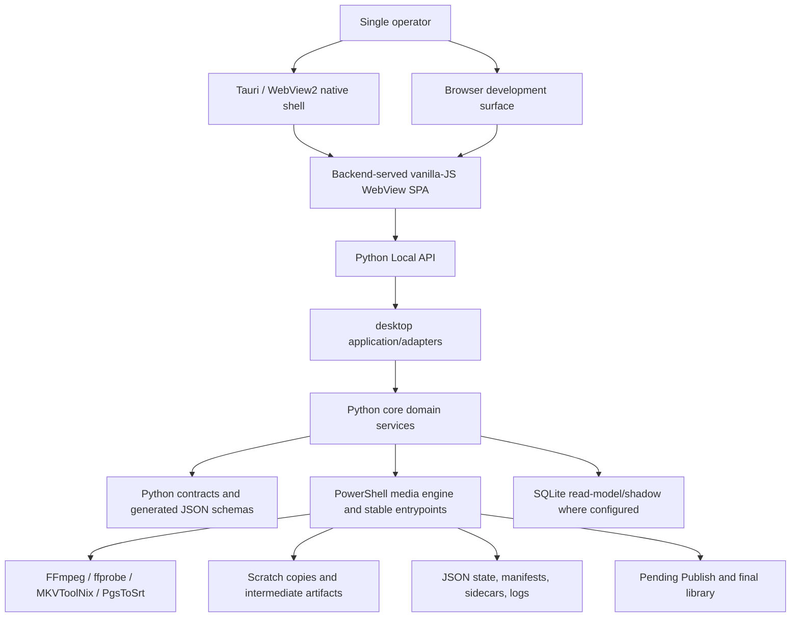
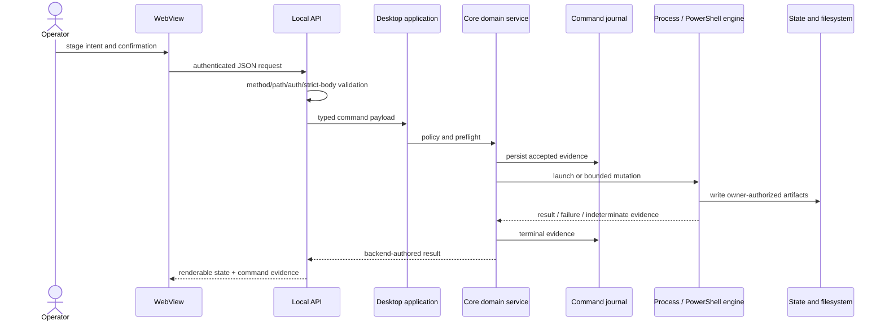
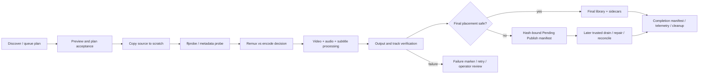

# Architecture Map

Status: **final audit synthesis complete at the frozen tracked universe**. Runtime layers, ownership boundaries, primary control/data flows, route/command joins, lifecycle, failure/recovery, validation, and cross-language dependency families have current hash-bound review evidence. The authoritative external `COVERAGE_MATRIX.jsonl` remains the per-file proof; open findings qualify production readiness but do not leave architecture-review scope unfinished.

## System shape



The frontend renders backend-authored state, stages operator intent, and invokes backend routes. It does not own filesystem mutation, queue mutation, settings persistence, media policy, publish/drain safety, rename apply/undo, repair apply, network lifecycle, process-tree cleanup, or shutdown readiness.

## Tracked repository composition

Audit baseline: 6,061 Git-tracked paths.

| Top-level surface | Tracked paths | Architectural role |
|---|---:|---|
| `docs/` | 2,973 | Active authority, inventories, generated navigation, historical evidence, review snapshots |
| `ops/` | 1,457 | PowerShell engine/config/tests, scripts, and structured release/change records |
| `src/` | 767 | Python contracts, core domains, desktop API/adapters, pipeline helpers, tools |
| `tests/` | 423 | Python/backend/WebView tests and fixtures |
| `apps/` | 399 | WebView SPA, Tauri shell, launchers, bundled desktop runtime/tooling |
| `.github/` | 13 | CI, audit, CodeQL, release, and beta-publication workflows |
| Other root metadata/artifacts | 29 | Build/lint/package manifests, entry docs, attachments, evidence artifacts |

Counts describe tracked inventory, not semantic completion. Generated summaries, release packets, bundled runtimes, and archived evidence have different verification obligations.

## Runtime layers and authority

| Layer | Primary paths | Reads | Mutates / owns | Must not own |
|---|---|---|---|---|
| Native shell | `apps/desktop/tauri/src-tauri/` | bootstrap URL/token, backend readiness, close-readiness | shell window, backend child handle, single-instance/native lifecycle | media/config/queue/publish policy |
| WebView SPA | `apps/desktop/webview/static/` | Local API read models, command evidence | browser-local staged inputs and presentation state | filesystem/state/config/process mutation |
| Local API transport | `src/mediapipeline/desktop/api/`, `local_api_main.py` | HTTP method/path/body, bootstrap auth | response status/shape and command admission boundary | independent domain policy |
| Desktop application/adapters | `src/mediapipeline/desktop/application/`, `network/` | contracts and core services | route-to-service adaptation, desktop lifecycle coordination | duplicate core policy |
| Core domains | `src/mediapipeline/core/` | typed requests, config, state, process evidence | policy, orchestration, state transactions, filesystem/process decisions | desktop/UI dependencies |
| Contracts | `src/mediapipeline/contracts/`, `core/kernel/contracts/` | validated mappings | canonical wire/domain shape and schema projection | runtime side effects |
| PowerShell engine | `ops/pipeline/entrypoints/`, `ops/pipeline/engine/` | projected config, queue plan, scratch input | media execution, scratch/intermediate/state/publish lifecycle | direct source mutation by default |
| Native tools | bundled/external FFmpeg family, MKVToolNix, PgsToSrt | scratch/source-copy media | declared output/intermediate artifacts | source-library mutation |
| Persistence | ignored `LocalBase/`, configured state/final roots | JSON/manifests/sidecars/SQLite | owner-specific atomic state and evidence | ambiguous multi-writer authority |

## Primary operator command flow



Open command-journal defects `AUDIT-FIND-W01-001` through `W01-004` qualify this ideal flow: replay identity, durable terminal/indeterminate evidence, corrupt-ledger handling, and secret redaction are not yet complete.

Completed W03 review adds downstream qualifications: route planning and pending-backlog reads can fail open while still yielding accepted/healthy queue evidence (`W03-008`, `W03-009`); reusable PID/cwd evidence can authorize the wrong process tree (`W03-001`, `W03-002`); and close readiness can discard wrong-schema network or active-audit state (`W03-013`, `W03-015`). The architectural arrows therefore require proof-preserving error semantics at every join, not merely the presence of a backend-owned layer.

## Media pipeline data flow



Safety invariants:

- source media is read/probed or copied, not mutated by default;
- processing occurs on scratch copies;
- original subtitles are preserved by default and bad OCR/conversion routes to review;
- audio/video/subtitle policy is configuration/profile driven;
- unsafe final movement is manifest-backed and drained later;
- verification failure blocks publish;
- frontend warnings never replace backend validation/strict confirmation.

Current W03 findings qualify the first and last transitions: retained legacy priority helpers can rename/retimestamp source media (`W03-003`), traversal failure can be reported as complete discovery (`W03-004`), route exceptions can survive into runnable acceptance (`W03-008`), and accepted fingerprints omit an intended-final-path field consumed by parity logic (`W03-010`). W04 and W05 are independently reviewing the publish/rename and media-policy stages.

## Python package composition

`src/mediapipeline/` has 767 tracked files:

| Package | Files | Role |
|---|---:|---|
| `core/` | 521 | Domain policy/services, state, orchestration, process/filesystem authority |
| `desktop/` | 137 | Local API, application adapters, network/watch/bootstrap lifecycle |
| `tools/` | 60 | Developer, generated-context, release, audit, and change-control tooling |
| `contracts/` | 40 | API/config/media/stage contracts and generated schemas |
| `pipeline/` | 8 | Pipeline helpers including subtitle conversion CLI |
| package root | 1 | Namespace marker |

Current Python dependency analysis reports zero module SCCs but one 13-package SCC and one unallowlisted `core.processes -> core.queue` edge. See `DEPENDENCY_AND_CYCLE_MAP.md` and `AUDIT-FIND-DEP-001`.

## PowerShell engine composition

`ops/pipeline/engine/` has 163 tracked files across these domains:

| Domain | Files | Primary role |
|---|---:|---|
| `process/` | 36 | process invocation, polling, termination, media commands |
| `decide/` | 17 | remux/encode/stream/policy decisions |
| `queue/` | 16 | discovery, plans, claims, rounds, retry |
| `publish/` | 14 | final placement, pending manifests, drain transactions |
| `subtitles/` | 13 | extraction/conversion/OCR/preservation/sidecars |
| `config/` | 12 | runtime overlay, key registry, paths, profiles |
| `audit/` | 10 | media/library audit flows |
| `shared/` | 9 | shared contracts, outcome/failure registry, utilities |
| `probe/` | 6 | media/stream/HDR probe |
| `naming/` and `paths/` | 10 | destination identity and safe path construction |
| Remaining domains | 20 | audio, ingest, library, policy, rerun, storage, status, verify, failures, entrypoint |

Stable callers use `ops/pipeline/entrypoints/`; active implementation belongs under domain-organized `engine/` paths. Legacy dotted/module-shim locations are not an allowed new ownership surface.

## Persistence and evidence model

The architecture has multiple explicit authorities rather than one universal database:

- JSON state/manifest files are primary for many operator and pipeline workflows.
- SQLite is a mirror/read model where configured; it is not automatically authoritative.
- command journal owns command acceptance/terminal evidence;
- queue snapshot/priority/hold/claim records own distinct queue phases;
- lifecycle leases, ActiveJobs, coordinator/worker records own process/network evidence;
- Pending Publish manifests/transaction state own deferred placement;
- completion manifests/sidecars own final evidence;
- generated summaries/inventories/maps are derived navigation and must prove freshness.

Exact state readers/writers/recovery rules are in `STATE_AND_AUTHORITY_MAP.md`. Failure handlers and retryability are in `FAILURE_AND_RECOVERY_MAP.md`. Process shutdown/close-readiness is in `PROCESS_LIFECYCLE_MAP.md`.

## Config authority

```text
WebView control
  -> Local API settings contract
  -> backend metadata/Pydantic validation
  -> JSON settings authority
  -> active PSD1 projection + projection evidence
  -> PowerShell runtime overlay and profile consumption
```

`CONFIG_AND_SCHEMA_MAP.md` enumerates keys and mappings. Current findings qualify the intended model: hidden preview-time writes (`W02-002`), replay/confirmation ordering (`W02-003`), effective-dump omissions (`W02-001`), and executable legacy extras (`SETTINGS-002`).

## Media-policy architecture qualification

Worker 05 completed all 132 assigned media-policy paths at exact current hashes and recorded 11 findings. The intended Python-plan → PowerShell-execution boundary is not yet behaviorally identical: Python ignores `AllowNoAudio=false` and `subtitle_mode=convert_preferred` in two planning paths (`W05-003`, `W05-004`), while its first-video-only planning model disagrees with FFmpeg command generation that maps every eligible video stream (`W05-010`). PowerShell can also retain prior-file audio globals after an allowed no-audio input (`W05-006`).

The helper boundary must enforce source/scratch identity itself. `W05-001` proves the ASS-to-SRT CLI accepts source/output or source/summary aliases and commits with replacement semantics; a distinct exact-hash review confirmed both disposable probes. Scratch isolation limits `W05-009` to scratch artifacts, but it does not make competing overwrite evidence truthful. These findings qualify the architecture without changing the default source-immutability invariant.

## Native-shell architecture qualification

Worker 09 completed all 43 Tauri-shell paths at exact current hashes and recorded 13 findings. The development shell can locate and supervise the backend, but the produced NSIS installer contains only the shell executable and NSIS support files (`W09-001`), so the installed product cannot satisfy the documented backend/WebView/runtime layout. Startup can fall through to ambient Python with inherited `PYTHONPATH` (`W09-003`), hard shell death does not leave ownership that a later shell can safely adopt (`W09-002`), and the updater plugin/metadata has no check/download/install/restart state machine (`W09-007`).

The native/backend contract is also incomplete at its edges: navigation injects the bearer token without an origin guard (`W09-006`), Rust startup-contract tests omit both priority-export routes (`W09-013`), and five harnesses can force-kill an unrelated backend that appeared after their baseline (`W09-009`). The shell therefore remains a development/preview surface until packaged layout, exact backend ownership, origin-bound bootstrap, close-gated updates, and native package open/close proof converge.

## Network architecture

Coordinator and worker roles use backend-owned lifecycle, exact library/path identity, claim/done/release protocols, heartbeats, result evidence, quarantine/reclaim behavior, and configured provider/auth hooks. A normal local Launch is blocked in network mode; role-specific lifecycle commands own coordinator/worker execution. The WebView exposes role and intent but cannot create authority independently.

Open prior findings qualify token creation: final encoding occurs after authority rotation (`NETWORK-001`), and configured role is not an authorization precondition (`NETWORK-003`).

## Release and validation architecture

Meaningful changes require a structured packet under `ops/release/changes/unreleased/`. Validation is behavior/risk-specific:

- unit/static checks for local logic;
- API/WebView/Tauri/PowerShell smokes for integration boundaries;
- release gates for packaging and high-risk policy;
- synthetic fixtures for audit execution;
- representative real-media proof only as an explicit external release requirement.

`TEST_AND_VALIDATION_MAP.md` records current CI gaps; `SECURITY_AND_TRUST_BOUNDARY_MAP.md` records authentication, strict confirmation, path/media, and secret boundaries.

## Map joins and remaining closure

| Question | Authoritative audit artifact |
|---|---|
| Exactly one row for every tracked file | `COVERAGE_MATRIX.jsonl` |
| Route/request/handler/state/process join | `ROUTE_COMMAND_FLOW_MAP.md` + worker-14 JSONL |
| Domain/file owner | `MODULE_OWNERSHIP_MAP.md` |
| Python and cross-language dependencies | `DEPENDENCY_AND_CYCLE_MAP.md` |
| Mutable state authority | `STATE_AND_AUTHORITY_MAP.md` |
| Process/close/shutdown behavior | `PROCESS_LIFECYCLE_MAP.md` |
| Settings/schema/runtime path | `CONFIG_AND_SCHEMA_MAP.md` |
| Failure/retry/recovery | `FAILURE_AND_RECOVERY_MAP.md` |
| CI/test/release gate coverage | `TEST_AND_VALIDATION_MAP.md` |
| Dead/shim/duplicate candidates | `DEAD_CODE_DUPLICATION_MAP.md` |
| Trust boundaries | `SECURITY_AND_TRUST_BOUNDARY_MAP.md` |

The final external freeze enforces exact consistency across these joins at stable file hashes. The diagrams remain explanatory views; the 6,499-row ledger, finding/error joins, independent attestations, and strict checks are the completion proof. Recorded product defects and later representative-runtime validation remain remediation work, not missing audit coverage.
