# Config and Schema Map

Status: end-to-end settings authority and principal registries mapped; per-key UI/runtime/test reconciliation remains in progress. Completed W03 review also identifies two non-settings schema/recovery gaps in progress and shared app-state persistence.

The current PowerShell registry check passes with **206 canonical keys** and scans **164 PowerShell files** for config references. That proves registry/schema/reference agreement within that check's scope; it does not prove that every key is exposed safely, appears in the effective-config dump, or has meaningful behavioral tests.

```mermaid
flowchart LR
    UI["Settings builders / raw advanced JSON"] -->|"changes, removals, review intent"| ROUTES["workspace / preview-patch / save-patch / import routes"]
    ROUTES --> CANDIDATE["Python candidate normalization, key policy, risk + review digest"]
    CANDIDATE --> MODEL["Pydantic Config + defaults + cross-field validation"]
    MODEL --> STORE["settings.v1.json authority"]
    STORE -->|"OS lock + digest CAS + atomic replace"| PROJECTION["generated PSD1 + projection manifest + last-good snapshots"]
    PROJECTION --> PSSCHEMA["PowerShell key/schema/default validation"]
    PSSCHEMA --> RUNTIME["runtime_config normalization + script-scope consumers"]
    STORE --> MIRROR["LocalBase Config mirror / metadata projection"]
    RUNTIME --> DUMP["effective-config diagnostic dump"]
```

## Authority and registry layers

| Layer | Primary files | Owns | Inputs/outputs | Required consistency proof | Current notes |
|---|---|---|---|---|---|
| Canonical Python key identity | `src/mediapipeline/core/kernel/config_key_groups.py`, `config_keys.py`, `config_key_order.py` | stable key names, groups, ordering, aliases/import compatibility | consumed by contracts, metadata, patch validation, tests | no duplicates; exact Python/PowerShell/schema/order parity | 206-key PowerShell registry check passes |
| Python model/defaults/coercion | `src/mediapipeline/contracts/config.py`, `config_defaults.py`, `config_coercion.py` | types, defaults, enum/range/cross-field contract, serialization | raw/imported mapping → normalized `Config` | model/schema/default round trip; invalid/nonfinite/unknown policy explicit | unknown model extras and legacy-import extras require distinct authority treatment |
| Settings metadata/UI binding | `src/mediapipeline/core/config/metadata*.py`, `metadata_parts/`, WebView `settingsView*.js` builders | display labels, control type, risk/help, public/advanced binding | redacted workspace → staged patch only | every public binding maps one canonical key; hidden keys remain intentionally unreachable; counts generated/checked | July 19 `CPA-2026-07-19-008` reports stale manually maintained coverage counts; current row-level reconciliation pending |
| Request and review contract | desktop API settings contracts/routes; `settings_patch_candidate_facade.py`, `settings_patch_policy.py`, orchestration facade | strict confirmation, candidate normalization, changed/removed keys, review binding, redaction | request JSON + current authority → reviewed candidate/command result | literal boolean confirmation; exact digest/list binding; unknown/case-variant/source-mutation rejection; secrets do not cross browser boundary | ordinary patch still accepts real auth-token values (`CSW-2026-07-09-SETTINGS-001`) |
| JSON settings authority | `settings_store.py`, `authority_lock.py`, `file_io.py`, `config_locations.py` | current durable settings, legacy evidence, migration journal, generation/digest conflict | PSD1 import or reviewed candidate → `settings.v1.json` plus snapshots/mirrors | cross-process compare/write atomicity, rollback, last-good restore, post-write verification, conflict truthfulness | OS lock/CAS implementation passed 11 current concurrency/crash/rollback tests; W02 first-pass and distinct exact-hash attestation are complete for the reviewed authority slice |
| PSD1 serialization/projection | `load.py`, `save_runner.py`, settings-store projection helpers | canonical PowerShell data document and projection manifest | normalized settings → quoted/ordered PSD1 + hashes | safe literal quoting, PowerShell round trip, schema validation, atomic replacement, hash agreement | legacy extras are still merged into active PSD1 despite docs calling them inert (`CSW-2026-07-09-SETTINGS-002`) |
| PowerShell registry/schema/defaults | `ops/pipeline/engine/config/config_keys.ps1`, `schema_keys.ps1`, `config_schema.ps1`, `schema_validation.ps1`, `default_values.ps1`, `choice_registry.ps1`; `ops/pipeline/config/schemas/media_pipeline_config.schema.json` | runtime-recognized keys, defaults, types/enums/ranges, required paths | PSD1 mapping → validated config hashtable | registry/order/default/schema/template parity; unknown runtime key policy; config-reference scan | current check validates registered keys but does not reject all unregistered projected extras before runtime merge |
| Runtime overlay/consumption | `runtime_merge.ps1`, `runtime_config.ps1`, `getters.ps1`, `library_overrides.ps1`, entrypoint | normalized script-scope values and per-library/show overrides | validated config + environment/runtime facts → effective engine policy | range and cross-key validation; registered-key allowlist; deterministic precedence; behavior tests | denylist-based runtime merge materializes unknown extras; audit is tracing every consumer |
| Diagnostic projection | `runtime_paths.ps1`, entrypoint `-DumpEffectiveConfigPath` | operator-visible effective settings evidence | script-scope values → stable JSON dump | exact inclusion/exclusion disposition for every behavior key; sensitive keys excluded | 17 registered runtime assignments are omitted despite a completeness claim (`AUDIT-FIND-W02-001`) |

## Persistence artifacts

| Artifact | Authority | Writers | Readers | Recovery/integrity |
|---|---|---|---|---|
| `settings.v1.json` in the per-user application directory | canonical desktop settings authority | backend settings store under cross-process lock | backend load/save/import services | schema/version checks, digest conflict, atomic replace, post-write reread, last-good restore |
| active `MediaPipeline_config*.psd1` | generated runtime projection when JSON authority exists; import source only during explicit migration/recovery | backend projection/save service; local operator only through documented direct-config path | PowerShell entrypoint and validation tools | PowerShell data-file parse, schema/key checks, hash in projection manifest, byte rollback |
| `settings_projection.v1.json` | evidence tying store/config hashes and paths; not independent policy authority | backend settings store | startup/diagnostics/inventories | post-write JSON equality and PSD1 SHA verification; regenerated from authority |
| `ConfigSnapshots/settings.v1.json` and projection snapshot | last-good recovery evidence | backend after verified commit | store recovery | verified snapshot restore; failure blocks rather than guesses |
| `LocalBase/State/Config/*` mirror | generated operational mirror | backend settings store | diagnostics/supporting readers | not authoritative; failure/warning must remain explicit |
| `LibraryProfiles` inside canonical settings | backend config authority for source/output designation and overrides | settings/library profile services | discovery, queue, runtime overlay, UI | strict ID/path/designation validation, normalization, promotion rules, profile-specific tests |
| local ignored PSD1s and auth tokens | operator/local secret material | operator/backend secret-specific flows | runtime/network services only as permitted | excluded from Git/package/log/browser surfaces; current ordinary patch boundary is insufficient for token values |
| `State/Progress/pipeline_progress.json` | current runtime evidence, not policy authority | PowerShell engine | status/snapshot/autonomy health | W03-006 confirms malformed JSON currently becomes ordinary `persistence_healthy=true`; parsing/schema failure must remain degraded and block health-sensitive autonomy |
| `app_state.json` schedule/machine/auth/preferences mapping | shared backend state authority across several consumers | schedule and application-state services | scheduler/watcher, machine identity, coordinator authentication, UI preferences | W03-014 confirms a schedule-only save over existing malformed JSON replaces the file and drops unrelated machine/auth fields; existing-unreadable must block partial merge/write or preserve explicit recovery evidence |

## Key-family flow checklist

| Key family | UI/edit surface | Validation/runtime owner | High-risk consequences | Audit state |
|---|---|---|---|---|
| Source, scratch, output, library profiles | structured path/profile builders plus backend browse | path contracts, profile validation, PowerShell runtime paths | source mutation, traversal/reparse/UNC identity, collision, wrong library placement | high-risk second review required |
| Video routing/size/HDR/encoder | structured and advanced settings | Python config model + PowerShell routing/runtime config | wrong remux/encode route, stream mapping, growth/quality policy | W05 first pass is complete; `AUDIT-FIND-W05-010` confirms Python plans only the first video stream while FFmpeg encode commands map every eligible video stream; representative-media proof remains external |
| Audio/subtitle policy and helper paths | structured/advanced settings | metadata/model plus PowerShell audio/subtitle engines and helper CLIs | unintended drops/transcodes/OCR/burn-in, untrusted tool path, source/output alias | W05 first pass is complete with `W05-001..009`; `AllowNoAudio=false` and `convert_preferred` are ignored in Python paths, stale audio globals survive allowed no-audio, and the ASS CLI source-alias P1 is independently confirmed |
| Queue/autonomy/pause/failure thresholds | mostly advanced/raw | runtime config, queue/process/status services | unattended blocking/churn, stale claims, unbounded work | registered but several values absent from effective dump |
| Pending publish/drain | structured/advanced | backend pending services and PowerShell publish engine | unauthorized final moves or backlog growth | manifest-backed authority; trusted/manual mode requires exact proof |
| Network role/endpoints/tokens | network settings/native flows | backend network facade/auth/contracts | secret leakage, SSRF/endpoint misuse, role bypass, worker lockout | token patch exposure and July 19 network findings remain under review |
| Logs/state DB/retention | advanced/raw | failures/telemetry/storage services | missing evidence, unbounded disk, stale mirrors | effective-dump omissions and retention behavior under review |

## Completion requirements for this map

1. Generate an exact 206-row key ledger joining Python symbol, JSON-schema property, PSD1 order/default, metadata binding, WebView control/raw-only/hidden disposition, runtime consumer, state impact, tests, and finding IDs.
2. Prove every non-public key is intentionally raw-only, native-only, direct-config-only, or retired; no key may be merely absent from the UI inventory.
3. Reconcile `LibraryProfiles`, profile inheritance/overrides, and legacy extras separately from flat keys.
4. Verify package/release exclusion for live stores, projections, ignored PSD1s, tokens, and LocalBase mirrors.
5. Rerun schema generator/check modes and the 206-key registry suite after the concurrent worktree stabilizes.
6. Add explicit version/parse-health and corrupt-read mutation tests for standalone progress and shared app-state artifacts; do not treat default values as proof of successful authority reads.
