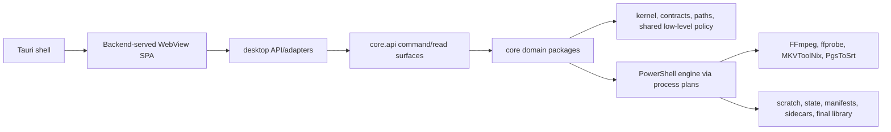

# Dependency and Cycle Map

Status: **final dependency review complete at frozen hashes**. Python dependency enforcement, PowerShell load order and launcher chains, WebView script/global/DOM ownership, Rust/Cargo and native launch dependencies, workflow/package pins, schema provenance, and generated-context relationships were independently reviewed. Finding-backed stale generated maps and allowlisted debt remain product/tooling remediation; they do not represent missing review scope.

## Evidence precedence

1. `src/mediapipeline/tools/dev/check_dependency_boundaries.py` against current source is executable truth for statically resolvable Python imports.
2. `docs/architecture/dependency_boundary_allowlist.txt` is the current debt/rationale register for hard-rule exceptions.
3. A separate current-tree AST scan is corroborating evidence for parser success and absence of module SCCs.
4. `docs/generated/DEPENDENCY_GRAPH.md`, `docs/generated/PROJECT_INDEX.jsonl`, and `docs/generated/dependency-atlas/` are navigation snapshots only while `AUDIT-FIND-COV-001` remains open.
5. String-dispatched routes/commands, PowerShell dot-sourcing, WebView globals, subprocesses, schemas, files, and packaging joins require the non-Python maps; they are not implied by a Python import edge.

## Intended direction



The enforceable Python rules add these constraints:

- `core` must not import `desktop` adapters.
- `config` must remain lower-level than orchestration, decision, process, and rename policy unless a specific debt edge is registered.
- API must not depend on UI policy.
- telemetry/observability/status directions are constrained.
- module and package cycles are hard findings.
- direct imports from deprecated `core.shared` compatibility surfaces are constrained.
- Python parse errors are hard findings.

## Current Python graph snapshots

| Evidence time | Import records | Unique module pairs | Source modules | Target modules | Module SCCs | Package SCCs | Result |
|---|---:|---:|---:|---:|---:|---:|---|
| Initial default gate | 3,943 | not retained | not retained | not retained | 0 | 1 | Exit 1; 39 hard, 38 allowlisted, 1 unallowlisted |
| Compact report-only rerun | 3,954 | 1,488 | 375 | 410 | 0 | 1 | Exit 0 by `--report-only`; enforcement result unchanged |
| Independent current AST scan | 2,161 resolved records across 769 Python files | analyzer-specific | analyzer-specific | analyzer-specific | 0 | not used for enforcement | 0 parse failures |

The 11-record drift between the first two canonical runs is recorded as `AUDIT-ERR-COORD-028`; it reflects concurrent source work and prevents freezing aggregate counts today. The stable violation and exact import location did not change.

## Enforced package-cycle result

The canonical analyzer reports one 13-package strongly connected component:

```text
core.audit
core.completed
core.config
core.final_library
core.network
core.observability
core.processes
core.publish
core.queue
core.rename
core.status
core.subtitles
core.telemetry
```

The hard-rule breakdown is:

| Rule | Current hard edges | Allowlisted | Unallowlisted |
|---|---:|---:|---:|
| `NO_PACKAGE_CYCLES` | 31 | 30 | 1 |
| `NO_CONFIG_TO_HIGHER_LEVEL` | 8 | 8 | 0 |
| All other hard rules | 0 | 0 | 0 |
| Total | 39 | 38 | 1 |

The sole unallowlisted edge is:

```text
mediapipeline.core.processes -> mediapipeline.core.queue
```

Its six symbol imports are one statement at `src/mediapipeline/core/processes/preflight_facade.py:17-24`, all targeting `mediapipeline.core.queue.freshness`:

- `QUEUE_SNAPSHOT_FRESHNESS_CLOCK_SKEW_SECONDS`
- `QUEUE_SNAPSHOT_FRESHNESS_DEFAULT_SECONDS`
- `QUEUE_SNAPSHOT_FRESHNESS_MAX_SECONDS`
- `QUEUE_SNAPSHOT_FRESHNESS_MIN_SECONDS`
- `evaluate_queue_snapshot_freshness`
- `normalize_queue_snapshot_freshness_seconds`

This is recorded as `AUDIT-FIND-DEP-001` (P2, confirmed). The direct consequence is a red canonical dependency gate; the architectural consequence is that launch preflight consumes queue-owned policy instead of a lower-level authority shared by both domains. The first failing command and compact reproduction are `AUDIT-ERR-COORD-023`; the source was clean at Git blob `503f3fe1c16f028f4a08d2656c1b1a0e7525a227` and content SHA-256 `2d37bca0fedf83cb8b5d840911e745e3a175e3848e9bf99ab4a2be68bb486240` when proven.

The appropriate repair is ownership relocation, not an unexplained allowlist addition: queue-snapshot freshness primitives should move below both process preflight and queue orchestration while preserving launch-admission semantics.

## Registered higher-level config debt

All eight current config-to-higher-level records are explicitly allowlisted debt, not clean directionality:

| Importing module | Imported owner | Symbols / purpose |
|---|---|---|
| `core.config.metadata_parts.advanced_fields` | `core.rename.constants` | rename default terms and filter option keys (3 records) |
| `core.config.metadata_parts.advanced_fields` | `core.rename.movie` | movie rename default-term policy |
| `core.config.metadata_parts.advanced_fields` | `core.rename.tv` | TV rename default-term policy |
| `core.config.settings_facade` | `core.processes.path_evidence` | configured path health and warning lines (2 records) |
| `core.config.settings_patch_candidate_facade` | `core.rename.policy` | rename cleaning policy from config |

These edges explain part of the large package SCC and remain architectural debt even though the gate accepts their exact keys. Any target/module change must either remove the crossing or update the explicit allowlist with a time-bounded reason; broad pattern exemptions are not authority.

## Warning-only compatibility edges

The same snapshot reports 43 `NO_BARREL_INIT_REEXPORTS` warnings. They are warning-only rather than hard enforcement, so a green hard-rule count does not prove compatibility/barrel cleanup is complete. They must be reconciled in `DEAD_CODE_DUPLICATION_MAP.md` as one of:

- intentional public package API;
- compatibility shim with live callers and retirement criteria;
- unnecessary re-export/duplicate ownership.

No module-level SCC was found, so the package SCC is a domain-direction problem rather than a direct Python import loop that would necessarily fail import initialization.

## Current dependency hubs

Counts below use unique source/target module pairs from the 3,954-record provisional snapshot.

Highest outbound fan-out:

| Module | Unique targets |
|---|---:|
| `core.processes.preflight_facade` | 21 |
| `core.api.command_handlers` | 20 |
| `core.processes.rerun_results_queue_projection` | 18 |
| `core.network.facade` | 17 |
| `core.network.facade_diagnostics` | 16 |
| `core.network.facade_policy` | 15 |
| `core.processes.preflight_support` | 15 |
| `core.status.facade` | 15 |

Highest inbound fan-in:

| Module | Unique importers |
|---|---:|
| `core.paths.contracts` | 108 |
| `core.kernel.dto_commands` | 64 |
| `core.kernel.config_keys` | 35 |
| `core.kernel.dto_base` | 23 |
| `core.kernel.dto_inventory` | 22 |
| `core.files.constants` | 22 |
| `core.kernel.runtime.subprocess_runner` | 21 |
| `core.kernel.contracts.pending_publish` | 21 |
| `core.config.library_profiles` | 21 |

Fan-in is not itself a defect. It identifies contracts whose drift has broad blast radius. Fan-out similarly identifies integration facades that require careful line review and cross-domain tests.

## Generated-atlas reconciliation

The checked-in dependency atlas currently describes 1,407 edges and 561 nodes. An SCC scan over those generated CSVs appeared to report two small cycles:

- `publish.pending_drain_confidence` / `pending_drain_results` / `pending_drain_rows`
- `network.coordinator` / `network.lifecycle` / `network.http_server`

Current source and generated-summary hash checks disproved both as current module cycles: the alleged reverse imports are absent, the six current files parse, and both the independent AST scan and canonical analyzer report zero module SCCs. These are stale generated edges under `AUDIT-FIND-COV-001`, not current code findings. Regeneration must occur only after the concurrent worktree freezes.

Worker 05 adds a narrower generated dependency omission. `AUDIT-FIND-W05-011` confirms that the checked-in ASS-to-SRT dependency-detail assets omit current `core/subtitles` consumers even though current source/caller searches reach them. Until atlas regeneration and an exact edge check succeed, those assets are navigation evidence only and cannot establish complete media-policy fan-in.

## Non-Python dependency closure and disposition

The final review added hash-bound evidence for these dependency families:

- PowerShell entrypoint-to-loader and engine dot-source order, including conditional/platform includes;
- WebView HTML script order, global exports, lazy asset loading, DOM ownership, and route-string dispatch;
- Tauri Cargo crate versions/features, Rust module ownership, sidecar/backend process launch, and bundled resource paths;
- batch/PowerShell/Python launcher chains and exit-code propagation;
- workflow action/container/package pins and release artifact dependencies;
- generated schema provenance and frontend/backend contract consumers;
- native/bundled tool version, license, integrity, and package-manifest closure.

Those joins were reconciled with `ARCHITECTURE_MAP.md`, `MODULE_OWNERSHIP_MAP.md`, `ROUTE_COMMAND_FLOW_MAP.md`, `PROCESS_LIFECYCLE_MAP.md`, `TEST_AND_VALIDATION_MAP.md`, and `DEAD_CODE_DUPLICATION_MAP.md`. Where executable/generated evidence remains stale or a runtime edge is unsafe, the central finding register—not an unreviewed-map placeholder—carries the disposition.

## Final freeze results

1. Canonical and independent dependency scans completed; every remaining hard edge or stale generated surface is finding-backed.
2. Current source parsing completed with no unexplained parser failure; module-SCC results were reconciled against stale generated edges.
3. Generated dependency artifacts were verified or explicitly dispositioned by source-hash/provenance checks; no stale map was treated as authority.
4. Fan-in/fan-out, allowlist debt, launcher chains, and cross-language consumers are linked to the architecture, lifecycle, route, state, and validation maps.
5. Future regeneration and product fixes remain in the findings backlog and must preserve the frozen audit evidence.
