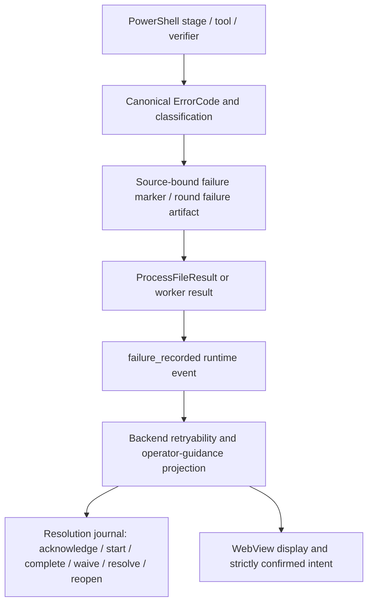

# Failure and Recovery Map

Status: the current failure/outcome registries and seven recovery workflows are mapped to machine-readable evidence. Four defects remain open, including one P1 cross-language pending-manifest contract split. Final counts must be rebound after concurrent source edits freeze.

## Authoritative audit evidence

- `workers/worker-15-failure-recovery-map.jsonl`: 272 join rows.
- `workers/worker-15-failure-recovery-map.md`: method, registry totals, workflows, validation, and source hashes.
- `workers/worker-15-failure-recovery-findings.jsonl`: four current findings.
- `workers/worker-15-failure-recovery-errors.jsonl`: 18 test/error/warning records.

The machine map contains:

| Record scope | Rows | Meaning |
|---|---:|---|
| Failure registry | 46 | Every `Get-MediaPipelineFailureCodeRegistry` row |
| Outcome registry | 215 | Every `Get-MediaPipelineOutcomeCodeRegistry` row |
| Unregistered emissions | 4 | Operational codes emitted by current source but absent from the outcome registry |
| Recovery workflow | 7 | Cross-layer trigger, authority, evidence, retry, and handler joins |
| **Total** | **272** | Shared codes intentionally have one row per namespace |

Each registry row records code, family, stage, trigger, retryability, severity, operator guidance, handler, implementation source, state/journal/log evidence, recovery path, tests, exact locations, parity state, and finding IDs.

## End-to-end failure evidence flow



The WebView is not recovery authority. Backend services and PowerShell own path trust, manifest qualification, queue mutation, process identity, repair safety, publish policy, retry classification, and durable evidence.

Pending Publish adds a transaction chain:

```text
park intent
  -> hash-bound pending_push_manifest.v1
  -> drain attempt and transaction phases
  -> payload/sidecar hash, collision, reveal, and completion proof
  -> completed sidecar/manifest
  -> cleanup or retained retry/review evidence
```

Network/process recovery adds:

```text
strict command
  -> ActiveJobs / lifecycle lease / coordinator claim
  -> heartbeat / result / done / reclaim evidence
  -> queue terminal, retry, quarantine, or operator-review decision
  -> bounded cleanup
```

## Registry universes

Failure registry: 46 codes across source-media (13), encode (11), remux (10), native-tool (6), encode-CPU (5), and output (1). Thirty-seven are retryable warnings; nine are nonretryable errors.

Outcome registry: 215 codes across subtitle (49), source-media (45), encode (43), publish (22), remux (17), generic-failure (13), encode-CPU (7), process-lifecycle (7), audio (6), non-failure (4), and destination-naming (2). It contains 176 retryable warnings, 35 nonretryable errors, and four informational outcomes.

Four current emitted codes are outside those 215 outcome rows:

- `OUTPUT_HASH_MISSING`
- `SIDECAR_HASH_INVALID`
- `SIDECAR_SIZE_INVALID`
- `OUTPUT_MEDIA_TRACK_VERIFICATION_FAILED`

The registry test detects the first three. Its scanner misses the fourth because the live verifier uses snake_case `error_code` and the test has incomplete field/prefix patterns.

## Recovery workflow joins

| Workflow | Trigger and authority | Durable evidence | Recovery rule | Current result |
|---|---|---|---|---|
| Pending publish park/drain | `pending_push_manifest.v1`, transaction phase, payload/sidecar proof, drain summary | Manifest, transaction state, pending/completed paths, hash/collision evidence | Drain only current, trusted, drainable, collision-free manifests below retry limit; exact-proof repair only | Safety/fault suites pass; P1 repair/drain contract split and missing registry codes remain |
| Rename undo | Backend `rename_undo.v1` plus strict `confirm_undo` | Preview/undo manifest, journal, path/collision checks | Validate roots, direction, collisions, duplicates, metadata pairing; undo once in reverse order | Targeted tests pass; strict-command replay/terminal gaps remain under W01 |
| Process crash/orphan cleanup | ActiveJobs, lifecycle lease, PID/cwd/cmdline proof, heartbeat/result | Jobs/lease/state records and cleanup outcome | Mark only definitely dead/mismatched records orphaned; ambiguous identity remains blocking; no-media/plan-only auto-resume only | W03 confirms PID/cwd correlation and PID-only leases remain unsafe under PID reuse (`W03-001`, `W03-002`) |
| Queue claims/results | Exact job/worker/source identity, coordinator in-flight row, worker pending/done state | Claim, heartbeat, result, done/release, quarantine/reclaim evidence | Persist failed done/release; accept exact late terminal evidence; remove terminal rows; bounded retry others | Network crash/done tests pass; unreadable local claim state still fails open to an empty store (`W03-007`) |
| Repair/reconcile | Backend dry-run, exact fingerprint, candidate-only diff, `confirm_apply=true` | Candidate/diff, backup, mutation journal, rollback evidence | Exact path/contract validation; backup metadata; roll back mutation or journal failure | Most tests pass; P1 pending repair/drain case fails twice |
| Strict command failure | Accepted/terminal command journal keyed by command ID | Acceptance, nested command correlation, terminal/indeterminate evidence | Reject before mutation if acceptance cannot persist; do not retry/close indeterminate work until reconciliation | Policy tests pass; W01-001 through W01-004 remain authoritative defects |
| Fail-closed media verification | Duration, topology, track plan, HDR/Dynamic HDR, quality evidence | Verification result, source failure record, outcome projection | Any unresolved mismatch becomes terminal failure/review before publish | Verification suites pass; one live code is registry/scanner blind |

### Completed W03 recovery overlay

Worker 03 completed all 317 assigned queue/process/status rows and adds these recovery-path qualifications to the seven workflow joins above:

| Finding | Recovery boundary failure | Required recovery posture |
|---|---|---|
| `AUDIT-FIND-W03-004` | directory traversal errors are skipped while the source inventory reports complete | carry partial/error identity into preview and block acceptance until the scope is trustworthy |
| `AUDIT-FIND-W03-006` | malformed progress JSON is projected as healthy persistence | expose parse corruption as degraded/unhealthy evidence and block unattended launch where policy requires health |
| `AUDIT-FIND-W03-009` | pending-publish enumeration failure becomes an empty healthy backlog | preserve query failure as blocking/unknown backpressure; never infer zero pending work |
| `AUDIT-FIND-W03-012` | Run Monitor identity restoration is skipped if completion reporting raises | restore the previous job identity in a `finally`-equivalent boundary and retain the report failure separately |
| `AUDIT-FIND-W03-013` | wrong-schema network-rerun state is silently omitted from close readiness | treat unreadable/future lifecycle evidence as blocking reconciliation, not absence of work |
| `AUDIT-FIND-W03-014` | schedule save replaces corrupt shared app state with schedule-only defaults | distinguish missing from unreadable authority; preserve bytes and block partial overwrite until recovery |
| `AUDIT-FIND-W03-015` | active audit snapshot evidence can collapse to idle | retain each active-work source independently in close-readiness policy and fail closed on disagreement |

The five W03 P1 findings and every high-risk W03 row remain subject to distinct current-hash review.

## Open findings

### `AUDIT-FIND-W15-001` — P1 — confirmed

Python `PendingPushManifest.from_mapping` accepts a current manifest without `output_sha256` or `output_hash_algorithm`. Orphan reconcile validates and writes it, returning `applied=true`. PowerShell `Test-PendingManifestCurrentContractFields` requires both SHA-256 fields and rejects that same manifest as `OUTPUT_HASH_MISSING`.

The repository's bundled repair-then-drain integration reproduced this split twice: strict apply succeeded, drain exited zero, and no final output appeared. Drain remains fail-closed, so this is not a corruption result; it is a broken recovery contract and misleading success. The correct repair is to strengthen the producer/Python current contract while preserving scan visibility for legacy records—not weaken PowerShell hash proof.

### `AUDIT-FIND-W15-002` — P2 — confirmed

The three pending-manifest trust outcomes `OUTPUT_HASH_MISSING`, `SIDECAR_HASH_INVALID`, and `SIDECAR_SIZE_INVALID` lack canonical outcome metadata. The authoritative registry check is red on exactly these codes.

### `AUDIT-FIND-W15-003` — P2 — confirmed

Seven codes shared by failure and outcome registries have namespace-dependent metadata: `ENCODER_UNAVAILABLE`, `FFMPEG_FAILED`, `FFMPEG_INVALID_ARGUMENT`, `FFMPEG_STOPPED`, `FFMPEG_TIMEOUT`, `OUTPUT_DISK_FULL`, and `SYSTEM_OUT_OF_MEMORY`. Family differs for all seven; stage, trigger, and/or handler also differ for the FFMPEG/system group. Retryability and severity happen to agree, but code-keyed routing and aggregation do not have one semantic authority.

### `AUDIT-FIND-W15-004` — P2 — confirmed

The emitted-code gate uses partial hand-written prefix and field-name regexes. It omits current `DYNAMIC`, `DOVI`, `DESTINATION`, and `LOCAL` families and snake_case `error_code` / `reason_code`, allowing `OUTPUT_MEDIA_TRACK_VERIFICATION_FAILED` to remain unregistered while the completeness gate misses it.

## Safeguards and gaps

Effective safeguards:

- Pending drain fails closed on missing/invalid byte proof.
- Repair/apply uses strict booleans, exact dry-run fingerprints, path boundaries, candidate-only mutation, backups, and journal evidence.
- Pending transaction fault injection covers park/drain seams, collision, idempotency, rollback, corrupt manifests, and tampered sidecars.
- Process/network recovery uses exact identity and keeps ambiguous evidence blocking.
- Media verification blocks publish on unresolved topology/track/HDR/quality mismatches.

Remaining gaps:

- A safe consumer can reject an artifact that an upstream current producer calls successfully repaired.
- Runtime fail-closed codes can lack metadata even when behavior is safe.
- Shared code identity can map to different family/stage/handler owners.
- A regex completeness test can turn green while missing supported emission forms.
- W01 command-journal replay and terminal-evidence defects still affect mutation recovery broadly.
- W03 shows additional fail-open collapse points where unreadable inventory, claims, backlog, app state, network-rerun state, or active-audit evidence is converted into empty/idle/default state.
- W05 adds media-helper recovery gaps: the ASS CLI can replace its own source path (`W05-001`), numeric-only cue content can disappear (`W05-005`), missing `mkvextract` leaks a staged Matroska artifact (`W05-007`), optional `seconv` has no timeout or stop path (`W05-008`), and a scratch no-clobber precheck is not enforced at commit (`W05-009`).
- W09 adds native recovery gaps: shell death can orphan a backend without adoptable ownership (`W09-002`), loopback requests lack a total deadline (`W09-005`), harness cleanup can kill a concurrent unrelated backend (`W09-009`), and updater registration has no recoverable check/install/restart path (`W09-007`).

## Validation snapshot

| Validation | Result |
|---|---|
| `Invoke-FailureCodeRegistryChecks.ps1` | **FAIL**: three emitted pending trust codes absent |
| `Invoke-FailureStateIdentityChecks.ps1` | PASS |
| `Invoke-MediaVerificationSafetyChecks.ps1` | PASS |
| `Invoke-MediaTrackOutputVerificationChecks.ps1` | PASS |
| `Invoke-PendingPublishSafetyChecks.ps1` | PASS |
| `Invoke-PendingPublishTransactionFaultInjectionChecks.ps1` | PASS across all named seams |
| Targeted bundled-Python recovery suite | **190 passed, 1 failed, 13 subtests passed** |
| Isolated repair-then-drain retry | **FAIL reproduced** |
| Machine-map/schema check | PASS: exact 46/215/4/7 split; 261 unique namespace/code keys |
| Worker finding/error schema check | PASS |

No real media or production state was used.

## Required closure

1. Independently second-review `AUDIT-FIND-W15-001` and every high-risk pending-manifest file at final hashes.
2. Reconcile Python and PowerShell current-manifest contracts without weakening hash-bound drain safety.
3. Register all four live missing outcomes with exact retryability/guidance.
4. Replace or comprehensively self-test the emitted-code scanner.
5. Establish one shared-code metadata authority and exact parity tests.
6. Rerun the red registry and repair-then-drain tests, then regenerate the 272-row map at stable source hashes.
7. Cross-check every code/handler against `STATE_AND_AUTHORITY_MAP.md`, `PROCESS_LIFECYCLE_MAP.md`, `ROUTE_COMMAND_FLOW_MAP.md`, and `TEST_AND_VALIDATION_MAP.md`.
8. Independently disposition W03-001, W03-007, W03-008, W03-009, and W03-015, then add regression proof for each fail-open recovery boundary above.
9. Add path-identity/no-replace tests for W05-001 and W05-009, cleanup ownership for W05-007, and bounded timeout/process-stop evidence for W05-008; preserve failed conversions for review rather than reporting success.
10. Add packaged native crash/relaunch, failed-start cleanup, end-to-end HTTP deadline, exact harness ownership, and interrupted-update recovery proof for W09-002/005/007/009.
