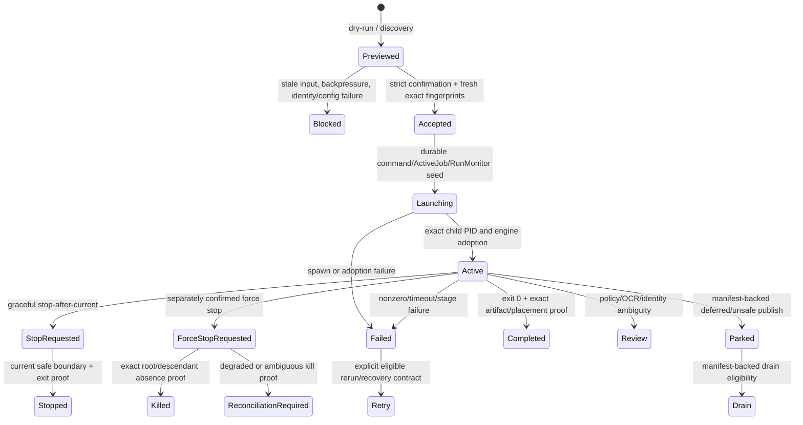

# Process Lifecycle Map

Status: **final lifecycle review complete at frozen hashes**. Principal process types, ownership, identities, startup, stop, timeout, cleanup, restart, and recovery boundaries are mapped. Queue/process/status, Tauri, media-helper, network, pipeline-entrypoint, and high-risk test paths have distinct current-hash review evidence; open lifecycle defects remain finding-backed remediation.

No live pipeline, worker, publish/drain, rerun, or representative-media process is launched by this audit. Dynamic proof uses existing evidence or disposable generated fixtures only.

## Native shell and backend

```mermaid
sequenceDiagram
    participant T as Tauri shell
    participant B as Python backend
    participant W as WebView
    T->>T: acquire per-user single-instance mutex
    T->>B: spawn one owned backend child
    B-->>T: bounded desktop_local_api_bootstrap.v1 (URL + token)
    T->>B: authenticated health / contract validation
    T->>W: create one main window at backend URL; inject token bootstrap
    W->>B: authenticated Local API requests
    T->>B: GET close-readiness on native close
    B-->>T: safe / blocked / confirmation-required evidence
    T->>B: POST shutdown after permitted close
    B-->>T: acknowledgement after backend-owned cleanup
    T->>T: bounded wait; force tree termination only under the documented acknowledged/grace boundary
```

The shell owns the exact backend child and native window. The backend owns recovery reconciliation, workers, active jobs, state flush, mutation readiness, and graceful shutdown. Transport failure is not permission to kill active work. Bootstrap output is bounded by line/character limits, the token is per-process and not persisted, and production surface checks must keep developer tooling/token logging absent.

## Process inventory

| Process/lifecycle | Start authority and strict intent | Durable identity/state | Duplicate/concurrency guard | Stop/termination owner | Crash/restart recovery | Current audit state |
|---|---|---|---|---|---|---|
| Tauri shell | operator launches packaged/native app | per-user single-instance mutex; native window identity | mutex rejects a second shell before backend spawn | OS/operator closes shell after backend contract | next launch must detect surviving backend/state without creating duplicate mutation authority | July 19 `CPA-2026-07-19-004`/`-006` current reconciliation pending |
| Python Local API backend | Tauri or canonical launcher spawns exact executable/args | bootstrap schema, PID/child handle, loopback URL, bearer token, backend session | Tauri mutex plus backend lifecycle/port guards; ordinary browser launchers have separate ownership | authenticated backend shutdown route; Tauri owns bounded child-tree fallback | lifecycle reconcile/recovery-status before watchers; stale ActiveJobs and partial state remain explicit | native hard-crash/duplicate-backend proof remains required |
| Local API command dispatch | authenticated WebView/native/API request | command ID, command journal row, strict request contract | route policy and intended duplicate guard | synchronous handler or owned background process service | unknown/exception outcome must remain terminal/indeterminate evidence | Worker-01 found request-stable replay/duplicate and terminal-exception gaps |
| Queue Run Once / continuous pipeline | confirmed backend launch route after fresh plan/preflight | launch/command/run IDs, ActiveJob, accepted queue fingerprints, Run Monitor seed | active-job/command guards, exact accepted scope, pipeline instance lock | graceful stop-after-current or confirmed force-stop service; exact process-tree cleanup | Run Monitor/ActiveJobs reconciliation; partial/ambiguous media stays failed/review/parked | W03 complete; route-exception parity, pending-backpressure fail-open, fingerprint omission, and priority-manifest TOCTOU are confirmed (`W03-008`–`011`) |
| Scheduled/watch-folder launch | backend schedule/watcher after persisted enabled policy and readiness | schedule/app state, watcher identity, launch/command IDs | watcher singleton and active-work/duplicate checks | backend shutdown or schedule disable/stop | persisted active state becomes reconciliation-required; never assume provider/process resumed | W03 complete; corrupt app state can be overwritten by a schedule-only save, losing machine/auth state (`W03-014`) |
| Audit scan/process | confirmed audit route/provider | ActiveJob kind `audit`, command ID, logs/results | audit-active guard and command journal | audit stop route/process service | orphan/exit reconciliation and retained results/logs | W03 complete; active audit evidence can be discarded by close-readiness state reduction (`W03-015`) |
| Local CSV rerun | confirmed start from backend preview/enrollment | local enrollment, batch/manifest, command/launch IDs, scoped CSV | exact enrollment/manifest/process evidence blocks duplicate generation | cooperative stop-after-current marker; force-stop only through process service | accepted rows survive premanifest failure; resume/retry requires exact process-exit and row identity | rerun contracts mapped; line review pending |
| Network CSV rerun | confirmed network start and role/preconditions | network batch/row IDs, coordinator claims, worker results, reducer/destination evidence | claim lease/state, retry budget, exact row/source/handoff identity | coordinator/worker lifecycle stop; row cleanup separately explicit | pending done/release/retry/review persists; reconciliation precedes new claims | July 19 network findings current reconciliation pending |
| Pending-publish drain | confirmed/manual or explicitly trusted backend-owned policy | drain ActiveJob/command ID, pending manifest transaction IDs | one drain scope plus manifest-state/idempotency checks | backend drain/process service; interruption preserves parked payload/manifest | retry/reconcile from manifest evidence; no filename/browser inference | no real media; generated/temp fixtures required |
| Rename apply/undo | confirmed exact preview/manifest fingerprint | rename manifest, apply/undo status, command journal | backend active/batch and already-applied/undone checks | synchronous/bounded backend operation; rollback/undo is its own confirmed flow | manifest/status drives recovery; WebView history is projection only | July 19 stale undo-history UI finding under reconciliation |
| Network coordinator provider | confirmed role-specific start after no-write dry run | lifecycle epoch, coordinator state/inflight claims, cluster log, command evidence | provider active state; role/precondition and duplicate-start guards | confirmed coordinator stop preserving inflight/done evidence | persisted active becomes reconciliation-required, not assumed live | provider-backed contract; join/auth/role findings remain open candidates |
| Network worker provider | confirmed role-specific start after no-write dry run | lifecycle epoch, worker state, one active claim, pending done reports | two-phase start, provider state, claim ownership | confirmed worker stop; abort/partial cleanup is separate explicit command | reconcile claim/done/release before claiming new work | worker must never scan local queue or infer coordinator path identity |
| Local parallel worker child | PowerShell parent scheduler under accepted pipeline scope | slot ID, worker claim/result/heartbeat, parent run/job identity | bounded slot count, claim ownership, heartbeat/grace policy | parent scheduler/force-stop tree cleanup | stale heartbeat alone does not release claim; parent/claim evidence governs | W03 complete; unreadable claim state is replaced empty and can admit duplicate source claims (`W03-007`) |
| FFmpeg/ffprobe/MKVToolNix/OCR/helper | PowerShell stage-specific native runner builds argv | exact stage/job/track/run context, PID/tree, stdout/stderr/tool log, exit code | stage and CPU/hardware mutexes where applicable | runner timeout/poll/kill-tree; force-stop service for whole run | interrupted logs retained; nonzero/timeout/kill becomes failure/review, never successful media evidence | representative-media proof external; argument/timeout coverage review pending |
| Tauri updater/external opener | explicit native/operator action through allowlisted shell capability | update manifest/version/signature or open-target evidence | single update/action context and release provenance | native API/OS | installed working version must remain usable on failure | workflow/update findings being normalized by worker-10 |

## Queue/pipeline lifecycle



Preview success does not authorize launch after inputs change. Child exit code zero does not prove final publication. Missing PID, stale heartbeat, or transport error does not prove termination. Terminal state requires the owning process and artifact contracts to agree.

## Worker 03 lifecycle defects at the completed checkpoint

The 317-row queue/process/status partition is hash-bound and complete at first pass. It records 15 current findings: five P1, nine P2, and one P3. The lifecycle-specific roots are:

- `AUDIT-FIND-W03-001`: destructive process-tree control accepts a reused PID when only the working directory matches.
- `AUDIT-FIND-W03-002`: durable lifecycle leases retain only PID liveness, not launch identity, so PID reuse can preserve false-active state.
- `AUDIT-FIND-W03-007`: unreadable local-worker claim state fails open to an empty store and permits duplicate source claims.
- `AUDIT-FIND-W03-012`: Run Monitor job identity is not restored when completion reporting raises.
- `AUDIT-FIND-W03-013`: wrong-schema network-rerun state is silently omitted from close-readiness blocking.
- `AUDIT-FIND-W03-015`: an active audit in the supplied backend snapshot can be reduced to idle when pipeline progress is empty.

All W03 P1 roots and high-risk W03 files received distinct current-hash review before the final completion gate.

## Worker 05 media-helper lifecycle defects

The completed 132-row W05 first pass identifies two external-helper lifecycle gaps. `AUDIT-FIND-W05-007` leaves a staged temporary Matroska file behind when the VobSub path discovers `mkvextract` is unavailable after staging. `AUDIT-FIND-W05-008` launches optional `seconv` cleanup without a timeout or stop path, so conversion can remain active indefinitely and prevent terminal stage evidence. Cleanup must be owned across every exit branch, and helper success/failure/timeout must remain correlated with the current media operation rather than inferred from output presence.

## Worker 09 native lifecycle defects

- `AUDIT-FIND-W09-002`: backend ownership is only in the live shell process; hard shell death or unverified failed-start cleanup can leave a backend that the next shell cannot safely adopt.
- `AUDIT-FIND-W09-004`: stdout/stderr are consumed as unbounded physical lines before downstream truncation or logging, so a child can force unbounded buffering.
- `AUDIT-FIND-W09-005`: loopback HTTP operations have per-operation limits but no total request deadline, allowing repeated partial progress to hold native close/startup work indefinitely.
- `AUDIT-FIND-W09-009`: harness cleanup uses baseline/port/process heuristics that can select and terminate an unrelated backend launched concurrently.

Exact child identity, bounded byte/line capture, end-to-end deadlines, and ownership-preserving recovery must be proven together; process existence or port ownership alone is insufficient.

## Network provider lifecycle

1. Read role/config/state and perform a no-mutation start/stop dry run.
2. Require literal `confirm_start` or `confirm_stop` only for the exact accepted provider action.
3. Confirm provider hook/preconditions; never fall back to normal local Launch.
4. Persist lifecycle epoch/command evidence before reporting active.
5. Coordinator advertises claim protocol; worker accepts only safe resolved library-relative/path-map identity.
6. Claim, heartbeat/work, done report, coordinator reduction, destination policy, and release retain exact worker/job/source/output identity.
7. Stop preserves coordinator inflight state, worker state, cluster log, and pending done reports.
8. Restart marks prior active state `reconciliation_required` and resolves claims/done/release before new work.

## Required exit and cleanup evidence

| Event | Insufficient evidence | Required evidence |
|---|---|---|
| backend ready | process exists | bounded bootstrap schema, authenticated health/contract, exact child still live |
| media process complete | exit code 0 | stage outputs, verification, expected artifact identity, publish/park/completed evidence |
| force stop complete | root PID absent | exact correlated root plus every enumerated descendant absent/zombie under current run/command identity |
| worker slot free | old heartbeat | claim/scheduler release or exact terminal result plus process evidence |
| safe native close | UI appears idle | backend close-readiness result covering ActiveJobs, drain, rename, network, rerun, schedules, and unsafe state |
| restart clean | no visible window/process | backend lifecycle reconcile over durable process/control/manifests with explicit ambiguous-state handling |
| timeout handled | exception raised | bounded process-tree cleanup attempt, captured stdout/stderr/tail, non-success result, orphan status if unproved |

## Product and release validation carried forward

1. Launcher/process symbols and `ActiveJob`/command identities are mapped; unsafe or incomplete behavior is linked to the central register.
2. Focused generated-fixture and contract validation evidence is retained with all failures, skips, and timeouts; a green smoke is never generalized beyond its scope.
3. Product remediation must add the missing regression/runtime evidence named by each lifecycle finding.
4. Representative real media, native crash/relaunch, actual updater/signing, and multi-host network proof remain explicit later release-validation work. They were not required to finish this repository-bytes audit.
