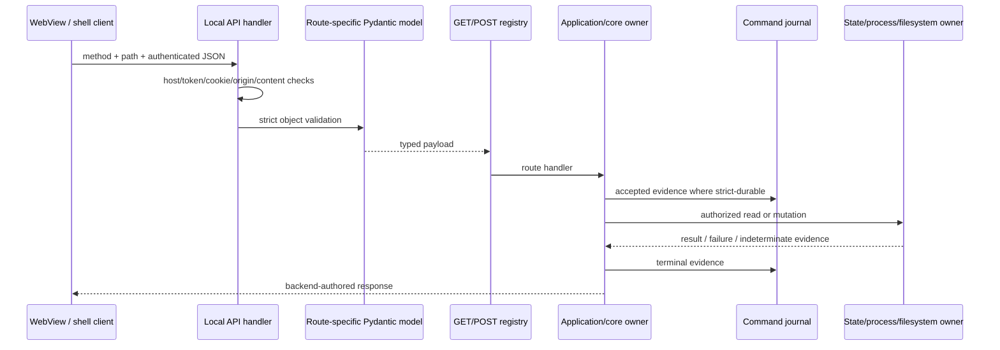

# Route and Command Flow Map

Status: the coherent 172-route Local API baseline is exhaustively joined. Two concurrently added priority-export routes are preserved as provisional, nonterminal rows until their source and inventory changes settle. The machine-readable route map is authoritative for individual joins.

## Machine evidence

- `workers/worker-14-route-command-map.jsonl`: 174 unique route rows.
- `workers/worker-14-route-command-map.md`: capture hashes, method, data dictionary, validation, and findings.
- `workers/worker-14-route-command-findings.jsonl`: two confirmed findings.
- `workers/worker-14-route-command-errors.jsonl`: 14 classified incidents.

Population:

| Snapshot | GET | POST | Total | Terminally joined | Unresolved |
|---|---:|---:|---:|---:|---:|
| Initial coherent baseline | 55 | 117 | 172 | 172 | 0 |
| Concurrent priority-export delta | 1 | 1 | 2 | 0 | 2 |
| **Current map** | **56** | **118** | **174** | **172** | **2** |

The two provisional rows are `GET /api/queue/priority-export` and `POST /api/queue/priority-export`. They were added by concurrent `MP-CHANGE-2026-0720-027`; their executable hashes held through a 20-second observation, but three central inventories still omitted them. They remain `terminal_review=false` / `blocked_by_concurrent_change`, not silently counted complete.

## Required route join

Every route row contains:

```text
method + route identity
  -> route contract
  -> authentication / host / origin boundary
  -> JSON/body/Pydantic validation
  -> strict confirmation fields
  -> handler registry and implementation location
  -> application facade / domain owner
  -> state reads and writes
  -> PowerShell / process / filesystem action
  -> accepted / terminal / indeterminate journal evidence
  -> frontend owner
  -> tests and inventory rows
```

Machine fields include `route_key`, snapshot/terminal status, request contract, confirmation fields, auth, validation, handler, service/domain/frontend owner, state reads/writes, process/filesystem action, journal evidence, tests, inventory join, exact evidence, source disagreements, and unresolved status.

## Dispatch and authority architecture



Ownership rules:

- HTTP transport validates and adapts; it does not become domain policy authority.
- Pydantic route models are the executable request boundary.
- Core/application services own state/process/filesystem decisions.
- WebView code stages and submits intent; it cannot authorize mutation by itself.
- Strict confirmations are literal backend-validated booleans.
- GET routes do not create command-journal entries.

## Authentication and HTTP boundary

- `GET /api/health` is the only public API route.
- Every other route requires loopback token/cookie authorization and host validation.
- POST/OPTIONS also validate origin.
- POST requires `application/json`.
- Body limit is 1,000,000 bytes.
- JSON must be strict UTF-8, object-rooted, without duplicate keys or non-finite numbers.
- The route-specific Pydantic model validates before dispatch.
- Secret/no-journal routes use explicit metadata rather than relying on generic redaction alone.

Authentication, bootstrap-token, host/origin, and secret boundaries are expanded in `SECURITY_AND_TRUST_BOUNDARY_MAP.md`.

## Command journal classes

Among the 117 stable POST routes, 23 require strict durable command evidence:

```text
preflight and validation
  -> accepted evidence persisted before mutation
  -> mutation/process launch
  -> terminal evidence persisted after mutation
```

If accepted evidence cannot persist, mutation must not start. If terminal evidence fails after mutation, the result must be indeterminate rather than safely retryable. Ordinary successful commands are added to the bounded journal; validation failures/exceptions are journaled unless route metadata deliberately suppresses secret/no-journal evidence. The JSON journal is atomically replaced and redacted; SQLite is best-effort mirror evidence.

Current defects `AUDIT-FIND-W01-001` through `W01-004` qualify this intended model: request-stable replay, durable terminal/indeterminate state, corrupt-journal recovery, and nested-secret redaction remain incomplete.

Completed W03 review qualifies the downstream domain/evidence side of otherwise valid route joins:

- Queue preview/launch can accept a runnable row after route-planning throws, with empty route identity (`AUDIT-FIND-W03-008`); HTTP/model validity therefore does not prove preview-to-engine parity.
- Pending-publish backlog enumeration failure is projected as zero and unblocked (`AUDIT-FIND-W03-009`); a successful read/launch response can conceal unknown backpressure.
- Close readiness can omit wrong-schema network-rerun state or active audit snapshot evidence (`AUDIT-FIND-W03-013`, `W03-015`); the native route result is only as trustworthy as each joined state reader/reducer.
- Schedule save over corrupt shared app state can erase unrelated machine/authentication fields (`AUDIT-FIND-W03-014`); strict `confirm_save` does not authorize destructive recovery of an unreadable merge base.

## Request contract/model parity

Stable POST routes:

| Relationship | Routes |
|---|---:|
| Exact contract-key/model-field set | 92 |
| At least one field-set difference | 25 |
| Model-only additive/compatibility fields | 24 |
| Contract-only fields | 6 |

The six contract-only routes are:

- `/api/completed/open`
- `/api/queue/open`
- `/api/rename/filter-cases`
- `/api/rename/preview`
- `/api/sample-validation/append`
- `/api/sample-validation/preview`

Five use additive `extra=allow` models. `/api/rename/filter-cases` alone advertises and emits supported fields while its model uses `extra=forbid`; this is a confirmed runtime workflow failure, not benign compatibility drift.

## Confirmed findings

### `AUDIT-FIND-W14-001` — P2 — request-contract integrity

The rename filename-preview backend emits a regression `case_payload` including `kind`, `template_preset`, and movie/TV expected fields. The WebView posts it unchanged to `/api/rename/filter-cases`. The route contract advertises six fields that `RenameFilterCaseCommandPayload` does not declare, and its `extra=forbid` policy rejects every one before handler dispatch.

A current bundled-Python reproduction returned Pydantic `extra_forbidden` for all six advertised missing fields. Direct facade/handler tests bypassed this HTTP envelope and did not catch the cross-layer schema drift.

Required direction: one shared regression-case schema for documentation, preview output, and request validation, plus exact backend-preview-to-HTTP-save tests for movie and TV payloads.

### `AUDIT-FIND-W14-002` — P3 — inventory arithmetic

`API_ROUTE_INVENTORY.md` has 172 unique baseline rows (55 GET, 117 POST) and 19 Process Commands rows, but headings say 116 POST and 18 Process Commands. Top-level total is correct. Deterministic heading/table parity is missing.

## Concurrent priority-export delta

The provisional source snapshot contains matching GET/POST route contracts and handler registries for `/api/queue/priority-export`:

- executable live set: 174 routes = 56 GET + 118 POST;
- `COMMAND_OWNERSHIP_MATRIX.md` includes the POST route;
- `API_ROUTE_INVENTORY.md`, `LOCAL_API_ROUTE_OWNERSHIP_MAP.md`, and `LOCAL_API_EVIDENCE_MUTATION_MATRIX.md` omit both routes;
- command matrix calls the request a “strict empty payload,” while mapped `EmptyCommandPayload` uses `extra=allow`.

Because these are active unrelated edits, the map records facts and blocks terminal review rather than assigning a defect disposition. Final freeze must decide whether the feature lands, changes, or disappears.

Worker 09 adds one current cross-layer consequence: the Rust startup contract hard-codes required Local API routes but omits both GET and POST `/api/queue/priority-export` (`AUDIT-FIND-W09-013`). The Python route/handler sets can therefore agree while the native shell accepts a backend missing the live feature. Final route authority must generate or compare the Rust startup set against the same canonical inventory used by Python contracts and handlers.

## Validation snapshot

| Validation | Result |
|---|---|
| Contract/handler/journal suite | 89 passed; 763 subtests passed |
| Stable route/contract/handler set equality | PASS: exact 172 baseline rows |
| Live route/contract/handler equality | PASS: 174 including two provisional rows |
| Payload-model presence for stable POST routes | PASS: 117/117 |
| Machine map schema/set uniqueness | PASS: 174 unique rows, all required keys |
| Cross-artifact path/line/schema validation | PASS: 1,879 references |
| Rename strict-model negative proof | PASS: all six fields rejected as expected |
| Inventory table parser | PASS: 172 rows, 55 GET, 117 POST, 19 process rows |
| `test_api_route_inventory.py` against concurrent live tree | 8 failed, 3 passed, 39 subtests; failures isolated to priority-export inventory drift |
| `test_tauri_shell_scaffold.py` | 95 passed, 1 failed; the failure identifies both priority-export routes missing from the Rust startup contract (`W09-013`) |
| Worker artifact whitespace/diff check | PASS; four `core.autocrlf` notices recorded as informational |

## Final freeze and closure

1. Resolve the concurrent priority-export delta and rerun exact route/handler/contract/inventory equality.
2. Rebind all 174-or-final-set rows to stable source and inventory hashes.
3. Independently review high-risk strict-durable routes and every P1 journal finding.
4. Reconcile the six contract-only and 24 model-only compatibility differences with explicit rationale.
5. Fix/retest rename preview-to-save parity without weakening strict request validation.
6. Add deterministic inventory heading/table counts.
7. Cross-check route state/process effects with `STATE_AND_AUTHORITY_MAP.md`, `PROCESS_LIFECYCLE_MAP.md`, `FAILURE_AND_RECOVERY_MAP.md`, and `TEST_AND_VALIDATION_MAP.md`.
