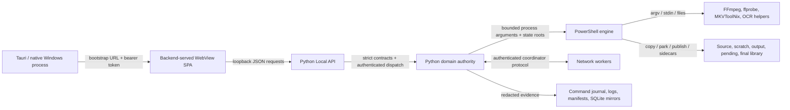

# Security and Trust Boundary Map

Status: cross-layer boundary skeleton verified; route-by-route and path-by-path reconciliation remains in progress.

This is audit evidence, not a replacement for `AGENTS.md`, `docs/operator/NO_TOUCH_BOUNDARY_REGISTER.md`, the API/command inventories, or executable contracts. A control listed here is not considered proven merely because it exists; the coverage and findings ledgers retain the hash-bound review state.

## Boundary register

| Boundary | Data crossing it | Authority after crossing | Primary controls and evidence | Recovery/fail-closed behavior | Current audit disposition |
|---|---|---|---|---|---|
| Native shell → backend/WebView | backend executable path, selected port, one-time/bootstrap token, start URL, native close intent | Tauri owns child lifecycle; backend owns HTTP auth and application state; WebView owns presentation only | `apps/desktop/tauri/src-tauri/src/backend_process.rs`, `lib.rs`, `single_instance_guard.rs`; `src/mediapipeline/desktop/local_api_main.py`; Tauri lifecycle architecture docs and tests | startup timeout/child exit is surfaced; native close must consult backend close-readiness and terminate the exact owned child/process tree | W03-013/015 qualify backend readiness. W09 confirms ambient Python/inherited `PYTHONPATH` execution (`W09-003`), origin-unbounded token injection (`W09-006`), crash-unstable backend ownership (`W09-002`), and unrelated-process cleanup risk (`W09-009`) |
| WebView → loopback Local API | authenticated read requests; mutation JSON; strict confirmation fields; selected paths; command IDs | Backend route/contract/handler becomes sole mutation authority | route normalization and bearer-token checks in desktop API host; strict boolean confirmation contracts; centralized command dispatch; route/command inventories; frontend mutation-boundary tests | malformed/unauthenticated requests reject before domain mutation; unknown mutation outcome must remain explicit rather than reported as success | Worker-01 verified gaps in request-stable duplicate protection and terminal exception evidence (`AUDIT-FIND-W01-001`, `-002`) |
| Local API dispatcher → command journal | accepted command identity, request summary, outcome, redacted detail, timestamps | Journal is operator evidence, not mutation authority; handler/domain state remains authoritative | `handler.py`, `handler_policy.py`, `routes_command.py`, `contract_command.py`, `command_journal.py`, `command_journal_policy.py`; strict route/handler count parity | corrupt/failed evidence must block or surface degraded health without overwriting prior proof | Worker-01 found corrupt startup can appear healthy and later overwrite evidence (`AUDIT-FIND-W01-003`); nested redaction depth needs runtime reachability proof (`-004`) |
| Settings WebView/request → JSON authority → PSD1 runtime | settings patch/import payloads, review digests, secrets, legacy extras, generated PSD1 | JSON settings store is persistence authority; backend validates/CAS-writes; PSD1 is generated runtime projection; PowerShell consumes runtime values | strict `confirm_save`/`confirm_import`; review confirmation; current-digest compare under OS lock; atomic replacement/rollback; projection round-trip and post-write verification; canonical registries/schema | cross-process contention conflicts or retries idempotently; malformed authority blocks/last-good recovery; failed projection restores prior bytes | Cross-process lock/CAS repair passed 11 tests and distinct W02 exact-hash review. Token request-side exposure and executable legacy extras remain P1 (`CSW-2026-07-09-SETTINGS-001`, `-002`). Effective dump omits 17 registered values (`AUDIT-FIND-W02-001`) |
| Python domain → PowerShell/native processes | executable paths, argument arrays, timeouts, environment, run/command IDs, state roots | Python owns launch scope and child lifecycle; PowerShell owns media-stage behavior after validated startup; helper tools never define policy | canonical process runner/kill-tree helpers; no-shell argument construction where applicable; hidden windows; timeout and exact identity evidence; ActiveJobs/command journal/run-monitor correlation | spawn/timeout/kill must preserve non-success state and verify descendant termination before terminal evidence; orphaned work must not be reported complete | W03-001 confirms cwd plus a reused PID can authorize killing an unrelated tree; W03-002 confirms leases lack durable launch identity |
| Source → scratch → output → pending/final | media bytes, metadata, manifests, sidecars, checksums, collision/path identity | Source is read/copy-only by default; scratch isolates work; manifest-backed pending publish owns parked output; backend/engine owns final placement | NO_TOUCH boundary; source identity/path containment; scratch-copy verification; `.partial` and atomic transitions; pending park/drain manifests; rename/publish/reconcile confirmations and tests | ambiguity, OCR/conversion failure, collision, low space, or unsafe destination routes to fail/review/park; source mutation remains forbidden unless an explicit separately validated policy authorizes it | W03-003 confirms legacy queue-priority helpers still rename/retimestamp source media. W05-001 proves the ASS CLI accepts source/output aliases and replaces the source; a distinct exact-hash review independently confirmed it. W05-009 separately weakens scratch no-clobber ownership. W04 remains active |
| Coordinator ↔ worker over network | endpoints, join blobs, auth tokens, claims, heartbeats, results, path identities | Coordinator owns job/claim authority; worker owns only a validated claim while leased; shared secret/role policy remains backend-owned | URL/role/auth validation, secret redaction, request size limits, claim/done/release state, path-identity rules, recovery tests | auth mismatch rejects; stale/incomplete claims recover without source mutation; token changes must be transactional | W03-007 confirms unreadable local-worker claim state fails open; July 19 network auth/path findings remain open for their assigned partition |
| Runtime → logs/journal/manifests/SQLite mirrors | diagnostic text, failure codes, progress, command results, paths, hashes, terminal proof | Source contracts/manifests remain authoritative as documented; caches/SQLite/WebView projections are mirrors | bounded writes/retention, JSON schemas, failure-code registry, log redaction, command IDs, exact run/job/track identities, freshness suppression | parse/corruption/future/stale evidence must be rejected or marked unavailable; mirrors must not synthesize final authority | W03-004–006, -009, -013, and -014 show traversal, progress, backlog, network, and app-state failures can collapse into complete/healthy/empty/default projections |
| Repository → package/release/update service | binaries, runtimes, config templates, schemas, signing metadata, version/tag/update endpoints | Release manifest/policy owns inclusion; live config, LocalBase, logs, credentials, personal paths, and unrelated audit attachments must remain excluded | release layout checks, package inventory, signing/notarization workflow, strict `test.ps1 -RequireTests`, update manifest/signature checks | missing tests/signatures or provenance mismatch must block strict release; update failure must preserve installed working version | W10 exact-hash independent review confirms workflow gaps. W13 found package inclusion of an unredacted operational screenshot (`W13-001` P1), nine unrelated remote screenshots (`W13-002` P2), and a third-party document without redistribution provenance (`W13-003` P1); a distinct exact-hash review independently confirmed both P1 dispositions. Cloud signing/update/native install evidence remains external |

## Cross-cutting trust rules

- Frontend state is never filesystem, queue, media-policy, pending-publish, rename, repair, network-lifecycle, or settings-persistence authority.
- A confirmation proves operator intent only when it is a literal JSON boolean and is bound to the exact reviewed candidate/state generation.
- Redaction after a secret crosses an untrusted boundary does not undo the exposure.
- A successful process exit or green workflow is not sufficient when required tests were skipped, downshifted, overwritten, or configured `continue-on-error`.
- Generated indexes, summaries, SQLite views, UI caches, and command-history projections are supporting evidence; executable source plus authoritative state contracts decide behavior.
- File path checks must account for canonical identity, UNC paths, symlinks/reparse points, traversal, collisions, and source/scratch/output role separation before mutation.
- High/critical paths from `docs/inventories/RISKY_FILE_REGISTRY.v1.json` require independent review even when `PROJECT_INDEX` is missing or stale. The hardened audit ledger now combines the registry with conservative path fallback and derives completion only from a distinct current-hash attestation; W11 independently verified this proof boundary.
- Empty/default/idle state is not fail-closed evidence when an authoritative read, parse, enumeration, or identity check failed. W03 found this collapse pattern across seven state families; each must remain degraded/blocking until explicitly reconciled.
- A conventional scratch-only caller does not excuse a mutation-capable helper from canonical source/output/summary separation and default no-replace commits. W05-001 is independently confirmed at its current hash.
- Native bootstrap credentials may be injected only into the expected authenticated loopback origin. Navigation events for any other origin must fail closed, and packaged startup must never select ambient interpreters or inherited import roots (`W09-003`, `W09-006`).
- Release/test evidence may not contain personal server names, user identities, or media topology merely because it is source text rather than a binary screenshot (`W09-010`).

## Remaining proof joins

1. Join all 174 executable Local API routes (56 GET, 118 POST), including the 117 command handler/contract entries, to auth, request contract, strict confirmations, domain owner, state reads/writes, journal outcome, and tests.
2. Reconcile every sensitive config key and network secret against browser/native/request/log/package exposure paths.
3. Enumerate every filesystem-mutating function and prove source/scratch/output/final role checks plus rollback/recovery.
4. Reconcile every external executable invocation with argument construction, timeouts, output capture, process-tree cleanup, and exact terminal evidence.
5. Reconcile current CodeQL/SARIF evidence with this branch; zero branch alerts currently means no branch analysis, not a clean result.
