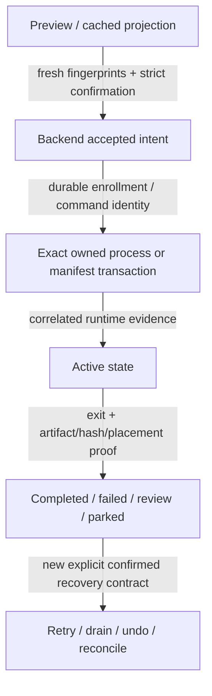

# State and Authority Map

Status: canonical state families and authority boundaries mapped. Worker 03 completed all 317 queue/process/status rows and qualified the fail-open/corruption behavior below; remaining domains still require exhaustive writer/reader and runtime-artifact reconciliation.

Authority labels used below:

- **policy authority**: may authorize or define behavior/mutation;
- **durable evidence**: records an accepted or executed fact but does not independently authorize a new mutation;
- **projection/mirror**: derived for display, query, or diagnostics and must never override its source;
- **control intent**: bounded operator/backend request that still requires an authoritative consumer and correlation checks.

## State families

| Artifact / schema | Authority and owner | Principal writers | Principal readers / consumers | Lifecycle and recovery | Audit notes |
|---|---|---|---|---|---|
| Source media | external operator/library authority; immutable input by default | none in normal policy | discovery, ffprobe, hashing, scratch copy | read/probe/hash/copy only; mismatch/instability fails or reviews; no cleanup/delete without separately enabled safe-delete policy | NO_TOUCH invariant; real-media mutation is unauthorized |
| `<scratch-file>.srcinfo` / `scratch_source_identity.v2` | durable source-to-scratch identity proof owned by PowerShell storage layer | `storage/scratch_copy.ps1` after stable full-file SHA-256 verification | scratch reuse and processing guards | atomically promoted only after size/hash proof; missing/malformed/mismatched identity forces recopy or failure, never source trust by timestamp alone | high-risk storage paths require independent review |
| `State/Completed/completed_jobs.jsonl` / `completed_job.v1` | append-only durable completion evidence | PowerShell completion/publish flow | Python Completed service, diagnostics, WebView, optional SQLite mirror | malformed/unverified rows are excluded; final placement and source identity must be explicit | `.pipeline.json` uses related sidecar schema and must remain correlated to actual output |
| output `.pipeline.json` / `pipeline_sidecar.v1` | durable per-output provenance, not authority to mutate source | completion/publish sidecar writer | Completed, repair/reconcile, audit/operator tools | written/carried only with successful output/park transaction; stale/missing sidecar routes to review | original media/subtitle evidence remains separate |
| `State/PendingServerPush/*.manifest.json` / `pending_push_manifest.v1` | policy-bearing manifest for one parked output; backend/PowerShell pending-publish authority | park transaction, rerun destination policy, repair/reconcile proposal flow | pending list/preview/drain, WebView, diagnostics, Run Monitor reconciliation | explicit states from parked/pending through retry/published; exact payload, destination, hashes, sidecars, transaction ID, and confirmation govern drain; ambiguity stays parked/review | never infer safe drain from browser state or filename; W03-009 shows enumeration failure currently collapses to an empty healthy backlog |
| `State/Rerun/Local/<batch_id>.json` / `desktop_rerun_local_enrollment.v1` | backend durable acceptance evidence before child spawn | Python rerun lifecycle | PowerShell read-only reference, retry/recovery/read model, close-readiness | persists accepted CSV rows and exact identities even if child fails before manifest; terminal supersession requires process-exit proof | closes acceptance-to-manifest gap |
| `RerunManifests/*.json` / `rerun_batch_manifest.v2` | runtime evidence, not standalone mutation authority | PowerShell rerun runner plus bounded backend updates where documented | rerun service/read model, recovery, WebView | planned/running/stopped/completed/failed/review rows retain command/launch/enrollment identity; malformed or mismatched manifests cannot authorize continuation | no formal generated JSON schema; symbol-level contract review pending |
| `State/Rerun/Network/network-rerun-*.json` / `desktop_rerun_network_batch.v1` | backend coordinator authority for network rerun batch/row lifecycle | confirmed start, claim/reducer/destination-policy services | coordinator claim provider, workers via protocol, rerun UI, close-readiness | claim/done/release/retry/review/publish states require exact batch/row/worker/source/handoff identity and bounded recovery evidence | W03-013 confirms wrong-schema state is silently omitted from close-readiness instead of remaining blocking |
| `State/Rerun/Control/stop_after_current.json` / `desktop_rerun_control.v1` | control intent correlated to one active rerun | backend confirmed command | PowerShell rerun runner and backend status/readiness | consumed only for exact batch/manifest/CSV identity; cleared/terminalized with durable result evidence | marker presence alone is not terminal proof |
| ActiveJobs JSON / `desktop_active_job.v1` | backend process-lifecycle authority for accepted/launched child identity | process launch/update/kill services | close-readiness, duplicate guards, status, recovery, force-stop | launching/active/terminal plus degraded/orphaned states; PID absence alone is not conclusive; descendant/process-exit proof governs terminalization | W03-001/002 show cwd plus PID and PID-only leases do not prove launch identity under PID reuse |
| `State/RunMonitor/<run_id>.json` / `pipeline_run_monitor.v1` | durable authority for one accepted Backend Queue Run Once workload and correlated runtime/terminal evidence | Python seeds immutable accepted identity; PowerShell owns live runtime writes; Python has narrow proven post-kill takeover | read API, WebView Current Work, close/readiness/status, support export | exact run/fingerprint/job/track identity, monotonic lifecycle, freshness and artifact reconciliation; `latest.json` is identity-only pointer | stale/future/uncorrelated evidence must be suppressed, never promoted |
| `State/Progress/queue_snapshot.json` / `queue_plan_snapshot.v1` | preview/plan evidence; launch authority only when fresh exact fingerprints and uncapped accepted rows revalidate | queue discovery/dry-run services and engine discovery | Queue UI, preflight/start, Run Monitor seed | display rows may be capped but plan/accepted fingerprints cover uncapped scope; cached fallback is explicitly non-launchable | W03-004/008/010/011 confirm traversal-completeness, route-exception parity, final-path fingerprint, and reload-TOCTOU gaps |
| `State/Progress/pipeline_progress.json` | current progress evidence, not standalone completion authority | PowerShell engine | snapshot/status API and Live/Progress UI | freshness/version/path checks; stale/malformed state shows unavailable/partial rather than success | W03-005/006 confirm stale FFmpeg fields can appear current and malformed JSON can be projected as healthy persistence |
| `State/Workers/slot-*/worker_heartbeat.json` and claim state / `local_worker_heartbeat.v1` | heartbeat is liveness evidence; claim store owns source assignment | PowerShell local workers and parent scheduler | parent scheduler/status/recovery | heartbeat age helps detect stale slot, but claim/scheduler state owns release/reclaim | W03-007 confirms unreadable claim authority is replaced empty and can admit a duplicate source claim |
| `State/Pipeline/ToolLogs/{Active,Interrupted}` and failure-promoted logs | diagnostic text evidence | native process runner/tool-log lifecycle | diagnostics, failure artifact service, operator support | successful tool logs delete; stop/orphan moves to Interrupted; failure promotes exact evidence; retention is bounded | log text requires injection/redaction review; directory disposition carries lifecycle meaning |
| `State/Progress/pipeline_events.jsonl` / `pipeline_event.v1` | append-only event evidence | pipeline/domain services | diagnostics recent events, optional SQLite mirror | invalid lines are skipped/reported; timestamps/event IDs aid correlation but do not override state contracts | actionability/redaction review pending |
| `State/Failures/*` manifests and `Artifacts/*` | durable failure/review evidence and retained diagnostics | PowerShell failure state plus Python failure cleanup/service | Diagnostics, Maintenance, retry/rerun guidance, operator | stable failure codes, bounded retention, artifacts preserved for actionable failures; cleanup must never cross state root or source boundary | failure-code-to-handler map pending |
| `State/mediapipeline_state.sqlite3` schema v2 | projection/mirror only | opportunistic Python storage mirror | query/diagnostic readers | mirror failures are logged/swallowed without changing command/stage/queue/completed/publish behavior; JSON/manifests remain authoritative | must never drive command history, drain, recovery, queue scope, or completion acceptance |
| local API `RunLogs/local_api_command_history.json` | bounded durable command-request/result evidence, not proof the underlying process later completed | centralized Local API dispatcher/journal | `GET /api/commands`, Home/Diagnostics/control histories, SQLite mirror | temp-file replace and bounded retention; persistence health should expose failures; malformed load currently can appear clean and later overwrite evidence | `AUDIT-FIND-W01-001..004` cover duplicate/replay, terminal exception, corruption, and redaction gaps |
| `State/ui_preferences.json` / `desktop_ui_preferences.v1` | backend persistence authority for allowlisted UI customization only | UI-preference backend route/service | WebView/Tauri layout/theme consumers | invalid/unallowed keys fall back or warn; reversible preferences never authorize backend/media mutation | browser local state is not equivalent authority |
| per-user `settings.v1.json` / `desktop_settings_store.v1` | canonical desktop settings policy authority | settings store under OS lock/digest CAS | backend config resolution and projection | validated import/save, conflict, atomic replace, post-write verification, last-good recovery | legacy extras field is archival by documented intent but is currently projected/executed (`CSW-...-SETTINGS-002`) |
| per-user `settings_projection.v1.json` plus PSD1 | projection evidence and runtime input, subordinate to JSON authority when present | settings store/projector | PowerShell entrypoint, diagnostics | hashes bind store and PSD1; failed writes roll back; explicit import recovers from PSD1 | effective dump is incomplete (`AUDIT-FIND-W02-001`) |
| app/schedule state (`app_state.json`, schedule artifacts) | backend scheduling/control authority shared with machine/auth/UI keys | schedule service and confirmed routes | watcher/scheduler, close-readiness, WebView, identity/auth consumers | strict schedule confirmation, bounded watcher lifecycle, restart recovery; existing-unreadable state must block partial save | W03-014 confirms schedule save currently replaces corrupt shared state and can erase machine/authentication values |
| rename preview/apply/undo manifests | backend-owned mutation plans and durable reversal evidence | rename preview/apply/undo services | confirmed rename commands, history/UI, recovery | path containment/collision/fingerprint checks; apply/undo exact manifest identity and status; completed undo cannot be replayed | July 19 `CSW-...-RENAME-004` needs current-source reconciliation |
| folder-policy sidecars | backend-owned per-folder policy override | folder-policy service | discovery/planning/config overlay | schema validation, path-boundary rules, atomic JSON writes; invalid policy warns/blocks according to route | full writer/reader join pending |
| audit/diagnostic exports and support bundles | evidence snapshot only | audit/diagnostics/support-export services | operator/review tooling | disposable/output-root constraints, redaction and package exclusions; never imported as mutation authority without a distinct confirmed route | archive/generated evidence must remain labeled historical/snapshot |

## Authority transitions that require exact proof

- UI/cache/history evidence cannot skip directly to `ACCEPTED`, `ACTIVE`, or `TERMINAL`.
- A successful route response cannot substitute for later process/artifact completion.
- A missing process, stale heartbeat, or absent file is ambiguous until the owning contract's recovery proof resolves it.
- A mirror or generated projection may be rebuilt from authority; it may not repair authority by guesswork.

Worker 03 exposes a repeated authority-collapse pattern: an unreadable or failed source is converted into ordinary empty/default/idle state at queue traversal, progress parsing, local-worker claims, pending-backlog enumeration, network-rerun readiness, schedule save, and active-audit close readiness. Those are not independent authority sources; each conversion must remain degraded/blocking until an explicit recovery contract resolves it.

Worker 05 adds media-state qualifications. Completed subtitle QA treats the literal boolean `output_exists=false` as passing evidence (`W05-002`); an allowed no-audio file can leave prior-file script globals authoritative for later remux consumers (`W05-006`); and scratch subtitle ownership is checked before conversion but not reserved through the replacing commit (`W05-009`). Output existence, inherited globals, and a shared scratch pathname are therefore not sufficient authority without typed values, per-file reset, and operation-bound commit ownership.

## Remaining exact inventory work

1. Reconcile every row in `docs/inventories/STATE_FILE_SCHEMA_REFERENCE.md`, `RUNTIME_ARTIFACT_INVENTORY.md`, and `LOG_ARTIFACT_CATALOG.md` to current writer/reader symbols and tests.
2. Add state families not yet represented in those active inventories or prove they are intentionally transient.
3. Enumerate atomic-write, locking, retention, corrupt-read, backup, and rollback behavior for every mutable artifact, explicitly dispositioning W03-006, W03-007, W03-013, and W03-014.
4. Join every state mutation to its Local API/PowerShell command, strict confirmation, command-journal evidence, failure code, and recovery action.
5. Independently review all source/scratch/output/publish/rename/network/process state transitions at final hashes.
