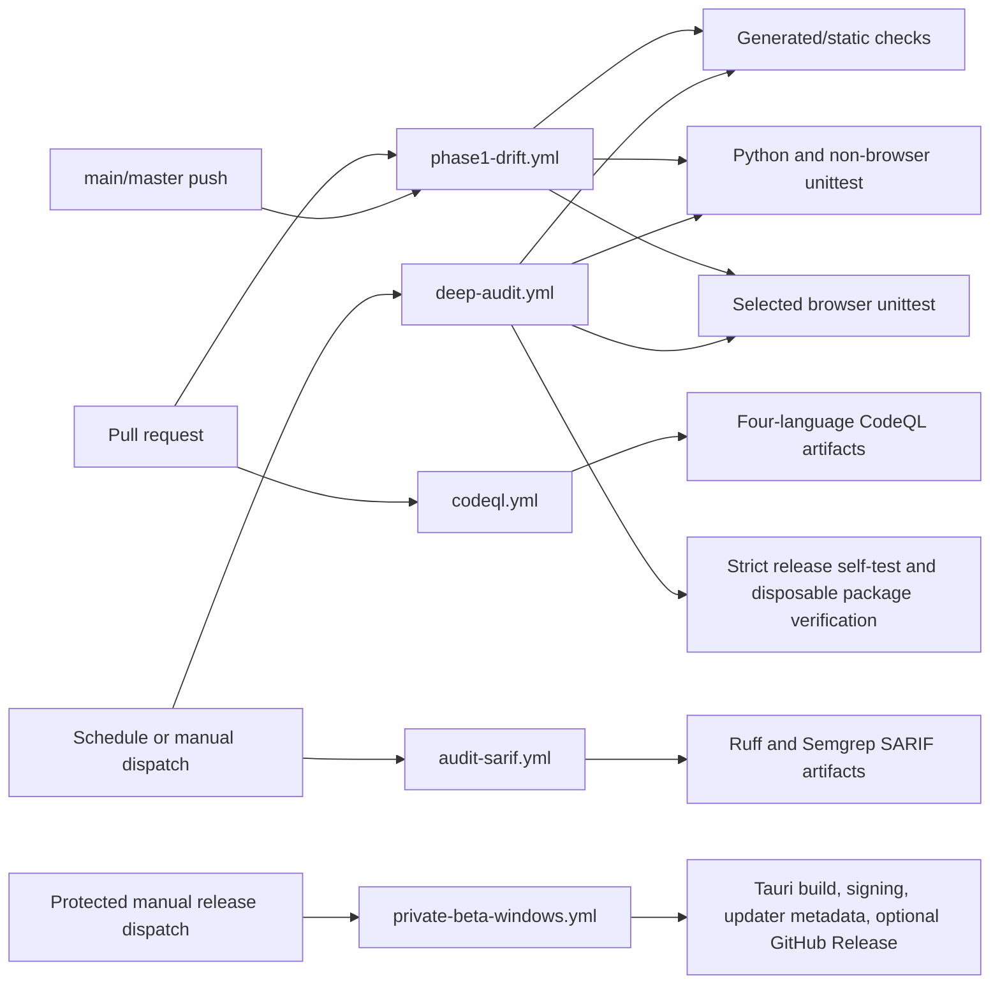

# Test and Validation Map

Status: **final validation-spine review complete at frozen hashes**. Workflow, test, smoke, browser, PowerShell, Tauri, generated-media, release, external-analysis, and representative-media rungs are inventoried and joined to current behavior. Executed results retain every failure, skip, timeout, and unavailable external proof; product remediation and later release validation remain separate from audit completion.

Evidence sources include:

- `docs/testing/VALIDATION_LADDER_RUNBOOK.md`
- `docs/testing/TEST_COVERAGE_MATRIX.md`
- `docs/inventories/TEST_SUITE_SUBSYSTEM_INVENTORY.md`
- `.github/workflows/deep-audit.yml`
- `.github/workflows/codeql.yml`
- `.github/workflows/audit-sarif.yml`
- `src/mediapipeline/tools/dev/audit_checks.py`

The completed map must distinguish static checks, unit tests, browser smokes, generated-media integration, package/open/close proof, external cloud analysis, and real-media-only evidence. Skips and downshift flags are not passes.

## Current inventory

| Surface | Count |
|---|---:|
| Python test files | 318 |
| WebView test files | 72 |
| Static Python/WebView test definitions | 3,696 |
| Browser modules | 34 |
| Non-browser WebView modules | 38 |
| PowerShell Unit scripts | 67 |
| Top-level PowerShell aggregate scripts | 5 |
| Canonical smoke wrappers | 37 |

Local prerequisites were present for bundled Python, Ruff/mypy/pytest modules, Node/npm, Rust/Cargo, Graphviz, PSScriptAnalyzer, Chrome/Edge, bundled PowerShell, FFmpeg/ffprobe, MKVToolNix, PgsToSrt, and Node dependencies. CodeQL and Semgrep were not locally provisioned; Ruff is available through bundled Python rather than as a shell executable.

## Evidence layers and strict invocation

| Layer | Strict evidence | Known limit |
|---|---|---|
| Audit/static | `mediapipeline.tools.dev.audit_checks run deep-audit --jobs 4 --json` plus four omitted generated checks | The 18-check suite is not the complete generated/check-mode set |
| Python | Full `unittest` discovery plus targeted pytest supplement | Unittest ignores 26 top-level pytest-style tests in four files |
| WebView non-browser | Generated non-browser module list under unittest | Skips must be recorded; discovery is not browser execution |
| Browser | All 34 generated-inventory modules through strict isolated wrapper processes | Deep Audit selects 29 method IDs from only 23 modules and direct unittest can pass skips |
| PowerShell | Reliability aggregate plus all 67 Unit scripts separately | Aggregate includes only 33 Unit scripts |
| Generated-media integration | Tool integration, E2E smoke, adversarial kill | Codec/tool/hardware `SKIP` paths can exit successfully |
| Tauri/Rust | CheckOnly, production-surface audit, full build and `cargo test --lib` | `npm run check` is only `cargo check`; prereq warnings can downshift |
| Release/package | `test.ps1 -RequireTests`; explicit disposable package build with `-Zip -Verify -IncludeTests` | Default release mode makes some test failures advisory |
| Security | Local Ruff SARIF; isolated Semgrep; remote current-branch CodeQL | SARIF steps are non-gating; CodeQL upload defaults to `never` |
| Real media | Operator-approved representative-media run | Explicitly outside this review-only audit unless separately authorized |
| Audit proof ledger | 34 focused unit tests, Ruff, compile, schema-v2 fragment joins, and non-strict 6,064-row mirror check | The proof machinery is current; the latest published checkpoint has 428 achieved and 5,636 open rows, so strict completion is not yet eligible |

## Workflow execution and evidence topology

The diagram shows configured control flow, not a claim that every edge is fail-closed. Findings below identify where a green job can omit or lose required evidence.

## Workflow line-review snapshot

| Workflow | Baseline role | Line-review state | Principal gaps | Findings | Independent review |
|---|---|---|---|---|---|
| `.github/workflows/deep-audit.yml` | Weekly/manual deep validation and disposable package proof | `line_reviewed_with_findings` | First Python failure can be overwritten; 26 pytest tests omitted; 11 browser modules omitted; raw unittest accepts skips; self-only push filter; four registered checks omitted; analyzer unpinned/fail-open | W10-001 through W10-006 | Complete at the current hash; distinct attestation confirms the exact set |
| `.github/workflows/phase1-drift.yml` | Required PR and main/master drift gate | `line_reviewed_with_findings` | Shares exit masking, pytest omission, browser selection/skip, generated-check, and analyzer gaps | W10-001, W10-002, W10-003, W10-005, W10-006 | Complete at the current hash; distinct attestation confirms the exact set |
| `.github/workflows/audit-sarif.yml` | Scheduled/manual Ruff and Semgrep artifact production | `line_reviewed_with_findings` | Self-only push filter; scanner failures/findings can stay green; no-SARIF path can stay green; floating scanner/rules versions | W10-004, W10-007, W10-008 | Complete at the current hash; distinct attestation retained despite lower risk tier |
| `.github/workflows/codeql.yml` | PR/scheduled/manual multi-language CodeQL analysis | `line_reviewed_with_findings` | Artifact-only upload is the default; no findings acceptance gate | W10-009 | Complete at the current hash; distinct attestation retained despite lower risk tier |
| `.github/workflows/private-beta-windows.yml` | Signed beta/stable installer and optional release publication | `line_reviewed_with_findings` | Pytest not provisioned by contract; beta endpoint cannot resolve a prerelease; strict release gate omitted; release identity not bound before clobber; job-wide secrets; no publication serialization | W10-010 through W10-015 | Complete at the current hash; distinct attestation confirms the exact set |

The exact line ranges, root causes, safeguards, reproduction logic, and remediation guidance are authoritative in `FINDINGS.jsonl`; the worker proof is in `workers/worker-10-ops-workflows.md`. The five files were hash-checked before and after review and were not edited.

## Completed W03 validation snapshot

The 317-row queue/process/status first pass is complete and its validation results are retained in `workers/worker-03-queue-process-status.md` and the W03 error fragment:

| Validation | Result | Audit meaning |
|---|---|---|
| Exact schema-v2 W03 fragment/path/hash/finding-set validation | PASS for 317/317 rows, 15 findings, and 30 W03 errors | First-pass evidence is internally complete; all 317 rows still need a distinct reviewer |
| PowerShell parser | PASS for all 18 assigned scripts | Syntax only; not behavioral proof |
| Focused bundled-Python queue/process/status rung | **110 passed, 1 failed, 26 subtests passed** | The single deterministic failure is `AUDIT-FIND-W03-015`: active audit snapshot evidence is lost by close-readiness reduction |
| Isolated close-readiness regression | **FAIL reproduced** | Confirms the grouped failure is stable rather than cross-test contamination |
| Local Worker Slot, Run Monitor State, Progress State Telemetry | PASS individually | Covers named surfaces only; W03 findings identify untested corruption/identity branches |
| Pipeline Queue Engine | PASS alone in 180.1 seconds | The earlier bounded parallel wrapper timeout is recorded; isolated completion supplies the usable result |

No real media, production state, or external process authority was used. W03-011 remains `needs-runtime-proof` for its priority-manifest race; W03-010 may require representative-media proof during a future remediation, not during this read-only audit.

W13 P1 proof is also independently complete at current hashes: `/root/coordinator_w13` rehashed and visually inspected the package-included operational PNG, parsed the tracked DOCX with the bundled document runtime, reran release-policy predicates, checked Git/provenance evidence, and confirmed `AUDIT-FIND-W13-001` and `AUDIT-FIND-W13-003`. The two-row independent attestation passes the global schema/hash/finding-set join; no binary or release behavior was changed.

## Behavior-to-gate matrix

| Behavior or boundary | Closest repository evidence | Required strict form | Current confidence limit |
|---|---|---|---|
| Generated contracts, indexes, inventories, and schema drift | `audit_checks.py`, individual generator `--check` modes, WebView prework | Every registered check either runs or has a named, reviewed exemption | Four maintained checks are outside the named Deep Audit suite; dependency-atlas regeneration lacks a non-mutating check mode |
| Python backend and tooling | `unittest discover` plus pytest-only files | Clean dependency install, explicit collection inventory, all discovered tests executed | Twenty-six top-level pytest tests are invisible to unittest and pytest is undeclared |
| WebView pure/static behavior | Generated non-browser module list and WebView prework | Complete inventory-derived module selection with zero unexplained skips | Discovery and static execution do not exercise a browser or native bridge |
| Browser/operator surface | `SMOKE_WRAPPER_MAP.json` and strict isolated browser wrapper | All 34 modules, nonzero test counts, required prerequisites, zero disallowed skips, bounded process logs | CI hard-codes 29 IDs from 23 modules and bypasses the strict wrapper |
| PowerShell policy and reliability | Reliability aggregate, individual Unit scripts, PSScriptAnalyzer | All 67 Unit scripts plus a pinned, mandatory analyzer | Aggregate reaches only 33 Unit scripts; missing analyzer is advisory |
| Media process and recovery policy | Tool-integration, E2E, and adversarial-kill suites with generated fixtures | Explicit codec/tool prerequisites and no success-producing skips | Hardware, codec, or helper absence can downshift evidence; real media remains separately authorized |
| Tauri bootstrap/lifecycle | CheckOnly, production-surface audit, Cargo test/build | Full native build/test plus open/close and backend-readiness evidence | `npm run check` alone is only `cargo check` |
| Release and packaging | `test.ps1 -RequireTests`, verified disposable package, package open/close | Same-commit strict gate before protected signing/publish | Private release workflow runs a narrower set and can publish without the strict gate |
| Security scanning | Ruff, Semgrep, CodeQL | Pinned scanners/rules, fail-closed execution, published/gated results | SARIF and CodeQL paths are artifact-oriented and can report green without an acceptance decision |

## Known validation-spine gaps requiring disposition

1. Deep Audit's push filter covers only its own workflow file; ordinary code pushes do not trigger it.
2. Deep Audit browser coverage selects 29 method IDs from 23 modules while the inventory contains 34 modules and bypasses strict skip enforcement.
3. Twenty-six pytest-style tests are invisible to canonical unittest discovery, while pytest is not declared in `requirements/dev.txt`.
4. The reliability aggregate covers 33 of 67 Unit scripts.
5. Four available generated checks are outside the named Deep Audit suite: smoke-wrapper map, duplicate-test-name report, WebView inventory docs, and context-slice integrity. Run Monitor schema is already included.
6. Dependency-atlas generation has no read-only check mode and cleans outputs before regeneration.
7. No coverage.py, pytest-cov, lcov, tarpaulin, or llvm-cov setup exists; test success cannot prove dynamic execution of every line.
8. Ruff/Semgrep SARIF scanner commands use `continue-on-error`; scanner failure or findings do not fail the workflow.
9. CodeQL is not locally installed and the audit branch has no remote analysis.
10. W05 found no focused path-alias/default-no-clobber coverage for the ASS CLI or scratch subtitle commit, no bounded `seconv` timeout/stop proof, and cross-language plan/command tests do not catch the first-video versus all-video mapping disagreement.
11. W09 found that PG-2 automation writes exact media/publish proof values without checking the referenced files or bytes (`W09-008`), Rust startup-contract validation omits both priority-export routes (`W09-013`), and the canonical wrapper omits rustfmt while current Rust fails `cargo fmt --check` (`W09-012`).
12. Tauri prerequisite validation can accept an unrelated `link.exe` as the MSVC linker (`W09-011`), and updater/plugin scaffolding has no executable update lifecycle validation (`W09-007`).

## Completed W05 validation boundary

Worker 05 completed 132/132 exact-hash first-pass rows and 11 findings. Its source review parsed all 21 assigned Python and all 37 assigned PowerShell files, passed 54 Python tests plus 45 subtests and eight PowerShell suites, reproduced 67 generated summaries, reconciled media-policy callers, and used disposable synthetic fixtures for the no-audio, subtitle-mode, boolean-QA, source-alias, and multi-video roots. A distinct reviewer independently reproduced both source-alias commits for `AUDIT-FIND-W05-001`. No real media was required or used; representative stream/topology proof remains a later explicit release-validation rung.

## Completed W09 validation boundary

Worker 09 completed 43/43 current-hash rows and 13 findings. Ten PowerShell files parsed; four JSON plus three TOML/lock inputs parsed; `cargo check --locked`, 56 Rust library tests, production-surface checks, 26 adversarial-close scaffold tests, and eight private-beta layout/release tests passed. The 95-test Tauri scaffold suite had one focused failure for the two missing priority-export routes, and `cargo fmt --check` failed reproducibly. List-only inspection of the existing NSIS archive found only six NSIS support files plus the shell executable. No installer/package was executed, no real media was used, and native crash/relaunch, active-work close, and updater installation remain external proof requirements.

## Product remediation and release-validation order

1. AI guardrail plan, static/deep checks, and every omitted check mode.
2. GitHub spine, WebView prework, and PSScriptAnalyzer.
3. Full Python unittest plus pytest-only supplement, retaining all skips.
4. Reliability aggregate followed by all 67 PowerShell Unit scripts in isolated processes.
5. Tool integration and generated-media E2E.
6. All 34 browser modules in bounded strict shards.
7. Tauri CheckOnly, production surface, full Rust build/tests.
8. Release self-test with `-RequireTests`, then an explicit-temp verified package.
9. Adversarial generated-media force-kill.
10. Local Ruff SARIF and externally provisioned Semgrep/CodeQL evidence.

Prior 2026-07-19 validation remains provenance only. The final audit claims only the current commands and exact frozen-byte evidence in the authoritative external ledger; it does not convert recorded failures or unavailable real-world proof into passes.
